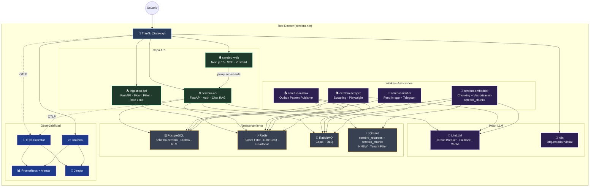
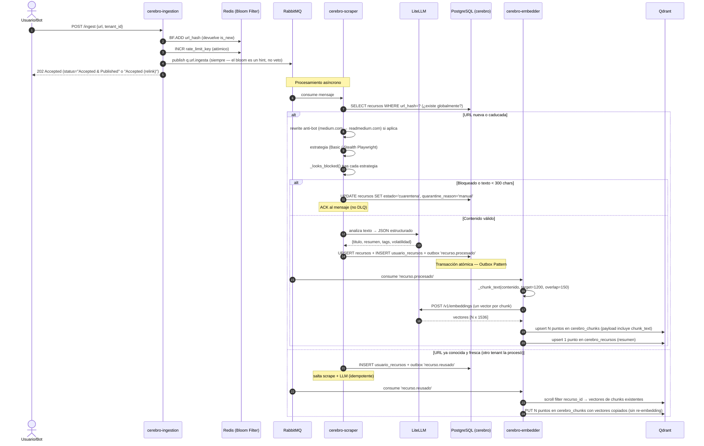
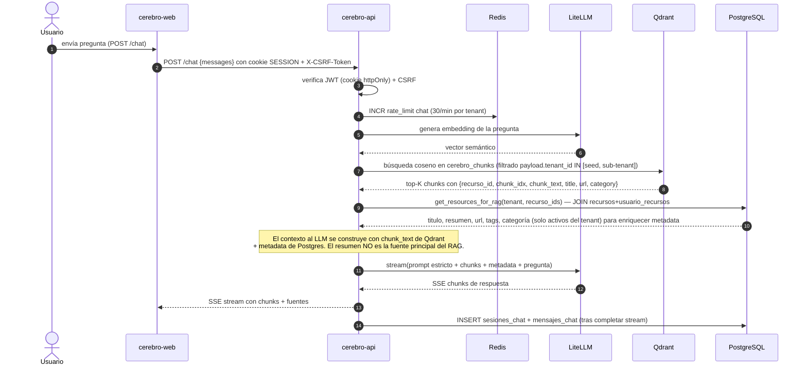
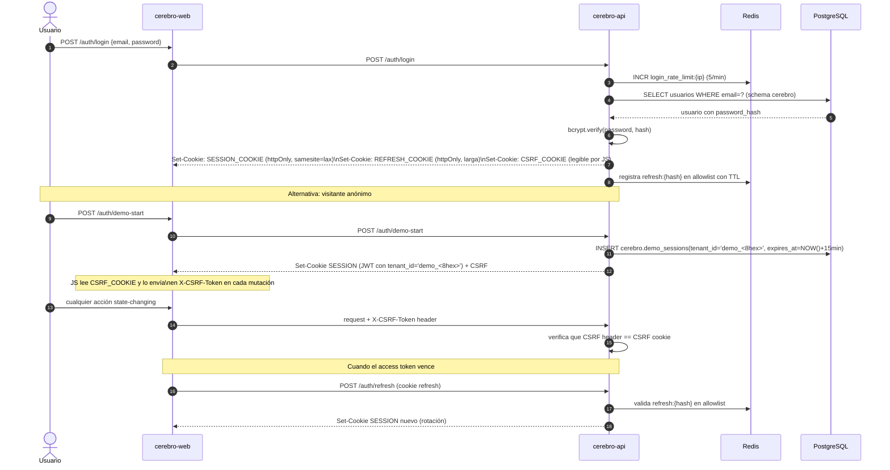
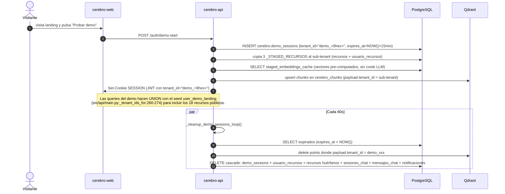

<div align="center">
  
  


# 🏗️ Arquitectura e Infraestructura — LinkAnvil

</div>


Este documento detalla la infraestructura del proyecto **LinkAnvil** basada en Docker Compose: la topología de red, los flujos de trabajo end-to-end (ingesta, RAG, autenticación, curación), la estrategia de persistencia dual (Postgres + Qdrant), la seguridad, el aislamiento de schemas, las migraciones, el liveness de workers, la observabilidad y el backup.

- Para una referencia rápida con puertos, imágenes y límites de recursos consulta el [catálogo de contenedores](./2_resumen_servicios.md).
- Para la descripción narrativa de cada servicio con analogías pedagógicas consulta [`3_componentes.md`](./3_componentes.md).

---

## Tabla de contenidos

1. [Topología del Sistema](#1-topología-del-sistema)
2. [Flujos de Trabajo Principales](#2-flujos-de-trabajo-principales)
   - 2.1 [Ingesta Asíncrona](#21-ingesta-asíncrona)
   - 2.2 [Chat RAG con SSE Streaming](#22-chat-rag-con-sse-streaming)
   - 2.3 [Autenticación](#23-autenticación)
   - 2.4 [Curación Nocturna (sin coste LLM extra)](#24-curación-nocturna-sin-coste-llm-extra)
   - 2.5 [Demo Session Bootstrap (Slices 6.x)](#25-demo-session-bootstrap-slices-6x)
3. [Estrategia de Persistencia](#3-estrategia-de-persistencia)
   - 3.1 [Patrón de Doble Base de Datos (Cerebro Lógico vs Semántico)](#31-patrón-de-doble-base-de-datos-cerebro-lógico-vs-semántico)
   - 3.2 [Persistencia de Sesiones de Chat](#32-persistencia-de-sesiones-de-chat)
   - 3.3 [Volúmenes Docker](#33-volúmenes-docker)
4. [Seguridad y Autenticación](#4-seguridad-y-autenticación)
   - 4.1 [httpOnly Cookie + CSRF Doble Submit](#41-httponly-cookie--csrf-doble-submit)
   - 4.2 [Rate Limiting Atómico](#42-rate-limiting-atómico)
   - 4.3 [Contenedores Non-Root](#43-contenedores-non-root)
   - 4.4 [Overlay de Producción](#44-overlay-de-producción)
   - 4.5 [Endpoints de Autenticación](#45-endpoints-de-autenticación)
5. [Aislamiento de Schema en PostgreSQL](#5-aislamiento-de-schema-en-postgresql)
6. [Gestión de Migraciones de Schema](#6-gestión-de-migraciones-de-schema)
7. [Liveness de Workers con Heartbeat Redis](#7-liveness-de-workers-con-heartbeat-redis)
8. [Observabilidad Integral](#8-observabilidad-integral)
9. [Backup Automático](#9-backup-automático)

---

## 1. Topología del Sistema

Todos los servicios corren dentro de la red Docker privada `cerebro-net`. Las peticiones externas entran exclusivamente por **Traefik** en el puerto 80/443. Los servicios internos no exponen puertos al host salvo en desarrollo.



---

## 2. Flujos de Trabajo Principales

### 2.1 Ingesta Asíncrona



> **Nota sobre la deduplicación**: la Ingestion API publica al queue **incluso cuando el bloom filter dice "duplicado"**. El bloom es un hint de Redis que puede divergir del estado real de Postgres (p.ej. tras un reset de DB) — confiar solo en él provocaría que la URL nunca llegue al worker y `usuario_recursos` no se cree para el tenant. La idempotencia se resuelve en el scraper: si el recurso global existe y está fresco, solo se inserta el link en `usuario_recursos` y el embedder copia los chunks existentes (`src/data/embedder_worker.py:171-209`).

### 2.2 Chat RAG con SSE Streaming



> **Sobre las dos colecciones de Qdrant**: el `/chat` consulta exclusivamente `cerebro_chunks` (`src/api/main.py:1748-1753`). La colección `cerebro_recursos` mantiene el vector del resumen (un punto por recurso/tenant) y se usa en flujos legacy y en el delete cascade (`src/api/main.py:295`).

### 2.3 Autenticación



Ver §4.5 para el detalle de cada endpoint y la validación adicional que hace `get_current_user` sobre las sesiones demo.

### 2.4 Curación Nocturna (sin coste LLM extra)

```mermaid
sequenceDiagram
    participant Cron as n8n (Cron diario)
    participant API as cerebro-api
    participant PG as PostgreSQL
    participant MQ as RabbitMQ

    Cron->>API: POST /admin/audit-cron + X-Admin-Token
    API->>API: run_audit_cron() (src/data/audit_cron.py)
    Note over API: Fase A — recursos activos con fecha_caducidad <= NOW()<br/>pasan a cuarentena (motivo='caducidad').<br/>Fase B — cuarentenados con > GRACE_PERIOD_DAYS días se expiran.
    API->>PG: UPDATE recursos SET estado=... (filtrado por temporal_class y audit_policy)
    API->>PG: INSERT outbox_eventos 'recurso.cuarentena' / 'recurso.expirado' (por tenant)
    Note over PG, MQ: El outbox-publisher emite a RabbitMQ; el notifier-worker<br/>notifica al usuario por feed in-app + Telegram.
```

La auditoría temporal está implementada en Python (`src/data/audit_cron.py:run_audit_cron`, autenticada con `AUDIT_CRON_TOKEN` en `src/api/main.py:1889-1902`). n8n sigue existiendo en el stack (`docker-compose.yml:547-549`) **solo como disparador HTTP** — no ejecuta SQL directo. El cron considera `temporal_class`, `valor_archivistico` y la `audit_policy` JSONB por tenant. El motivo `evento_pasado` se decide al ingestar (migración 0006), no aquí.

### 2.5 Demo Session Bootstrap (Slices 6.x)

Cada visitante anónimo recibe un sub-tenant aislado con TTL de 15 minutos. Flujo:



Referencias: `src/api/main.py:868-1007` (endpoint), `:350-389` (cleanup), `:260-274` (_tenant_ids_for), `:979` (indexado en `cerebro_chunks`), `infra/postgres/migrations/0009_demo_sessions.sql`, `infra/postgres/migrations/0011_staged_embeddings_cache.sql`.

---

## 3. Estrategia de Persistencia

### 3.1 Patrón de Doble Base de Datos (Cerebro Lógico vs Semántico)

LinkAnvil usa intencionalmente dos sistemas de persistencia complementarios:

**PostgreSQL — Cerebro Lógico y Transaccional:**
- Fuente única de verdad estructurada: URLs, metadatos, relaciones, histórico
- Garantías ACID: ningún dato se pierde ni queda en estado inconsistente
- **Modelo recurso global + pivote per-tenant:** la tabla `recursos` es global (deduplicada por `url_hash`); la asociación usuario↔recurso vive en `usuario_recursos(tenant_id, recurso_id)`. La RLS se activa con `FORCE ROW LEVEL SECURITY` en **cinco tablas**: `usuario_recursos`, `sesiones_chat`, `mensajes_chat`, `grafo_relaciones`, `outbox_eventos` (`infra/postgres/migrations/0001_baseline.sql:140-183`). Todas comparten la policy `tenant_isolation` que lee `current_setting('app.tenant_id')`, fijado por la app con `SELECT set_config('app.tenant_id', $1, true)` antes de cada query crítica (ej. `src/data/db.py:117`, `src/api/main.py:335`).
- Si dos usuarios suben la misma URL, el contenido se procesa una vez y se reusa; cada uno mantiene su propia entrada en la pivote.
- Patrón Outbox para consistencia eventual de eventos asíncronos.

**Qdrant — Cerebro Semántico e Intuitivo:**
- Exclusivamente almacena vectores matemáticos (embeddings) de alta dimensionalidad
- Búsquedas por similitud coseno (HNSW) en milisegundos
- Encuentra recursos "semánticamente afines" aunque no compartan palabras exactas
- **Dos colecciones**:
  - `cerebro_recursos` — UN punto por `(recurso_id, tenant_id)` con el **resumen** (vector del título + resumen). Usado por flujos legacy y por el delete cascade. `point_id = uuid5(ns, "<recurso_id>:<tenant_id>")` (`src/data/embedder_worker.py:34-35`).
  - `cerebro_chunks` — **N puntos por recurso**, uno por chunk del contenido (~1200 chars con overlap 150). Es la colección que consulta el `/chat` para RAG (`src/api/main.py:1748-1753`). `point_id = uuid5(ns, "<recurso_id>:<tenant_id>:chunk:<idx>")` y el payload incluye `chunk_text` además de `tenant_id`, `recurso_id`, `title`, `url`, `category` (`src/data/embedder_worker.py:38-39, 137-169`). El chunking vive en `_chunk_text` (`src/data/embedder_worker.py:42-79`).
- Cuando un segundo tenant reusa una URL, sus chunks se crean **copiando los vectores existentes** del primero (sin re-embedding): el embedder hace `scroll filter recurso_id` y reinyecta cambiando solo `payload.tenant_id` (`src/data/embedder_worker.py:171-209`).

Esta arquitectura de doble cerebro permite RAG avanzado: la intuición difusa de la IA (Qdrant) protegida por la seguridad transaccional del motor relacional (Postgres).

### 3.2 Persistencia de Sesiones de Chat

Las sesiones y mensajes de chat se persisten en Postgres en las tablas `sesiones_chat` y `mensajes_chat` (`infra/postgres/migrations/0001_baseline.sql:104, 118`), no en `localStorage` del navegador. Esta decisión fue motivada por un problema observado: resetear el stack Docker completo (incluyendo volúmenes) no limpiaba los chats porque el estado vivía en el navegador. Ahora los mensajes se borran al borrar el volumen de Postgres, y el store Zustand del frontend los obtiene siempre de la API.

Ambas tablas tienen RLS forzada con la policy `tenant_isolation`, de modo que un sub-tenant demo solo ve sus propias filas. El cleanup del demo (`_cleanup_demo_sessions_loop` en `src/api/main.py:350-389`) borra en cascada las filas asociadas al sub-tenant junto con sus puntos en Qdrant.

La columna `seq BIGSERIAL` en `mensajes_chat` garantiza orden determinista de los mensajes dentro de un mismo timestamp (cuando se insertan varios mensajes en la misma transacción).

### 3.3 Volúmenes Docker

Los datos persistentes usan volúmenes Docker gestionados:
- `postgres-data` — base de datos relacional (crítico: incluido en backup)
- `qdrant-data` — vectores (crítico: incluido en backup)
- `redis-data` — caché y estado de sesión Redis
- `n8n-data` — workflows y credenciales de n8n
- `prometheus-data` — series temporales de métricas
- `grafana-data` — dashboards y configuración
- `playwright-profile` — perfil de Chromium para sesiones autenticadas

---

## 4. Seguridad y Autenticación

### 4.1 httpOnly Cookie + CSRF Doble Submit

**Problema previo:** El JWT de sesión se almacenaba en `localStorage`. Cualquier vulnerabilidad XSS en el frontend podía leer el token y suplantar al usuario indefinidamente.

**Solución implementada:** Dos cookies en respuesta al login:
- `SESSION_COOKIE` — JWT firmado con `httponly=True, samesite="lax"`. JavaScript no puede leerla. El servidor la valida en cada request.
- `CSRF_COOKIE` — token CSRF aleatorio sin `httponly`. JavaScript puede leerlo y lo envía en el header `X-CSRF-Token` en cada request que modifica estado (POST, PUT, DELETE). La API verifica que header == cookie.

Adicionalmente, el login emite un `REFRESH_COOKIE` httpOnly de mayor duración que se canjea contra `/auth/refresh` (ver §4.5).

**Ventaja del doble submit:** No requiere sesión server-side ni tabla de tokens CSRF. El servidor solo compara los dos valores que llegan en el mismo request — un atacante externo no puede leer la cookie CSRF desde otro dominio (Same-Origin Policy).

**Bearer fallback:** Si no hay cookie `SESSION_COOKIE`, la API acepta `Authorization: Bearer <token>`. Esto permite que bots de Telegram y scripts externos sigan funcionando durante la migración y en casos de uso machine-to-machine.

### 4.2 Rate Limiting Atómico

Todos los rate limiters usan el patrón Redis INCR+EXPIRE:
```python
count = await redis.incr(key)
if count == 1:
    await redis.expire(key, window_seconds)
if count > limit:
    raise HTTPException(429)
```

**Por qué este patrón:** La versión anterior usaba `GET` seguido de `INCR` — dos operaciones separadas con una race condition (TOCTOU): dos requests simultáneos podían ambos pasar el check de `GET` y luego ambos ejecutar `INCR`, omitiendo el límite. El patrón INCR+EXPIRE es atómico: solo una operación incrementa y la comparación se hace sobre el resultado.

**Límites configurados:**
- `/auth/login`: 5 requests/minuto por IP
- `/auth/register`: 3 requests/hora por IP
- `/chat`: 30 requests/minuto por tenant

### 4.3 Contenedores Non-Root

Todos los servicios con código propio (`cerebro-api`, `cerebro-ingestion`, `cerebro-scraper`, `cerebro-embedder`, `cerebro-outbox`, `cerebro-notifier`) corren con usuario `cerebro` (uid 1000) en lugar de root. El frontend corre con usuario `node` (uid 1000 en la imagen Node.js).

**Por qué:** Si un atacante logra ejecutar código en el contenedor (via inyección en el scraper o un RCE en una dependencia), el proceso no tiene privilegios de root y no puede modificar el filesystem del host, escalar privilegios, ni acceder a sockets del sistema.

**Caso especial — Playwright:** Chromium requiere acceso a su caché de binarios. Como el usuario es `cerebro` y no root, hay que asegurarse de que los binarios se instalen en el home del usuario correcto: `PLAYWRIGHT_BROWSERS_PATH=/home/cerebro/.cache/ms-playwright` y el `chown -R cerebro` del directorio `/data` en el Dockerfile.

### 4.4 Overlay de Producción

El archivo `docker-compose.prod.yml` es un overlay que extiende `docker-compose.yml` para producción. Activa:
- **TLS automático** con Let's Encrypt vía Traefik `certResolver`
- **Redirección HTTP→HTTPS** en todos los routers
- **Puertos internos cerrados**: servicios como Postgres (5432), Redis (6379), RabbitMQ (5672) no exponen ports al host — solo accesibles dentro de `cerebro-net`
- **Docker secrets**: `POSTGRES_PASSWORD_FILE`, `JWT_SECRET_FILE`, `LITELLM_KEY_FILE`, `LITELLM_MASTER_KEY_FILE`, etc. leen secretos de `/run/secrets/<nombre>` en lugar de variables de entorno (`docker-compose.prod.yml:90-146`).

Para desplegar en producción:
```bash
docker compose -f docker-compose.yml -f docker-compose.prod.yml up -d
```

Documentación completa en `docs/PRODUCTION.md`.

### 4.5 Endpoints de Autenticación

La API expone seis endpoints bajo `/auth/*` (`src/api/main.py:801-1088`):

| Endpoint | Función | Notas |
|---|---|---|
| `POST /auth/register` | Alta de usuario registered | Email + password (bcrypt). Crea `tenant_id` UUID real. (`src/api/main.py:801`) |
| `POST /auth/login` | Login | Set-Cookie SESSION + REFRESH + CSRF. (`src/api/main.py:814`) |
| `POST /auth/demo-start` | Visita demo anónima | Crea sub-tenant `demo_<8hex>` con TTL 15 min en `cerebro.demo_sessions`. JWT emitido con ese sub-tenant. (`src/api/main.py:868`) |
| `POST /auth/refresh` | Renueva access token | Lee refresh cookie, valida en Redis allowlist (`refresh:{hash}`) y rota el token. (`src/api/main.py:1011`) |
| `POST /auth/logout` | Logout | Borra refresh allowlist + clear cookies. (`src/api/main.py:1081`) |
| `GET /auth/me` | Perfil + estado demo | Devuelve `tenant_id`, `audit_policy`, `demo_session_seconds_remaining` si aplica. (`src/api/main.py:1088`) |

El middleware `get_current_user` (`src/api/main.py:455-525`) valida adicionalmente las sesiones demo contra `cerebro.demo_sessions`: si la fila no existe o `expires_at <= NOW()`, responde 401 con `X-Auth-Reason: demo_invalid` / `demo_expired`. Esto cierra el agujero de un JWT demo todavía válido criptográficamente cuyo TTL en BD ya expiró.

---

## 5. Aislamiento de Schema en PostgreSQL

### El Problema con LiteLLM y Prisma

LiteLLM usa el ORM Prisma internamente para gestionar sus tablas. En cada arranque, Prisma ejecuta una migración de tipo `schema_sync` que elimina del schema `public` cualquier tabla que no reconozca como propia. Cuando las tablas de LinkAnvil (`recursos`, `sesiones_chat`, etc.) estaban en `public`, **cada restart de LiteLLM las destruía**.

### La Solución: Schema `cerebro`

Todas las tablas de LinkAnvil residen en el schema `cerebro`:

```sql
-- init.sql
CREATE SCHEMA IF NOT EXISTS cerebro;
SET search_path TO cerebro, public;

CREATE TABLE IF NOT EXISTS recursos (...);          -- global, sin tenant_id
CREATE TABLE IF NOT EXISTS usuario_recursos (...);  -- pivote per-tenant con RLS
CREATE TABLE IF NOT EXISTS sesiones_chat (...);
-- etc.
```

El pool asyncpg en `cerebro-api` usa un callback `init=` que se ejecuta una vez por conexión: fija el `search_path` **y** registra el codec JSONB para que asyncpg serialice/deserialice automáticamente los campos `audit_policy`, `payload`, etc.:

```python
async def _init_conn(conn):
    await conn.execute("SET search_path TO cerebro, public")
    await conn.set_type_codec("jsonb", schema="pg_catalog",
                              encoder=json.dumps, decoder=json.loads)

_pool = await asyncpg.create_pool(DATABASE_URL, min_size=2, max_size=10, init=_init_conn)
```

Evidencia: `src/api/database.py:393-413`.

Prisma solo opera en `public` y nunca toca `cerebro`. n8n usa el schema `n8n` (configurable con `DB_POSTGRESDB_SCHEMA: n8n`).

**Resultado:** Los tres sistemas coexisten en la misma instancia Postgres sin interferir:
- `public` → tablas de LiteLLM/Prisma (efímeras, se recrean en cada start)
- `cerebro` → tablas de LinkAnvil (persistentes, gestionadas por `scripts/migrate.sh`)
- `n8n` → tablas del orquestador (persistentes, gestionadas por n8n)

---

## 6. Gestión de Migraciones de Schema

### Runner Shell Puro (`scripts/migrate.sh`)

LinkAnvil usa un runner de migraciones escrito en Bash que invoca `psql` directamente, sin dependencias Python adicionales.

**Por qué sin Alembic:** `psql` ya está disponible en la imagen `postgres:16-alpine` que usamos para el `db-migrate` one-shot. Añadir Alembic requeriría una imagen Python separada o añadir Python a la imagen Postgres, aumentando complejidad y tamaño de imagen sin ventaja real para el volumen de migraciones previsto.

**Funcionamiento:**
1. Crea `cerebro.schema_migrations(version INTEGER, applied_at TIMESTAMPTZ)` si no existe
2. Lee todos los archivos `infra/postgres/migrations/NNNN_*.sql` ordenados numéricamente
3. Para cada archivo, extrae el número de versión y verifica si ya está en `schema_migrations`
4. Si no está, lo ejecuta en una transacción y registra la versión

**Idempotencia:** La segunda ejecución detecta que todas las versiones ya están registradas y sale con `"schema is up to date"`. Seguro de ejecutar en CI o en cada deploy.

**Truco de la aritmética base-10:** Los nombres de archivo usan `0001`, `0002`, etc. Bash interpreta los ceros iniciales como números octales en operaciones aritméticas. La solución es forzar base 10:
```bash
version=$((10#${BASH_REMATCH[1]}))  # 0001 → 1, no interpretado como octal
```

Para aplicar migraciones pendientes:
```bash
bash scripts/migrate.sh
```

**Migraciones aplicadas (a la fecha):**

| Versión | Archivo | Propósito |
|---|---|---|
| 0001 | `0001_baseline.sql` | Schema `cerebro` + tablas core (`recursos`, `usuario_recursos`, `sesiones_chat`, `mensajes_chat`, `outbox_eventos`, `grafo_relaciones`) + RLS forzada en cinco tablas |
| 0002 | `0002_recursos_global.sql` | Migración de `recursos` a modelo global (sin `tenant_id`) + pivote `usuario_recursos` |
| 0003 | `0003_obsolescencia.sql` | Campos de caducidad y estado de obsolescencia |
| 0004 | `0004_notifications.sql` | Tabla `notificaciones` para feed in-app + Telegram |
| 0005 | `0005_recursos_contenido.sql` | Columna `contenido` para el cuerpo scrapeado |
| 0006 | `0006_temporal_class_y_strictness.sql` | `temporal_class` y motivos `evento_pasado` decididos al ingestar |
| 0007 | `0007_audit_policy_y_auto_archive.sql` | `audit_policy` JSONB por tenant + auto-archive |
| 0008 | `0008_byok_y_demo_flag.sql` | BYOK keys cifradas + flag `is_demo` |
| 0009 | `0009_demo_sessions.sql` | Tabla `cerebro.demo_sessions` para sub-tenants efímeros |
| 0010 | `0010_demo_session_events.sql` | Eventos del ciclo de vida del demo (telemetría) |
| 0011 | `0011_staged_embeddings_cache.sql` | Cache de embeddings pre-computados para los 3 recursos staged del demo (Slice 6.5) |

---

## 7. Liveness de Workers con Heartbeat Redis

### El Problema con Healthchecks Tradicionales

Un worker Python que se queda bloqueado esperando una conexión de base de datos o procesando un mensaje muy grande seguirá respondiendo al `docker ps` como "running" aunque no esté procesando trabajo nuevo. El healthcheck de Docker basado en comandos de proceso no detecta esta condición.

### Solución: Heartbeat Redis + TTL

Cada worker (scraper, embedder, outbox, notifier) ejecuta una tarea asyncio en background que periódicamente escribe una clave en Redis:
```python
await redis.set(f"worker:{name}:heartbeat", "1", ex=45)  # TTL 45 segundos
```

El healthcheck de Docker del worker lee esa clave:
```yaml
healthcheck:
  test: ["CMD-SHELL", "python -c \"import redis,os,sys; r=redis.Redis.from_url(os.environ['REDIS_URL']); sys.exit(0 if r.get('worker:scraper:heartbeat') else 1)\""]
  interval: 30s
```

Si el worker se bloquea y deja de escribir el heartbeat, la clave expira en 45 segundos. En el siguiente check de Docker (30s), la clave no existe y el healthcheck falla. Docker marca el contenedor como `unhealthy` y puede reiniciarlo según la política `restart: unless-stopped`.

**Ventaja:** Detecta workers zombi (proceso vivo pero no procesando) con un mecanismo mínimo que no requiere exponer un puerto HTTP adicional.

---

## 8. Observabilidad Integral

### Distributed Tracing

Cada petición entrante genera un `Trace-ID` único en Traefik que se propaga mediante headers OpenTelemetry a través de todos los servicios. El OTel Collector recibe las trazas y las envía a Jaeger, donde se puede visualizar el recorrido completo de una URL desde la ingesta hasta la inserción en Qdrant.

**Corrección de configuración OTel (v0.103+):** La propiedad `service.telemetry.metrics.address` fue eliminada en OTel Collector v0.103. El archivo `infra/otel/config.yaml` usa la nueva estructura:
```yaml
service:
  telemetry:
    metrics:
      readers:
        - pull:
            exporter:
              prometheus:
                host: "0.0.0.0"
                port: 8888
```
Sin esta corrección, el colector arrancaba en loop reiniciando indefinidamente. La versión actual del colector usada por el stack se fija en `docker-compose.yml` (servicio `otel`).

### Logging Estructurado JSON

Todos los servicios Python usan `src/observability/logging.py` que configura un `JsonFormatter`:
- Cada log es un objeto JSON con campos estándar: `timestamp`, `level`, `service`, `message`
- Los campos `extra={}` pasados al logger se promueven al nivel raíz del JSON (no anidados)
- `LOG_LEVEL` configurable por variable de entorno (default `INFO`)

Esto permite que herramientas como Loki (Grafana) o cualquier agregador de logs indexen los campos del log sin parsear strings.

### Alertas Prometheus

El archivo `infra/prometheus/alert.rules.yml` contiene **9 reglas activas** que disparan notificaciones en Grafana cuando:

- `HighLLMLatency` — latencia promedio LiteLLM > 20s sostenida 2 min
- `DLQ_Filling_Up` — `dlq.url.fallidas` > 10 mensajes en 5 min
- `HighErrorRateIngestion` — errores 5xx en API/Traefik > 5% sostenidos 2 min
- `APIHighP99Latency` — p99 de cerebro-api > 2s sostenida 5 min
- `IngestionQueueBacklog` — `q.url.ingesta` > 1000 mensajes durante 10 min
- `EmbeddingsDLQAny` — cualquier mensaje en `q.embeddings.fallidos` durante 1 min
- `PostgresConnectionsHigh` — conexiones > 160 (80% de `max_connections=200`) sostenidas 5 min
- `WorkerStuck` — un worker no responde al scraping de métricas durante 3 min
- `VolumeDiskHigh` — volumen `postgres-data` o `qdrant-data` > 80% lleno durante 10 min

---

## 9. Backup Automático

El script `scripts/backup.sh` genera backups de los dos almacenamientos críticos:

**PostgreSQL:**
```bash
pg_dump --schema=cerebro | gzip > backup_postgres_YYYYMMDD_HHMMSS.sql.gz
```

**Qdrant:**
```bash
curl -X POST "http://qdrant:6333/collections/{collection}/snapshots"
```

Los backups se guardan en `$BACKUP_DIR` (configurable) y se eliminan los que superan `BACKUP_RETENTION_DAYS` días. El script se puede ejecutar manualmente o programar como cron job en el host.

---

## 📋 Notas del v2 (generado por doc-reviser · 2026-05-19)

**Origen**: `docs/src/4-arquitectura.md` · branch `develop` @ `7c723f3`
**Review aplicado**: `docs/review/2026-05-19/docs/4-arquitectura.review.md`

### Cambios aplicados
- **2 CRITICAL · 4 HIGH · 6 MEDIUM · 0 LOW** (de 15 hallazgos totales del review)
- Secciones tocadas:
  - §1 — diagrama de topología: añadido `cerebro-notifier`; embedder reetiquetado a "Chunking + Vectorización · cerebro_chunks"; Qdrant reetiquetado para mostrar las dos colecciones.
  - §2.1 — diagrama de ingesta: actualizado para reflejar chunking + upsert a `cerebro_chunks` y `cerebro_recursos`; clonación de chunks entre tenants.
  - §2.2 — diagrama de Chat RAG: la búsqueda ahora indica `cerebro_chunks`; payload con `chunk_text`; aclaración de que el resumen NO es la fuente del RAG.
  - §2.3 — diagrama de auth: añadido `/auth/demo-start`, `/auth/refresh`, refresh cookie y allowlist Redis.
  - §2.4 — Curación nocturna: reescrita para reflejar que n8n es solo disparador HTTP de `POST /admin/audit-cron` y la lógica vive en Python (`src/data/audit_cron.py`).
  - §2.5 — sección nueva "Demo Session Bootstrap (Slices 6.x)" con diagrama y referencias.
  - §3.1 — bullet de Qdrant rehecho: dos colecciones (`cerebro_recursos` + `cerebro_chunks`), modelo real de chunks; RLS extendida a cinco tablas con paths.
  - §3.2 — añadida referencia a RLS en `sesiones_chat`/`mensajes_chat` y al cleanup del demo.
  - §4 — añadido §4.5 "Endpoints de Autenticación" (tabla con los 6 endpoints + comportamiento del middleware demo); §4.1 menciona el REFRESH_COOKIE; §4.3 incluye `cerebro-notifier` en la lista de servicios non-root; §4.4 confirma nombres de secrets reales.
  - §5 — sustituido el ejemplo `server_settings={"search_path": ...}` por el callback real `init=_init_conn` con `set_type_codec("jsonb", ...)`.
  - §6 — añadida tabla de las 11 migraciones aplicadas (0001..0011).
  - §7 — añadido `notifier` a la lista de workers con heartbeat.
  - §8 — corregido a 9 reglas de alerta con sus nombres oficiales del rules.yml.

### Pendientes (no aplicados en este v2)
- **[LOW] §4.4 nombres exactos de secrets**: resuelto durante el reviser tras inspeccionar `docker-compose.prod.yml:90-146`. Los nombres usados (`POSTGRES_PASSWORD_FILE`, `JWT_SECRET_FILE`, `LITELLM_KEY_FILE`, `LITELLM_MASTER_KEY_FILE`) son los reales — el v2 ya los lista correctamente.
- **[LOW] §8 versión OTel Collector**: el v2 menciona que la versión actual se fija en `docker-compose.yml` (servicio `otel`); no se incrustó el tag exacto para evitar quedar desactualizado al pinnear; verificación manual rutinaria.
- **[UNVERIFIED] Ningún hallazgo UNVERIFIED quedó pendiente**: el único `[UNVERIFIED]` del review (§4.4 nombres de secrets) fue verificado durante el reviser contra `docker-compose.prod.yml`.

### Bugs de código flaggeados (no son drift de doc, requieren acción aparte)
- **[CODE-DOC inconsistency]** La migración `infra/postgres/migrations/0009_demo_sessions.sql:18` documenta el cascade como `cerebro.chat_sessions + chat_messages`, pero las tablas reales son `sesiones_chat`/`mensajes_chat` (`infra/postgres/migrations/0001_baseline.sql:104, 118`). El comentario de 0009 está en español/inglés mezclado y puede inducir a error a un mantenedor que busque las tablas por su nombre literal. No es drift del doc auditado, pero conviene corregir la nomenclatura del comentario en 0009 para que coincida con baseline.
