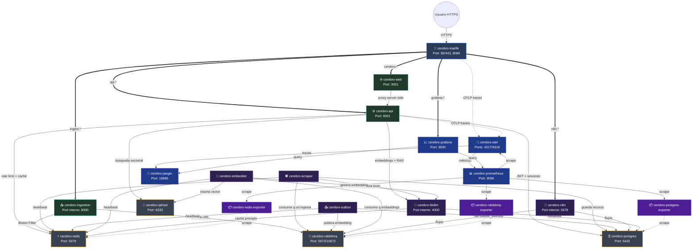

  
  

# 📋 Resumen de Contenedores y Topología de Red

El clúster del **LinkAnvil** está compuesto por **21 contenedores** que operan dentro de la red privada `cerebro-net`, más un sidecar opcional (`tailscale-funnel`, profile `telegram`) que expone públicamente el endpoint de webhooks de Telegram cuando se necesita. Se dividen en seis capas funcionales: entrada y API, interfaz web, workers asíncronos, almacenamiento, orquestación/IA y observabilidad.

Este documento es el **catálogo operativo** del sistema: puertos, imágenes, recursos y propósito en una línea por servicio. Para entender el *porqué* de cada componente, las analogías pedagógicas y los flujos completos, consulta [3_arquitectura.md](./3_arquitectura.md).

---

## Tabla de contenidos

1. [🗺️ Diagrama de Conexiones entre Contenedores](#️-diagrama-de-conexiones-entre-contenedores)
2. [🗂️ Catálogo de Contenedores](#️-catálogo-de-contenedores)
3. [📊 Resumen de Límites por Contenedor](#-resumen-de-límites-por-contenedor)

---

## 🗺️ Diagrama de Conexiones entre Contenedores

---

## 🗂️ Catálogo de Contenedores

Una fila por servicio. `RAM/CPU` indica el límite asignado en `docker-compose.yml`. Los servicios marcados como **sidecar** sólo arrancan con un profile específico.

| Contenedor | Capa | Imagen / Código | Puerto(s) | RAM / CPU | Propósito (1 línea) |
|---|---|---|---|---|---|
| `cerebro-tailscale` | Gateway (sidecar `telegram`) | `tailscale/tailscale:stable` | 443 público vía Funnel | — | Túnel HTTPS público fijo para webhook de Telegram → `ingestion-api:8000`. |
| `cerebro-traefik` | Gateway | `traefik:v3.6.14` | 80, 443, 8080 | 256 MB / 0.5 | Único punto de entrada: routing por labels Docker, rate-limit global, retries, Trace-ID OTel y TLS Let's Encrypt en producción. |
| `cerebro-ingestion` | Ingesta | `infra/ingestion.Dockerfile` · `src/ingestion/main.py` | 8000 (interno) | 512 MB / 1.0 | Recibe URLs, aplica Bloom Filter + rate-limit atómico en Redis y publica a `q.url.ingesta`. Responde `202` al instante. |
| `cerebro-api` | API | `infra/api.Dockerfile` · `src/api/main.py` | 8001 | 768 MB / 1.0 | Backend FastAPI: auth JWT (cookie httpOnly + CSRF), chat RAG con SSE, CRUD de sesiones/mensajes, integración LiteLLM + Qdrant. |
| `cerebro-web` | Frontend | `infra/frontend.Dockerfile` · `src/frontend/` | 3001 | 384 MB / 0.5 | Next.js 15 + Zustand API-backed: login, chat SSE, listado de recursos. Proxy server-side hacia `cerebro-api`. |
| `cerebro-scraper` | Worker | `src/scraper/worker.py` | — | 1.5 GB / 2.0 (shm 1 GB) | Consume `q.url.ingesta`, scrapea con Basic/Stealth Playwright, valida bloqueos, llama a LiteLLM y persiste recurso + evento Outbox. |
| `cerebro-embedder` | Worker | `src/data/embedder_worker.py` | — | 768 MB / 1.0 | Consume `q.embeddings`, genera vector vía LiteLLM e inserta en Qdrant. Copia vectores existentes en flujo `reused`. |
| `cerebro-outbox` | Worker | `src/data/outbox_publisher.py` | — | 384 MB / 0.5 | Polling de `cerebro.outbox_eventos` → publica en RabbitMQ. Garantiza consistencia eventual sin Dual-Write. |
| `cerebro-litellm` | Motor LLM | `infra/litellm/config.yaml` | 4000 (interno) | 1 GB / 1.0 | Proxy multi-proveedor con Circuit Breaker, fallback automático y caché de prompts en Redis. |
| `cerebro-n8n` | Orquestación | `n8nio/n8n` | 5678 (interno) | 768 MB / 1.0 | Orquestador visual: webhooks de Telegram, scraping ligero y curación nocturna. Usa schema `n8n`. |
| `cerebro-n8n-bootstrap` | Orquestación | one-shot | — | — | Espera a `n8n`, genera la API key inicial y la inyecta en `.env`. Se ejecuta una sola vez. |
| `cerebro-postgres` | Almacenamiento | `postgres:17-alpine` | 5432 | 2 GB / 2.0 | Base de datos relacional. Schemas: `cerebro` (LinkAnvil), `n8n` (orquestador), `public` (LiteLLM/Prisma). |
| `cerebro-redis` | Almacenamiento | `redis:7-alpine` | 6379 | 768 MB / — | Bloom Filter de dedupe, rate-limiters atómicos, heartbeats de workers y caché LiteLLM. |
| `cerebro-rabbitmq` | Mensajería | `rabbitmq:3-management` | 5672, 15672 | 768 MB / 1.0 | Broker con vhost `cerebro`. Colas `q.url.ingesta`, `q.embeddings` y DLQs asociadas. |
| `cerebro-qdrant` | Vector DB | `qdrant/qdrant` | 6333 | 2 GB / 2.0 | Vectores HNSW. Colecciones `cerebro_recursos` (doc-level) y `cerebro_chunks` (RAG), filtrado por `tenant_id` en payload. |
| `cerebro-otel` | Observabilidad | `otel/opentelemetry-collector-contrib` | 4317, 4318, 8888, 8889 | 384 MB / 0.5 | Recolector OTLP: enruta trazas a Jaeger y métricas a Prometheus. |
| `cerebro-prometheus` | Observabilidad | `prom/prometheus` | 9090 | 1 GB / 1.0 | TSDB de métricas + 6 reglas de alerta activas (latencia, colas, DLQ, heartbeats, disco). |
| `cerebro-jaeger` | Observabilidad | `jaegertracing/all-in-one` | 16686 | 384 MB / 0.5 | Distributed tracing: visualización de la cascada de spans por Trace-ID. |
| `cerebro-grafana` | Observabilidad | `grafana/grafana` | 3000 | 384 MB / 0.5 | Dashboards y alertas sobre Prometheus + Jaeger. |
| `cerebro-postgres-exporter` | Exporter | `prometheuscommunity/postgres-exporter` | 9187 (interno) | 128 MB / 0.25 | Métricas Prometheus de PostgreSQL (conexiones, locks, tamaño). |
| `cerebro-redis-exporter` | Exporter | `oliver006/redis_exporter` | 9121 (interno) | 128 MB / 0.25 | Métricas Prometheus de Redis (memoria, hit rate, clientes). |
| `cerebro-rabbitmq-exporter` | Exporter | `kbudde/rabbitmq-exporter` (pin) | 9419 (interno) | 128 MB / 0.25 | Métricas Prometheus de RabbitMQ (cola, consumers, mensajes). Versión congelada para evitar regresiones. |

---

## 📊 Resumen de Límites por Contenedor

Repartimos los recursos para que el stack quepa en una sola máquina sólida sin interferencias. Almacenamiento y scraper ocupan los tanques más grandes; exporters y observabilidad son mínimos.

| Contenedor | RAM Límite | CPU Límite | Tipo |
|---|---|---|---|
| cerebro-postgres | 2 GB | 2.0 | Almacenamiento |
| cerebro-qdrant | 2 GB | 2.0 | Vector DB |
| cerebro-scraper | 1.5 GB | 2.0 | Worker |
| cerebro-litellm | 1 GB | 1.0 | Motor LLM |
| cerebro-prometheus | 1 GB | 1.0 | Observabilidad |
| cerebro-api | 768 MB | 1.0 | API |
| cerebro-embedder | 768 MB | 1.0 | Worker |
| cerebro-rabbitmq | 768 MB | 1.0 | Mensajería |
| cerebro-n8n | 768 MB | 1.0 | Orquestación |
| cerebro-redis | 768 MB | — | Almacenamiento |
| cerebro-ingestion | 512 MB | 1.0 | API |
| cerebro-outbox | 384 MB | 0.5 | Worker |
| cerebro-web | 384 MB | 0.5 | Frontend |
| cerebro-otel | 384 MB | 0.5 | Observabilidad |
| cerebro-jaeger | 384 MB | 0.5 | Observabilidad |
| cerebro-grafana | 384 MB | 0.5 | Observabilidad |
| cerebro-traefik | 256 MB | 0.5 | Gateway |
| exporters (×3) | 128 MB c/u | 0.25 c/u | Exporters |

---

> Para decisiones de diseño, flujos de secuencia (ingesta, chat RAG, auth, curación nocturna), patrón Outbox, dual-DB Postgres+Qdrant, aislamiento de schema, migraciones, heartbeat y backup, consulta **[3_arquitectura.md](./3_arquitectura.md)**.
