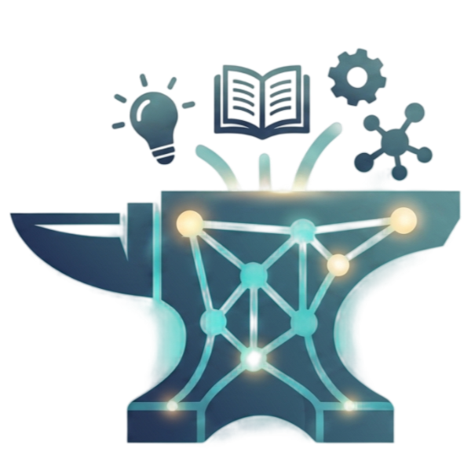
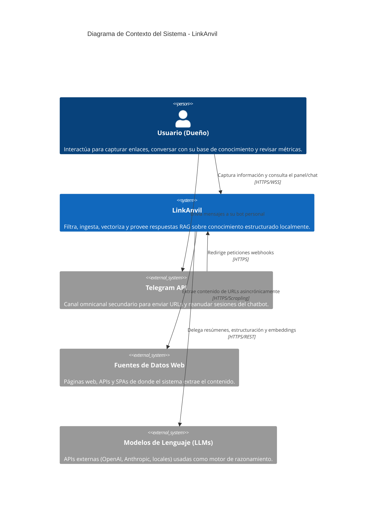
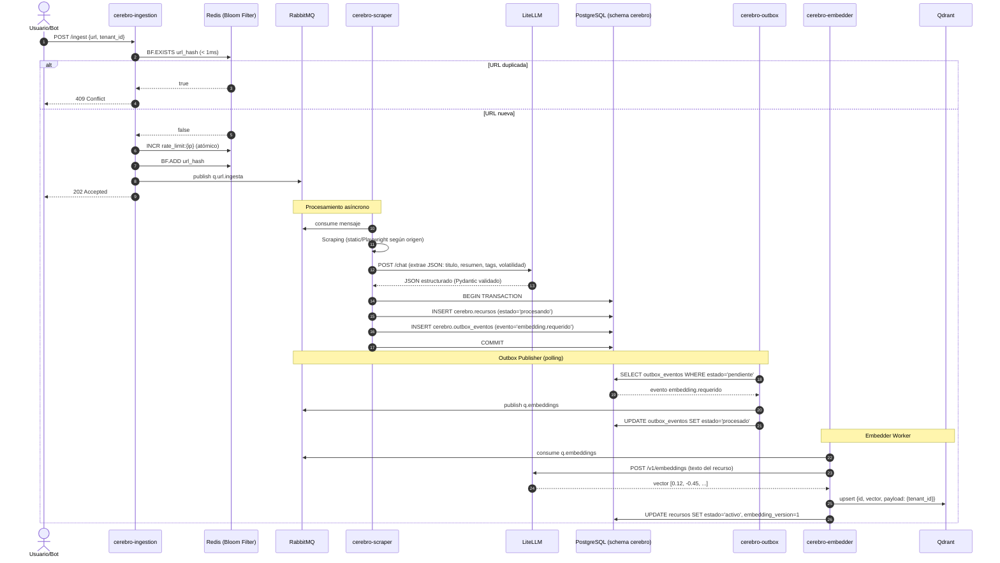
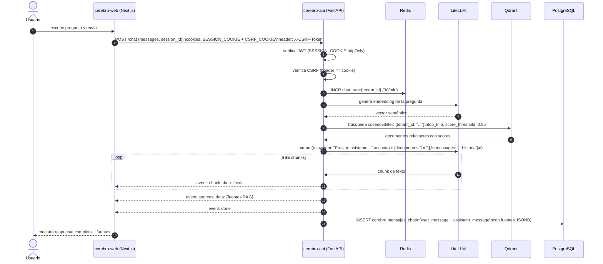
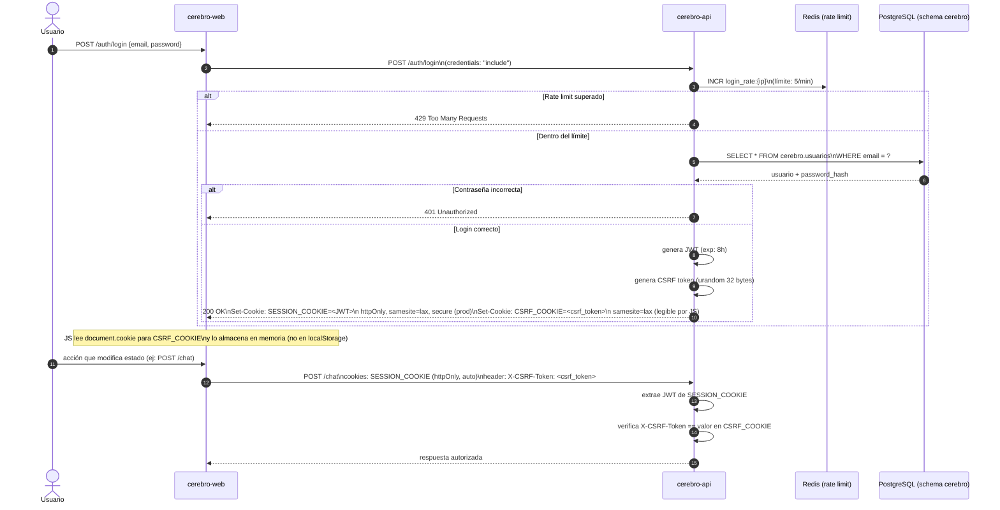
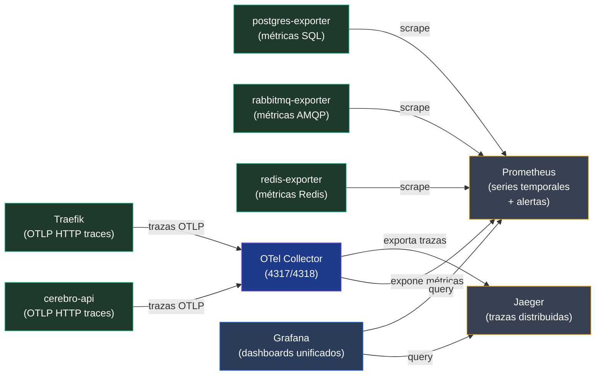

  
  

# 🖼️ Documentación Visual y Diagramas C4 — LinkAnvil

Este documento provee la notación visual técnica bajo el estándar C4 Model, detallando la interacción de contenedores y el flujo distribuido de la arquitectura event-driven.

---

## Nivel 1: Diagrama de Contexto

> Muestra cómo LinkAnvil encaja en el ecosistema, las interacciones con el usuario humano y los sistemas externos.

---

## Nivel 2: Diagrama de Contenedores

> Detalla las piezas principales del software dentro de la red aislada `cerebro-net` y sus responsabilidades.

```mermaid
C4Container
    title Arquitectura Interna — 21 contenedores en cerebro-net

    Person(usuario, "Usuario")
    System_Ext(telegram, "Telegram Bot")
    System_Ext(llms, "LLM Providers")

    Container_Boundary(cerebro_net, "Red Virtual Segura (cerebro-net)") {

        Container(traefik, "API Gateway", "Traefik v3.6", "Único punto de entrada. Rate limiting, enrutamiento dinámico, Trace-ID OTel, TLS en producción.")

        Container(ingestion, "Ingestion API", "FastAPI · redis.asyncio", "Recibe URLs, Bloom Filter deduplicación, rate limiter INCR atómico, publica a RabbitMQ.")
        Container(api, "cerebro-api", "FastAPI · asyncpg", "Auth JWT httpOnly cookie + CSRF, chat RAG SSE, CRUD sesiones/mensajes, paginación.")
        Container(web, "cerebro-web", "Next.js 15 · Zustand", "UI chat, historial, panel de recursos. Store API-backed (sin localStorage).")

        Container(scraper, "cerebro-scraper", "Python · Playwright", "Consume q.url.ingesta. Scrapling/Chromium headless. Heartbeat Redis.")
        Container(embedder, "cerebro-embedder", "Python · httpx pool", "Consume q.embeddings. Genera vectores vía LiteLLM, inserta en Qdrant. Heartbeat Redis.")
        Container(outbox, "cerebro-outbox", "Python", "Polling outbox_eventos Postgres → publica en RabbitMQ. Garantiza consistencia eventual.")

        Container(litellm, "LiteLLM Gateway", "LiteLLM", "Proxy multi-proveedor. Circuit Breaker, Fallback, caché Redis de prompts.")
        Container(n8n, "n8n Orquestador", "n8n", "Workflows visuales: scraping ligero, Telegram, curación nocturna.")

        ContainerDb(postgres, "PostgreSQL", "postgres:16-alpine", "Schema cerebro (aislado de Prisma LiteLLM): recursos, sesiones_chat, mensajes_chat, outbox_eventos, usuarios, relaciones.")
        ContainerDb(redis, "Redis Stack", "redis-stack-server", "Bloom Filter, rate limiting, heartbeat workers, caché LiteLLM.")
        ContainerDb(rabbitmq, "RabbitMQ", "rabbitmq:3.13", "Colas: q.url.ingesta, q.embeddings. DLQ: q.embeddings.fallidos.")
        ContainerDb(qdrant, "Qdrant", "qdrant:v1.17.1", "Almacena y busca embeddings por similitud coseno, filtrado por tenant_id.")
    }

    Rel(usuario, traefik, "HTTPS", "80/443")
    Rel(telegram, traefik, "Webhooks", "HTTPS")

    Rel(traefik, ingestion, "ingest.*")
    Rel(traefik, api, "api.*")
    Rel(traefik, web, "cerebro.*")
    Rel(traefik, n8n, "n8n.*")

    Rel(web, api, "proxy server-side", "HTTP")
    Rel(api, postgres, "auth, sesiones, mensajes", "asyncpg")
    Rel(api, redis, "rate limiting, caché", "redis.asyncio")
    Rel(api, litellm, "embeddings + chat stream", "httpx")
    Rel(api, qdrant, "búsqueda vectorial RAG", "httpx")

    Rel(ingestion, redis, "Bloom Filter + rate limit", "redis.asyncio")
    Rel(ingestion, rabbitmq, "publica q.url.ingesta", "AMQP")

    Rel(scraper, rabbitmq, "consume q.url.ingesta", "AMQP")
    Rel(scraper, litellm, "analiza texto", "httpx")
    Rel(scraper, postgres, "INSERT recursos + outbox", "asyncpg")
    Rel(scraper, redis, "heartbeat TTL", "redis")

    Rel(outbox, postgres, "lee outbox_eventos", "asyncpg")
    Rel(outbox, rabbitmq, "publica q.embeddings", "AMQP")

    Rel(embedder, rabbitmq, "consume q.embeddings", "AMQP")
    Rel(embedder, litellm, "genera embedding", "httpx")
    Rel(embedder, qdrant, "upsert vector + tenant_id", "httpx")

    Rel(litellm, llms, "Fallback autorizado", "HTTPS")
    Rel(litellm, redis, "caché de prompts", "redis")
```

---

## Diagrama de Flujo: Ingesta Asíncrona

> Flujo completo desde que el usuario envía una URL hasta que queda vectorizada en Qdrant.

---

## Diagrama de Flujo: Chat RAG con SSE Streaming

> Cómo el usuario obtiene respuestas fundamentadas en su base de conocimiento personal.

---

## Diagrama de Flujo: Autenticación con Cookie httpOnly

> El modelo de seguridad completo para el navegador: por qué no se usa localStorage.

---

## Diagrama de Flujo: Pipeline de Observabilidad

> Cómo fluye la telemetría desde los servicios hasta Grafana.

