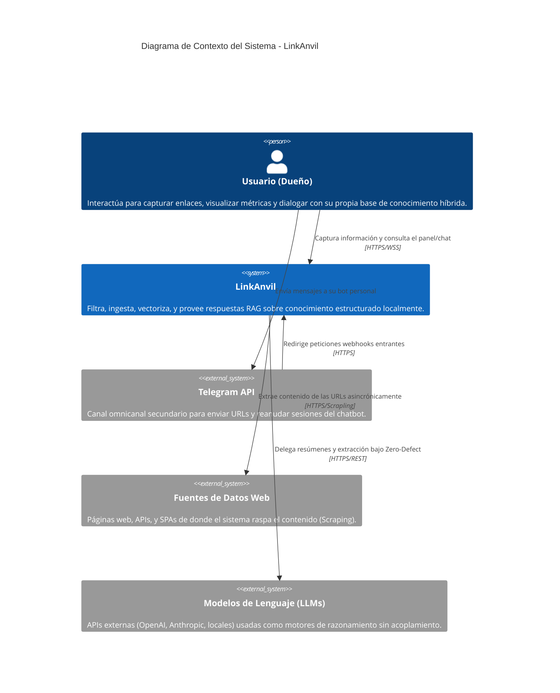
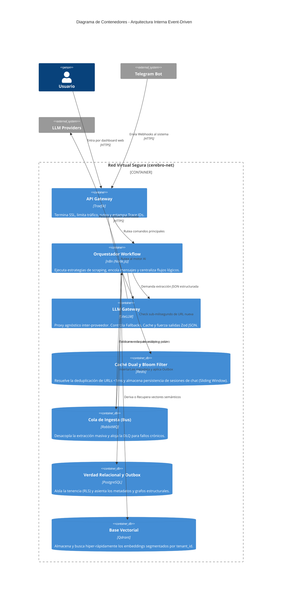
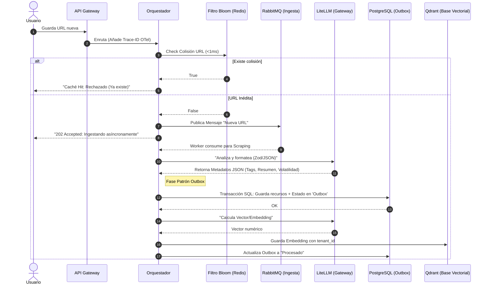

# 🖼️ Documentación Visual y Diagramas C4 — LinkAnvil

Este documento provee la notación visual técnica bajo el estándar C4 Model, detallando la interacción de contenedores y el flujo distribuido de la arquitectura tolerante a fallos.

---

## Nivel 1: Diagrama de Contexto (Context Diagram)
>
> Muestra cómo el LinkAnvil encaja en el ecosistema superior, las interacciones con el usuario humano y sistemas de terceros.

---

## Nivel 2: Diagrama de Contenedores (Container Diagram)
>
> Detalla las piezas principales del software dentro de la red aislada `cerebro-net` y sus responsabilidades (El Recolector, El Analista, La Memoria, etc.).

---

## Diagrama de Flujo: Ingesta Asíncrona (Dual-Write Prevention)
>
> Detalle del patrón Outbox para la indexación cruzada y resiliente de datos provenientes del orquestador.

---

## Diagrama de Flujo: Exportaci�n de B�veda Obsidian (Vault.zip)
>
> Detalle del proceso de exportaci�n estructurada en formato ZIP con enlaces bidireccionales y cach� din�mico (hot.md).

`mermaid
sequenceDiagram
    autonumber
    actor Usuario
    participant Traefik as API Gateway
    participant Exporter as VaultExporter
    participant PG as PostgreSQL
    participant Mem as Memoria (ZIP)

    Usuario->>Traefik: GET /export/vault
    Traefik->>Exporter: Inicia generaci�n
    
    Exporter->>PG: Extrae Nodos, Aristas e Historial
    PG-->>Exporter: SQL Relacional (filtrado por tenant_id)
    
    Exporter->>Mem: Escribe raw/ y CLAUDE.md
    Exporter->>Mem: Escribe wiki/hot.md (Cach� RAG)
    
    loop Translaci�n de Grafo
        Exporter->>Exporter: Convierte aristas en enlaces [[Obsidian]]
        Exporter->>Mem: Escribe notas en wiki/
    end
    
    Exporter-->>Traefik: vault.zip (stream)
    Traefik-->>Usuario: Descarga ZIP Local
`
"@

Add-Content -Path "docs/src/2_architecture_risks.md" -Value @"

---

## 4. ADR-004: Offline-First LLM Wiki Export (Markdown/Obsidian)

**Contexto**: El usuario necesita acceso a su base de conocimiento incluso si la infraestructura Docker est� apagada.
**Decisión**: Un motor de exportación dinámico y seguro que traduce la base relacional/vectorial a archivos Markdown anidados (`raw/`, `wiki/`) compatibles nativamente con Obsidian, rellenando los YAML Frontmatter con el rastro del LLM y traduciendo aristas a enlaces `[[bidireccionales]]`. Todo el empaquetado del archivo `.zip` se realiza **completamente en memoria RAM** y se envía en streaming directo (on-the-fly) al navegador del usuario. No se crea ningún estado intermedio, carpeta temporal, ni archivo remanente en el almacenamiento de disco de nuestro servidor maestro, sellando completamente la privacidad multi-tenant.
**Consecuencias**: Permite control soberano total de la informaci�n (Cero Vendor-Lock In) pero requiere tareas peri�dicas de exportaci�n delta para actualizar la b�veda.
