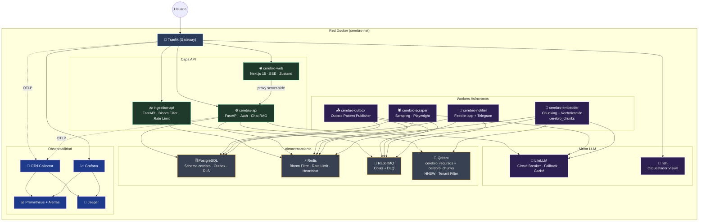
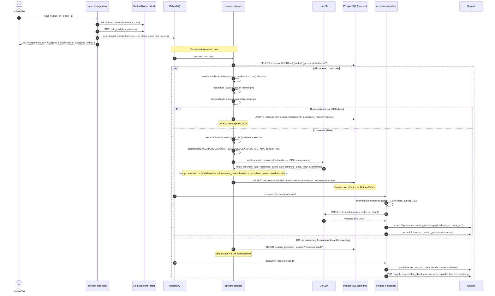
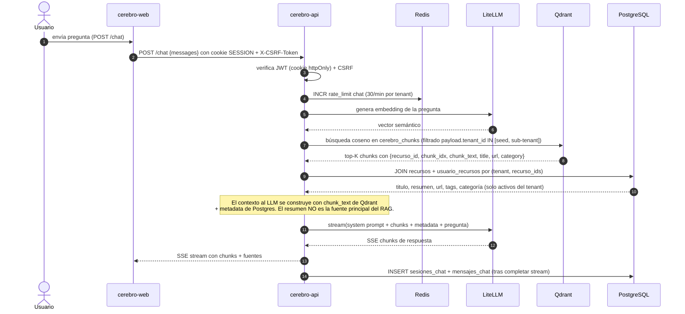
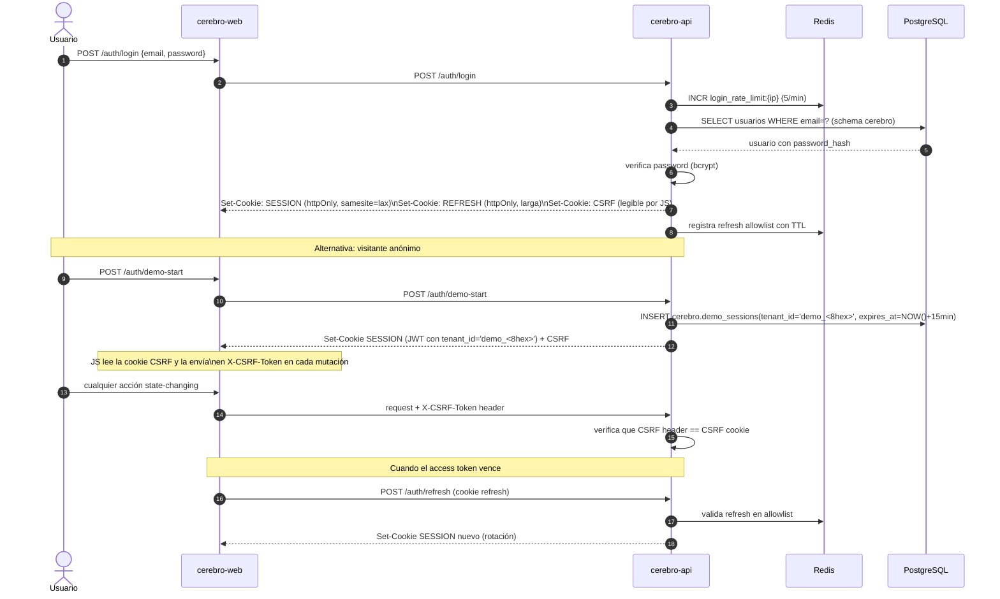
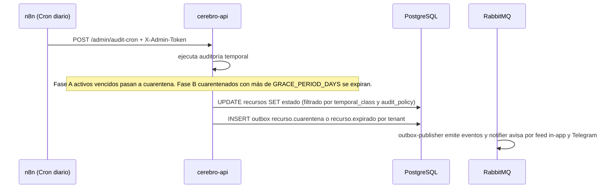
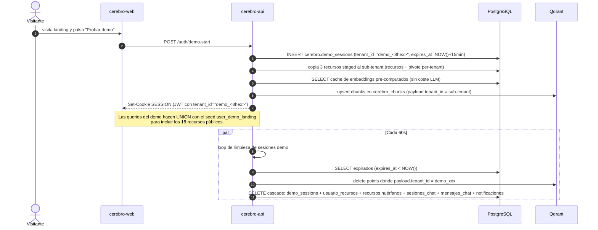

<div align="center">
  
  


# 🏗️ Arquitectura e Infraestructura — LinkAnvil

</div>


Este documento detalla la infraestructura del proyecto **LinkAnvil** basada en Docker Compose: la topología de red, los flujos de trabajo end-to-end (ingesta, RAG, autenticación, curación), la estrategia de persistencia dual (Postgres + Qdrant), la seguridad, el aislamiento de schemas, las migraciones, el liveness de workers, la observabilidad y el backup.

- Para una referencia rápida con puertos, imágenes y límites de recursos consulta el [catálogo de contenedores](./2_resumen_servicios.md).
- Para la descripción narrativa de cada servicio con analogías pedagógicas consulta [`3_componentes.md`](./3_componentes.md).

---

## Tabla de contenidos

1. [Topología del Sistema](#1-topología-del-sistema)
2. [Flujos de Trabajo Principales](#2-flujos-de-trabajo-principales)
   - 2.1 [Ingesta Asíncrona](#21-ingesta-asíncrona)
   - 2.2 [Chat RAG con SSE Streaming](#22-chat-rag-con-sse-streaming)
   - 2.3 [Autenticación](#23-autenticación)
   - 2.4 [Curación Nocturna (sin coste LLM extra)](#24-curación-nocturna-sin-coste-llm-extra)
   - 2.5 [Demo Session Bootstrap](#25-demo-session-bootstrap)
3. [Estrategia de Persistencia](#3-estrategia-de-persistencia)
   - 3.1 [Patrón de Doble Base de Datos (Cerebro Lógico vs Semántico)](#31-patrón-de-doble-base-de-datos-cerebro-lógico-vs-semántico)
   - 3.2 [Persistencia de Sesiones de Chat](#32-persistencia-de-sesiones-de-chat)
   - 3.3 [Volúmenes Docker](#33-volúmenes-docker)
4. [Seguridad y Autenticación](#4-seguridad-y-autenticación)
   - 4.1 [httpOnly Cookie + CSRF Doble Submit](#41-httponly-cookie--csrf-doble-submit)
   - 4.2 [Rate Limiting Atómico](#42-rate-limiting-atómico)
   - 4.3 [Contenedores Non-Root](#43-contenedores-non-root)
   - 4.4 [Overlay de Producción](#44-overlay-de-producción)
   - 4.5 [Endpoints de Autenticación](#45-endpoints-de-autenticación)
5. [Aislamiento de Schema en PostgreSQL](#5-aislamiento-de-schema-en-postgresql)
6. [Gestión de Migraciones de Schema](#6-gestión-de-migraciones-de-schema)
7. [Liveness de Workers con Heartbeat Redis](#7-liveness-de-workers-con-heartbeat-redis)
8. [Observabilidad Integral](#8-observabilidad-integral)
9. [Backup Automático](#9-backup-automático)

---

## 1. Topología del Sistema

Todos los servicios corren dentro de la red Docker privada `cerebro-net`. Las peticiones externas entran exclusivamente por **Traefik** en el puerto 80/443. Los servicios internos no exponen puertos al host salvo en desarrollo.



---

## 2. Flujos de Trabajo Principales

### 2.1 Ingesta Asíncrona



> **Nota sobre la deduplicación**: la Ingestion API publica al queue **incluso cuando el bloom filter dice "duplicado"**. El bloom es un hint de Redis que puede divergir del estado real de Postgres (por ejemplo, tras un reset de BD) — confiar solo en él provocaría que la URL nunca llegue al worker y la asociación per-tenant nunca se cree. La idempotencia se resuelve en el scraper: si el recurso global existe y está fresco, solo se inserta el link en la tabla pivote y el embedder copia los chunks existentes sin re-embedding.

### 2.2 Chat RAG con SSE Streaming



> **Sobre las dos colecciones de Qdrant**: el endpoint `/chat` consulta exclusivamente `cerebro_chunks`. La colección `cerebro_recursos` mantiene el vector del resumen (un punto por `(recurso, tenant)`) y se usa en flujos legacy y en el delete cascade al borrar un recurso.

### 2.3 Autenticación



Ver §4.5 para el detalle de cada endpoint y la validación adicional que se aplica sobre las sesiones demo.

### 2.4 Curación Nocturna (sin coste LLM extra)



La auditoría temporal vive en la API y se autentica con el token `AUDIT_CRON_TOKEN`. n8n actúa **solo como disparador HTTP** del endpoint `/admin/audit-cron` — no ejecuta SQL directo. El cron considera la clasificación temporal del recurso, su valor archivístico y la `audit_policy` JSONB del tenant. El motivo `evento_pasado` se decide al ingestar (introducido por la migración 0006), no aquí.

### 2.5 Demo Session Bootstrap

Cada visitante anónimo recibe un sub-tenant aislado con TTL de 15 minutos. Flujo:



Las tablas y columnas que soportan este flujo se introdujeron en las migraciones 0009 (`cerebro.demo_sessions`) y 0011 (cache de embeddings staged).

---

## 3. Estrategia de Persistencia

### 3.1 Patrón de Doble Base de Datos (Cerebro Lógico vs Semántico)

LinkAnvil usa intencionalmente dos sistemas de persistencia complementarios:

**PostgreSQL — Cerebro Lógico y Transaccional:**
- Fuente única de verdad estructurada: URLs, metadatos, relaciones, histórico.
- Garantías ACID: ningún dato se pierde ni queda en estado inconsistente.
- **Modelo recurso global + pivote per-tenant:** la tabla `recursos` es global (deduplicada por `url_hash`); la asociación usuario↔recurso vive en `usuario_recursos(tenant_id, recurso_id)`. La RLS se activa con `FORCE ROW LEVEL SECURITY` en **cinco tablas**: `usuario_recursos`, `sesiones_chat`, `mensajes_chat`, `grafo_relaciones`, `outbox_eventos`. Todas comparten la policy `tenant_isolation` que lee `current_setting('app.tenant_id')`, fijado por la app con `SET LOCAL` antes de cada query crítica.
- Si dos usuarios suben la misma URL, el contenido se procesa una vez y se reusa; cada uno mantiene su propia entrada en la pivote.
- Patrón Outbox para consistencia eventual de eventos asíncronos.

**Qdrant — Cerebro Semántico e Intuitivo:**
- Almacena exclusivamente vectores (embeddings) de alta dimensionalidad.
- Búsquedas por similitud coseno (HNSW) en milisegundos.
- Encuentra recursos "semánticamente afines" aunque no compartan palabras exactas.
- **Dos colecciones**:
  - `cerebro_recursos` — UN punto por `(recurso_id, tenant_id)` con el **resumen** (vector del título + resumen). Usado por flujos legacy y por el delete cascade.
  - `cerebro_chunks` — **N puntos por recurso**, uno por chunk del contenido (~1200 caracteres con overlap de 150). Es la colección que consulta el `/chat` para RAG. El payload de cada punto incluye `chunk_text` además de `tenant_id`, `recurso_id`, `title`, `url`, `category`.
- Cuando un segundo tenant reusa una URL, sus chunks se crean **copiando los vectores existentes** del primero (sin re-embedding): el embedder hace `scroll filter recurso_id` y reinyecta cambiando solo `payload.tenant_id`.

Esta arquitectura de doble cerebro permite RAG avanzado: la intuición difusa de la IA (Qdrant) protegida por la seguridad transaccional del motor relacional (Postgres).

### 3.2 Persistencia de Sesiones de Chat

Las sesiones y mensajes de chat se persisten en Postgres en las tablas `sesiones_chat` y `mensajes_chat`, no en `localStorage` del navegador. Esto garantiza que resetear el stack Docker completo (incluyendo volúmenes) limpia el historial igual que cualquier otro dato persistente, y que el store del frontend siempre obtiene los mensajes desde la API.

Ambas tablas tienen RLS forzada con la policy `tenant_isolation`, de modo que un sub-tenant demo solo ve sus propias filas. El cleanup del demo borra en cascada las filas asociadas al sub-tenant junto con sus puntos en Qdrant.

La columna `seq BIGSERIAL` en `mensajes_chat` garantiza orden determinista de los mensajes dentro de un mismo timestamp (cuando se insertan varios mensajes en la misma transacción).

### 3.3 Volúmenes Docker

Los datos persistentes usan volúmenes Docker gestionados:

- `postgres-data` — base de datos relacional (crítico: incluido en backup)
- `qdrant-data` — vectores (crítico: incluido en backup)
- `redis-data` — caché y estado de sesión Redis
- `n8n-data` — workflows y credenciales de n8n
- `prometheus-data` — series temporales de métricas
- `grafana-data` — dashboards y configuración
- `playwright-profile` — perfil de Chromium para sesiones autenticadas

---

## 4. Seguridad y Autenticación

### 4.1 httpOnly Cookie + CSRF Doble Submit

**Problema previo:** el JWT de sesión se almacenaba en `localStorage`. Cualquier vulnerabilidad XSS en el frontend podía leer el token y suplantar al usuario indefinidamente.

**Solución implementada:** dos cookies en respuesta al login:

- `SESSION_COOKIE` — JWT firmado con `httponly=True, samesite="lax"`. JavaScript no puede leerla. El servidor la valida en cada request.
- `CSRF_COOKIE` — token CSRF aleatorio sin `httponly`. JavaScript lo lee y lo envía en el header `X-CSRF-Token` en cada request que modifica estado (POST, PUT, DELETE). La API verifica que header == cookie.

Adicionalmente, el login emite un `REFRESH_COOKIE` httpOnly de mayor duración que se canjea contra `/auth/refresh` (ver §4.5).

**Ventaja del doble submit:** no requiere sesión server-side ni tabla de tokens CSRF. El servidor solo compara los dos valores que llegan en el mismo request — un atacante externo no puede leer la cookie CSRF desde otro dominio (Same-Origin Policy).

**Bearer fallback:** si no hay cookie `SESSION_COOKIE`, la API acepta `Authorization: Bearer <token>`. Esto permite que bots de Telegram y scripts externos sigan funcionando en casos de uso machine-to-machine.

### 4.2 Rate Limiting Atómico

Todos los rate limiters usan el patrón Redis INCR+EXPIRE:

```
count = INCR key
if count == 1: EXPIRE key window_seconds
if count > limit: 429 Too Many Requests
```

**Por qué este patrón:** una variante con `GET` seguido de `INCR` introduce una race condition (TOCTOU): dos requests simultáneos pueden ambos pasar el check de `GET` y luego ambos ejecutar `INCR`, omitiendo el límite. `INCR+EXPIRE` es atómico: una sola operación incrementa y la comparación se hace sobre el resultado.

**Límites configurados:**

- `/auth/login`: 5 requests/minuto por IP
- `/auth/register`: 3 requests/hora por IP
- `/chat`: 30 requests/minuto por tenant

### 4.3 Contenedores Non-Root

Todos los servicios con código propio (`cerebro-api`, `cerebro-ingestion`, `cerebro-scraper`, `cerebro-embedder`, `cerebro-outbox`, `cerebro-notifier`) corren con usuario `cerebro` (uid 1000) en lugar de root. El frontend corre con usuario `node` (uid 1000 en la imagen Node.js).

**Por qué:** si un atacante logra ejecutar código en el contenedor (vía inyección en el scraper o un RCE en una dependencia), el proceso no tiene privilegios de root y no puede modificar el filesystem del host, escalar privilegios, ni acceder a sockets del sistema.

**Caso especial — Playwright:** Chromium requiere acceso a su caché de binarios. Como el usuario es `cerebro` y no root, los binarios se instalan en el home del usuario correcto:

- `PLAYWRIGHT_BROWSERS_PATH=/home/cerebro/.cache/ms-playwright`
- El directorio `/data` se entrega al usuario `cerebro` en la imagen.

### 4.4 Overlay de Producción

El archivo `docker-compose.prod.yml` es un overlay que extiende `docker-compose.yml` para producción. Activa:

- **TLS automático** con Let's Encrypt vía Traefik `certResolver`.
- **Redirección HTTP→HTTPS** en todos los routers.
- **Puertos internos cerrados**: servicios como Postgres (5432), Redis (6379), RabbitMQ (5672) no exponen ports al host — solo accesibles dentro de `cerebro-net`.
- **Docker secrets**: variables `POSTGRES_PASSWORD_FILE`, `JWT_SECRET_FILE`, `LITELLM_KEY_FILE`, `LITELLM_MASTER_KEY_FILE`, etc. leen secretos de `/run/secrets/<nombre>` en lugar de variables de entorno.

Para desplegar en producción:

```bash
docker compose -f docker-compose.yml -f docker-compose.prod.yml up -d
```

Documentación completa en `docs/PRODUCTION.md`.

### 4.5 Endpoints de Autenticación

La API expone seis endpoints bajo `/auth/*`:

| Endpoint | Función | Notas |
|---|---|---|
| `POST /auth/register` | Alta de usuario registered | Email + password (bcrypt). Crea `tenant_id` UUID real. |
| `POST /auth/login` | Login | Set-Cookie SESSION + REFRESH + CSRF. |
| `POST /auth/demo-start` | Visita demo anónima | Crea sub-tenant `demo_<8hex>` con TTL 15 min en `cerebro.demo_sessions`. JWT emitido con ese sub-tenant. |
| `POST /auth/refresh` | Renueva access token | Lee refresh cookie, valida contra allowlist en Redis y rota el token. |
| `POST /auth/logout` | Logout | Borra refresh allowlist + clear cookies. |
| `GET /auth/me` | Perfil + estado demo | Devuelve `tenant_id`, `audit_policy`, `demo_session_seconds_remaining` si aplica. |

El middleware de autenticación valida adicionalmente las sesiones demo contra `cerebro.demo_sessions`: si la fila no existe o `expires_at <= NOW()`, responde 401 con `X-Auth-Reason: demo_invalid` o `demo_expired`. Esto cierra el agujero de un JWT demo todavía válido criptográficamente cuyo TTL en BD ya expiró.

---

## 5. Aislamiento de Schema en PostgreSQL

### El Problema con LiteLLM y Prisma

LiteLLM usa el ORM Prisma internamente para gestionar sus tablas. En cada arranque, Prisma ejecuta una migración de tipo `schema_sync` que elimina del schema `public` cualquier tabla que no reconozca como propia. Cuando las tablas de LinkAnvil estaban en `public`, **cada restart de LiteLLM las destruía**.

### La Solución: Schema `cerebro`

Todas las tablas de LinkAnvil residen en el schema `cerebro`:

```sql
CREATE SCHEMA IF NOT EXISTS cerebro;
SET search_path TO cerebro, public;

CREATE TABLE IF NOT EXISTS recursos (...);          -- global, sin tenant_id
CREATE TABLE IF NOT EXISTS usuario_recursos (...);  -- pivote per-tenant con RLS
CREATE TABLE IF NOT EXISTS sesiones_chat (...);
-- etc.
```

El pool de conexiones asyncpg de `cerebro-api` corre un callback una vez por conexión que:

1. Fija el `search_path` a `cerebro, public`.
2. Registra el codec JSONB para que asyncpg serialice/deserialice automáticamente los campos JSONB (`audit_policy`, `payload`, etc.).

Prisma solo opera en `public` y nunca toca `cerebro`. n8n usa el schema `n8n` (configurable con `DB_POSTGRESDB_SCHEMA: n8n`).

**Resultado:** los tres sistemas coexisten en la misma instancia Postgres sin interferir:

- `public` → tablas de LiteLLM/Prisma (efímeras, se recrean en cada start)
- `cerebro` → tablas de LinkAnvil (persistentes, gestionadas por el runner de migraciones)
- `n8n` → tablas del orquestador (persistentes, gestionadas por n8n)

---

## 6. Gestión de Migraciones de Schema

### Runner Shell Puro

LinkAnvil usa un runner de migraciones escrito en Bash (`scripts/migrate.sh`) que invoca `psql` directamente, sin dependencias Python adicionales.

**Por qué sin Alembic:** `psql` ya está disponible en la imagen `postgres:16-alpine` que usamos para el contenedor one-shot `db-migrate`. Añadir Alembic requeriría una imagen Python separada o añadir Python a la imagen Postgres, aumentando complejidad y tamaño de imagen sin ventaja real para el volumen de migraciones previsto.

**Funcionamiento:**

1. Crea `cerebro.schema_migrations(version INTEGER, applied_at TIMESTAMPTZ)` si no existe.
2. Lee todos los archivos `infra/postgres/migrations/NNNN_*.sql` ordenados numéricamente.
3. Para cada archivo, extrae el número de versión y verifica si ya está en `schema_migrations`.
4. Si no está, lo ejecuta en una transacción y registra la versión.

**Idempotencia:** la segunda ejecución detecta que todas las versiones ya están registradas y sale con `"schema is up to date"`. Seguro de ejecutar en CI o en cada deploy.

**Detalle:** los nombres de archivo usan `0001`, `0002`, etc. Para evitar que Bash interprete los ceros iniciales como octal en operaciones aritméticas, el runner fuerza base 10 al parsear el número de versión.

Para aplicar migraciones pendientes:

```bash
bash scripts/migrate.sh
```

**Migraciones aplicadas (a la fecha):**

| Versión | Propósito |
|---|---|
| 0001 | Baseline: schema `cerebro` + tablas core (`recursos`, `usuario_recursos`, `sesiones_chat`, `mensajes_chat`, `outbox_eventos`, `grafo_relaciones`) + RLS forzada en cinco tablas |
| 0002 | Migración de `recursos` a modelo global (sin `tenant_id`) + pivote `usuario_recursos` |
| 0003 | Campos de caducidad y estado de obsolescencia |
| 0004 | Tabla `notificaciones` para feed in-app + Telegram |
| 0005 | Columna `contenido` para el cuerpo scrapeado |
| 0006 | `temporal_class` y motivos `evento_pasado` decididos al ingestar |
| 0007 | `audit_policy` JSONB por tenant + auto-archive |
| 0008 | BYOK keys cifradas + flag `is_demo` |
| 0009 | Tabla `cerebro.demo_sessions` para sub-tenants efímeros |
| 0010 | Eventos del ciclo de vida del demo (telemetría) |
| 0011 | Cache de embeddings pre-computados para los recursos staged del demo |

---

## 7. Liveness de Workers con Heartbeat Redis

### El Problema con Healthchecks Tradicionales

Un worker que se queda bloqueado esperando una conexión de base de datos o procesando un mensaje muy grande seguirá respondiendo al `docker ps` como "running" aunque no esté procesando trabajo nuevo. El healthcheck de Docker basado en comandos de proceso no detecta esta condición.

### Solución: Heartbeat Redis + TTL

Cada worker (`cerebro-scraper`, `cerebro-embedder`, `cerebro-outbox`, `cerebro-notifier`) ejecuta una tarea en background que periódicamente escribe una clave en Redis con TTL:

```
SET worker:<name>:heartbeat 1 EX 45
```

El healthcheck de Docker del worker lee esa clave y falla si no existe. Si el worker se bloquea y deja de escribir el heartbeat, la clave expira en 45 segundos. En el siguiente check de Docker (intervalo 30s), la clave no existe y el healthcheck falla. Docker marca el contenedor como `unhealthy` y puede reiniciarlo según la política `restart: unless-stopped`.

**Ventaja:** detecta workers zombi (proceso vivo pero no procesando) con un mecanismo mínimo que no requiere exponer un puerto HTTP adicional.

---

## 8. Observabilidad Integral

### Distributed Tracing

Cada petición entrante genera un `Trace-ID` único en Traefik que se propaga mediante headers OpenTelemetry a través de todos los servicios. El OTel Collector recibe las trazas y las envía a Jaeger, donde se puede visualizar el recorrido completo de una URL desde la ingesta hasta la inserción en Qdrant.

La configuración del colector usa la estructura `service.telemetry.metrics.readers[].pull.exporter.prometheus` (host `0.0.0.0`, port `8888`) vigente en versiones recientes del OTel Collector.

### Logging Estructurado JSON

Todos los servicios Python emiten logs en JSON:

- Cada log es un objeto JSON con campos estándar: `timestamp`, `level`, `service`, `message`.
- Los campos `extra={}` pasados al logger se promueven al nivel raíz del JSON (no anidados).
- `LOG_LEVEL` es configurable por variable de entorno (default `INFO`).

Esto permite que herramientas como Loki (Grafana) o cualquier agregador de logs indexen los campos del log sin parsear strings.

### Alertas Prometheus

Las reglas activas (9) disparan notificaciones en Grafana cuando:

- `HighLLMLatency` — latencia promedio LiteLLM > 20s sostenida 2 min.
- `DLQ_Filling_Up` — `dlq.url.fallidas` > 10 mensajes en 5 min.
- `HighErrorRateIngestion` — errores 5xx en API/Traefik > 5% sostenidos 2 min.
- `APIHighP99Latency` — p99 de cerebro-api > 2s sostenida 5 min.
- `IngestionQueueBacklog` — `q.url.ingesta` > 1000 mensajes durante 10 min.
- `EmbeddingsDLQAny` — cualquier mensaje en `q.embeddings.fallidos` durante 1 min.
- `PostgresConnectionsHigh` — conexiones > 160 (80% de `max_connections=200`) sostenidas 5 min.
- `WorkerStuck` — un worker no responde al scraping de métricas durante 3 min.
- `VolumeDiskHigh` — volumen `postgres-data` o `qdrant-data` > 80% lleno durante 10 min.

---

## 9. Backup Automático

El script `scripts/backup.sh` genera backups de los dos almacenamientos críticos:

**PostgreSQL:**

```bash
pg_dump --schema=cerebro | gzip > backup_postgres_YYYYMMDD_HHMMSS.sql.gz
```

**Qdrant:**

```bash
curl -X POST "http://qdrant:6333/collections/{collection}/snapshots"
```

Los backups se guardan en `$BACKUP_DIR` (configurable) y se eliminan los que superan `BACKUP_RETENTION_DAYS` días. El script puede ejecutarse manualmente o programarse como cron job en el host.
