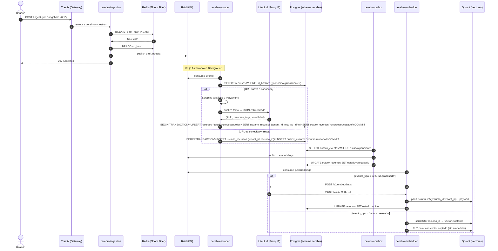

  
  

# 🌊 Ejemplo Completo de Flujo: Ingestión, Relaciones y Obsolescencia

Para ilustrar cómo los 21 contenedores del **LinkAnvil** interactúan en tiempo real, presentaremos un escenario de uso diario.

**El Escenario:**
Un desarrollador interactúa con el sistema para guardar documentación sobre un framework de Inteligencia Artificial ("LangChain"). El usuario realizará tres acciones cronológicas:

1. Añadir la documentación original (LangChain v0.1).
2. Añadir un tutorial relacionado con esa documentación.
3. Añadir la nueva versión de la documentación (LangChain v0.2), que hace obsoleta a la v0.1.

A lo largo de este viaje, veremos el flujo síncrono (respuesta inmediata al usuario), el flujo asíncrono (procesamiento de fondo) y cómo actúa la observabilidad pasiva.

---

## Tabla de contenidos

1. [🟢 Fase 1: El Primer Enlace (Ingestión y Creación)](#-fase-1-el-primer-enlace-ingestión-y-creación)
   - 1.1 [Recepción y Encolado (Milisegundos)](#1-recepción-y-encolado-milisegundos)
   - 1.2 [Procesamiento Asíncrono (Segundos)](#2-procesamiento-asíncrono-segundos)
   - 1.3 [Almacenamiento (Estado y Vectores — Patrón Outbox)](#3-almacenamiento-estado-y-vectores--patrón-outbox)
   - 1.b [Reuso cross-tenant (URL ya conocida globalmente)](#1b-reuso-cross-tenant-url-ya-conocida-globalmente)
2. [🟡 Fase 2: Añadir Enlaces Relacionados (Grafo de Conocimiento)](#-fase-2-añadir-enlaces-relacionados-grafo-de-conocimiento)
3. [🔴 Fase 3: Obsolescencia y Deprecación](#-fase-3-obsolescencia-y-deprecación)
   - 3.a [Camino temporal — el cron nocturno (caso más común)](#3a-camino-temporal--el-cron-nocturno-caso-más-común)
   - 3.b [Camino semántico — el reemplazo por contenido más reciente](#3b-camino-semántico--el-reemplazo-por-contenido-más-reciente)
   - 3.c [Y luego — el usuario decide](#3c-y-luego--el-usuario-decide)
4. [👁️ Fase 4: Observabilidad Silenciosa (Todo lo que el usuario no vio)](#️-fase-4-observabilidad-silenciosa-todo-lo-que-el-usuario-no-vio)
   - [Trazabilidad de las Peticiones (Tracing)](#trazabilidad-de-las-peticiones-tracing)
   - [Monitorización Médica (Metrics)](#monitorización-médica-metrics)
   - [El Exportador Físico (Gemelo Markdown)](#el-exportador-físico-gemelo-markdown)

---

## 🟢 Fase 1: El Primer Enlace (Ingestión y Creación)

**Acción:** El usuario envía desde su navegador la URL `https://python.langchain.com/v0.1/docs/` al sistema.

### 1. Recepción y Encolado (Milisegundos)

1. **`cerebro-traefik`** (o **`cerebro-tailscale`** si entra por webhook de Telegram): Recibe la petición y la enruta a `cerebro-ingestion`.
2. **`cerebro-ingestion`**: Aplica rate limiting atómico, consulta el Bloom Filter en Redis (con `BF.ADD`, que devuelve si era nueva o no) y **publica siempre al queue** — el bloom filter es un hint best-effort, no un veto. Si era duplicada, se publica con marca de "relink" para que el scraper resuelva la idempotencia más abajo.
3. **`cerebro-rabbitmq`**: La URL se inyecta en la cola `q.url.ingesta`.
4. **Retorno Inmediato**: `202 Accepted` con `status="Accepted & Published"` (URL nueva) o `"Accepted (relink)"` (vista antes en el bloom filter).

### 2. Procesamiento Asíncrono (Segundos)

1. **`cerebro-scraper`**: Consume el mensaje de RabbitMQ. Aplica primero un reescritor de dominios anti-bot agresivos (`medium.com` → `readmedium.com`) si el host coincide; luego decide la estrategia: Basic HTTP para HTML estático, Stealth Playwright/Chromium para SPAs, sitios JS-heavy o cuando el origen es `telegram`/`extension`.
2. **Scraping y validación**: Tras cada estrategia ejecuta `_looks_blocked()` con marcadores específicos (`cf-mitigated`, `verifica que usted no es un bot`, `failed to render this page`…) — evitando keywords genéricos como `cloudflare` solo, que matchearían `cdnjs.cloudflare.com` en sitios legítimos. Si tras Stealth sigue bloqueado, o si el texto extraído tras `_html_to_clean_text` es < 300 chars, **el recurso se mueve a `cuarentena` automáticamente** (con `quarantine_reason='manual'` y 30 días de gracia) en vez de embeder texto basura. El mensaje se ack-ea (no DLQ — el bloqueo no es un fallo recuperable).
3. **`cerebro-litellm`**: Si el contenido pasó la validación, el scraper envía el texto a LiteLLM solicitando un resumen, extracción de entidades y *tags*. LiteLLM se comunica con el proveedor (ej. NVIDIA NIM) y devuelve el JSON estructurado (validado con Pydantic).

### 3. Almacenamiento (Estado y Vectores — Patrón Outbox)

1. **`cerebro-scraper` consulta `cerebro.recursos` por `url_hash`**: si la URL ya existe globalmente y está fresca (estado='activo', `fecha_caducidad - now() > margen`), salta el scraping y va al paso de **reuso** (ver Fase 1.b). Si no existe o está caducada, sigue el flujo normal.
2. **`cerebro-postgres`**: El scraper guarda el recurso global en `cerebro.recursos` (sin `tenant_id`, deduplicado por `url_hash`), inserta el link `cerebro.usuario_recursos(tenant_id, recurso_id)` y un evento `recurso.procesado` en `cerebro.outbox_eventos`, todo en la **misma transacción**. Estado inicial: `'procesando'`.
3. **`cerebro-outbox`**: Lee `outbox_eventos` con estado `pendiente` y publica en la cola `q.embeddings`. Marca el evento como `procesado`.
4. **`cerebro-embedder`**: Consume `q.embeddings`. Llama a LiteLLM para generar el embedding numérico del texto.
5. **`cerebro-qdrant`**: El vector se inyecta con `point_id = uuid5(ns, "<recurso_id>:<tenant_id>")` y payload con `tenant_id`, `recurso_id`, url, título, categoría, volatilidad.
6. **`cerebro-postgres`**: El embedder actualiza `recursos.estado = 'activo'` y `embedding_version = 1`.

### 1.b Reuso cross-tenant (URL ya conocida globalmente)

Si la URL ya fue procesada por otro usuario y sigue fresca, el scraper:

1. Asocia el recurso global al nuevo tenant: `INSERT INTO usuario_recursos (tenant_id, recurso_id) ON CONFLICT DO NOTHING`.
2. Emite un evento `recurso.reusado` en outbox.
3. El embedder, al consumirlo, hace `scroll filter recurso_id` en Qdrant para localizar un punto existente y crea uno nuevo con el mismo vector y el `tenant_id` actualizado — **sin llamada a LiteLLM**, porque el embedding depende solo del contenido público.

Resultado: alta visibilidad inmediata en la KB del segundo usuario sin coste de scraping ni de embedder.

---

## 🟡 Fase 2: Añadir Enlaces Relacionados (Grafo de Conocimiento)

**Acción:** Al día siguiente, el usuario guarda un tutorial de YouTube: `https://youtube.com/watch?v=build-bot-langchain`.

El flujo se repite idéntico a la Fase 1, pero con un paso adicional de **Colisión Semántica**:

1. Tras generar el Embedding del tutorial a través de **`cerebro-litellm`**, **`cerebro-embedder`** hace una consulta de búsqueda por similitud en **`cerebro-qdrant`**.
2. **Qdrant** devuelve alta similitud (ej. Cosine > 0.88) con el UUID del recurso "LangChain v0.1".
3. **cerebro-scraper** envía ambos resúmenes a **LiteLLM** con un *prompt* interno: *"¿Están relacionados estos dos recursos y cómo?"*.
4. **LiteLLM** responde afirmativamente: *"El tutorial implementa los conceptos del framework"*.
5. **`cerebro-postgres`**: Se crea una entrada en `cerebro.relaciones` vinculando bidireccionalmente el Tutorial y el Framework.

---

## 🔴 Fase 3: Obsolescencia y Deprecación

> 📘 **Referencia canónica del ciclo de vida**: [`lifecycle.md`](./lifecycle.md).
> Esta sección cuenta dos narrativas concretas; el documento dedicado
> describe el state machine completo, todas las transiciones y los
> efectos exactos sobre Postgres y Qdrant.

Hay **cuatro caminos** posibles ahora (migraciones 0006 + 0007):

1. **Cron temporal**: una fecha de caducidad cumplida → cuarentena.
2. **Colisión semántica**: un recurso más nuevo vuelve obsoleto a uno antiguo.
3. **Decisión manual**: el usuario manda algo a cuarentena desde `/kb`.
4. **`audit_policy` al ingestar** (nuevo): el LLM detecta que el
   contenido es retrospectivo y la policy del tenant decide qué hacer.

Ilustramos los caminos 1, 2 y 4 (el manual es trivial).

### 3.a Camino temporal — el cron nocturno (caso más común)

**Acción:** El usuario añadió hace meses la URL del estreno de una
exposición, con `fecha_caducidad = 2026-03-19`. Hoy es 2026-04-10. El
usuario no ha vuelto a tocar el sistema.

1. A las 03:00 locales (07:00 UTC) `cerebro-n8n` dispara el workflow
   `linkanvil — audit cron diario`, que hace `POST /admin/audit-cron`
   con el `X-Admin-Token`.
2. `cerebro-api` ejecuta `run_audit_cron()` (`src/data/audit_cron.py`).
   La **Fase A** del cron lanza un `UPDATE recursos SET estado='cuarentena'`
   filtrado por `estado='activo' AND fecha_caducidad <= NOW()::DATE`.
3. La URL de la exposición transiciona a `cuarentena`, motivo `caducidad`,
   con `quarantine_grace_until = 2026-05-10` (30 días por defecto via
   `OBSOLESCENCE_GRACE_DAYS`).
4. Por cada tenant linkeado al recurso, `_emit_outbox_per_tenant` inserta
   un evento `recurso.cuarentena` en `outbox_eventos`.
5. **`cerebro-outbox`** publica esos eventos al fanout
   `cerebro.procesamiento`. **`cerebro-notifier`** consume desde
   `q.notifications`, crea una fila en `notificaciones` (feed in-app) y,
   si el tenant tiene bot Telegram configurado, envía un mensaje.
6. Los **vectores en Qdrant siguen intactos** — ni `cerebro_recursos` ni
   `cerebro_chunks` se tocan. El recurso simplemente deja de aparecer en
   el RAG porque `get_active_resource_ids` filtra por `estado='activo'`.

**Variante con disparo manual**: si el usuario no quiere esperar al cron,
puede pulsar el botón **"Revisar caducidades"** en `/kb`, que llama a
`POST /resources/audit-now` (auth user normal + rate-limit 5/min) y
ejecuta exactamente la misma lógica.

### 3.b Camino semántico — el reemplazo por contenido más reciente

**Acción:** El usuario añade la nueva documentación estructurada:
`https://python.langchain.com/v0.2/docs/`.

1. Entra por `cerebro-traefik` → `cerebro-ingestion` → `cerebro-scraper`
   como de costumbre.
2. Durante la extracción, el texto indica claramente "Versión 0.2",
   "Migración desde 0.1", "Deprecado".
3. En la fase de Similitud Semántica, **`cerebro-embedder`** consulta
   **Qdrant** y obtiene similitud alta con LangChain v0.1.
4. **`cerebro-embedder`** llama a LiteLLM con el prompt de clasificación
   semántica (ver [`prompts.md` §2.2](./prompts.md#22-clasificador-de-relación-semántica-embedder)):
   pide tipificar la relación con UNA palabra del enum
   `{ES_UN, CONTRADICE, EXTIENDE, VUELVE_OBSOLETO, ASOCIACION_GENERAL}`.
5. La IA responde `VUELVE_OBSOLETO`.
6. **Manejo de Estado en `cerebro-postgres`** (`save_semantic_collisions`):
   - El nuevo enlace (v0.2) se inserta como `'activo'`.
   - El enlace antiguo (v0.1) se actualiza de `'activo'` a `'cuarentena'`
     con `quarantine_reason='colision_semantica'` y
     `quarantine_grace_until = today + 30d`.
   - Se crea una relación bidireccional en `grafo_relaciones`
     (`VUELVE_OBSOLETO` y su inverso `OBSOLECIDO_POR`).
7. Igual que en 3.a: outbox → notifier → in-app + Telegram. Vectores en
   Qdrant intactos.

### 3.d Camino por policy — contenido pasado clasificado al ingestar

**Acción:** El usuario pega en `/ingest` dos URLs el mismo día:

- `https://www.diaridegirona.cat/girona/2024/03/18/expojove-oferira-propostes-d-estudis-99635086.html`
  — artículo de prensa sobre la feria Expojove 2024 (ya celebrada).
- `https://aemetblog.es/2020/09/18/avance-climatico-nacional-del-verano-2020/`
  — informe oficial de AEMET sobre el verano de 2020.

Su tenant tiene `audit_policy` en el preset **Equilibrado** (default).

1. **Scraper** descarga ambas URLs y llama a LiteLLM con el prompt
   actualizado (3 campos extra: `event_date`, `temporal_class`,
   `valor_archivistico`). El LLM extrae:

   | URL | event_date | temporal_class | valor_archivistico |
   |---|---|---|---|
   | Expojove | 2024-03-18 (deduce del path de la URL) | `referencia` | `medio` (prensa estándar) |
   | AEMET | 2020-09-18 (del path) | `referencia` | `alto` (informe oficial con datos) |

2. **save_with_outbox** consulta la `audit_policy` del tenant:
   - Expojove: key `referencia_pasada_medio` → policy dice `"cuarentena"`.
     El recurso queda `estado='cuarentena'`, `quarantine_reason='evento_pasado'`,
     30 días de gracia. Aparecerá en `/quarantine` con badge azul
     "Evento pasado".
   - AEMET: key `referencia_pasada_alto` → policy dice `"expirado"`.
     Marca `auto_archive_pending=true`, `estado='procesando'`.

3. **Embedder** procesa ambos eventos:
   - Expojove: como entró en `cuarentena` el outbox emitió
     `recurso.cuarentena`, el embedder lo ignora (no está en el
     whitelist), así que Expojove NO se vectoriza (gana cuarentena).
   - AEMET: outbox emitió `recurso.procesado` con `auto_archive_pending=true`.
     El embedder vectoriza, inyecta el point en Qdrant, construye chunks,
     transiciona directo a `'expirado'`, y **emite un segundo evento outbox
     `recurso.expirado` con `motivo='auto_archive'`** (helper
     `_emit_auto_archive_event`).

4. **Notificación al usuario**:
   - Expojove: el `recurso.cuarentena` con motivo `evento_pasado` llega
     al notifier → INSERT en `notificaciones` + PUBLISH a Redis
     `resources:{tenant}` + (si Telegram activo) bot manda mensaje
     "⚠️ Tu recurso \"Expojove…\" tiene fecha pasada y requiere
     revisión".
   - AEMET: el `recurso.expirado` con motivo `auto_archive` llega al
     notifier → INSERT + PUBLISH + Telegram "📦 Tu recurso
     \"Avance Climático Nacional…\" se archivó automáticamente.
     Recuperable en chat con toggle Archivo ON".
   - El frontend recibe ambos via SSE (`/resources/stream`): la campana
     incrementa unread y los badges del sidebar (`Cuarentena` / `Expirados`)
     se refrescan al instante.

5. **Resultado tras 30 segundos**:
   - Expojove en `/quarantine` con badge azul "Evento pasado",
     esperando decisión del usuario.
   - AEMET en `/expired` (UI dice "Archivo histórico") con chunks
     indexados en Qdrant.
   - Bell con 2 notificaciones nuevas, una por cada URL.

6. **Recuperación en chat**: el usuario pregunta "¿Cómo fue el verano
   2020 según AEMET?". Si tiene el toggle **RAG ON + Archivo ON**, el
   `/chat` pasa `include_archive=true` y `get_active_resource_ids`
   amplía el filtro a `estado IN ('activo','expirado')`. Qdrant devuelve
   los chunks del AEMET y el LLM responde con datos reales del informe.
   Si tiene **Archivo OFF**, el AEMET no aparece (queda como archivo
   pasivo).

7. **Cambio de policy**: el usuario va a `/profile` (o abre el panel
   lateral Perfil), switchea a preset **Estricto** y re-ingesta el AEMET.
   Esta vez la key `referencia_pasada_alto` dice `"cuarentena"` → AEMET
   va a triaje manual. El usuario puede pulsar **Rescatar** o dejar que
   la gracia lo mande a `expirado`.

### 3.c Y luego — el usuario decide

Una vez en `cuarentena`, hay **30 días de gracia** (`OBSOLESCENCE_GRACE_DAYS`).
El usuario verá el recurso en `/quarantine` con tres acciones:

| Acción del usuario | Efecto |
|---|---|
| **Rescatar** | El recurso vuelve a `activo`. `fecha_caducidad` se recalcula según `volatilidad` (baja=+365d, media=+180d, alta=+60d, dinamica=+30d). Los vectores en Qdrant son los mismos — vuelve a ser visible al RAG. |
| **Expirar ya** | El recurso pasa a `expirado` saltándose el resto del período de gracia. |
| **Borrar definitivamente** | Desliga al tenant. Si era el último: borrado global en Postgres + cleanup de los puntos en Qdrant (`cerebro_recursos` y `cerebro_chunks`). **Es la única operación de todo el ciclo que toca Qdrant**. |
| **No hacer nada** | A los 30 días, la Fase B del cron transiciona a `expirado` automáticamente. El recurso sigue ocupando vectores en Qdrant, pero invisible al RAG. |

Un recurso en `expirado` **no se borra solo nunca**. El usuario debe
pasar por `/expired` y pulsar "Borrar definitivamente" para liberar
espacio en Qdrant. No existe (a día de hoy) garbage collection
automático de vectores huérfanos en estado terminal.

---

## 👁️ Fase 4: Observabilidad Silenciosa (Todo lo que el usuario no vio)

Mientras ocurrían las 3 fases anteriores, la mitad del clúster operaba silenciosamente para garantizar el rendimiento y la transparencia:

### Trazabilidad de las Peticiones (Tracing)

Cada vez que la URL pasó de Traefik a `cerebro-ingestion`, y de allí a `cerebro-scraper`, `cerebro-embedder` y LiteLLM, se propagó un `Trace-ID` de correlación único mediante headers OpenTelemetry.

- **`cerebro-otel`** (OpenTelemetry) interceptó el inicio y fin de cada llamada gRPC/HTTP de fondo.
- **`cerebro-jaeger`** dibujó una gráfica en cascada permitiendo al administrador ver exactamente cuántos milisegundos tomó LiteLLM en responder frente a lo que tardó el scraping web.

### Monitorización Médica (Metrics)

Las métricas del sistema no pararon.

- Los Exporters (**`cerebro-postgres-exporter`**, **`cerebro-redis-exporter`** y **`cerebro-rabbitmq-exporter`**) tradujeron el estado interno de las bases de datos cada 15 segundos.
- **`cerebro-prometheus`** raspó (*scraped*) estas traducciones para medir los picos de memoria RAM.
- Todo esto alimentó un Dashboard maestro en **`cerebro-grafana`**, mostrando si el pico de inyecciones de enlaces en RabbitMQ estaba ahogando el hardware.

### El Exportador Físico (Gemelo Markdown)

Finalmente, de manera desacoplada y reaccionando a los eventos "Outbox" guardados en Postgres:

- Un script de cron (`audit_cron` o similar guiado por sistema de eventos) activó al **Exportador LLM Wiki**.
- Este servicio extrajo el grafo de **Postgres** y materializó carpetas y archivos locales de extensiones Markdown (`.md`).
- Creó un archivo con *frontmatter* YAML y etiquetas correspondientes a "LangChain v0.2", insertó links al estilo Obsidian (`[[Tutorial Bot LangChain]]`) y movió la nota de v0.1 a un subdirectorio de archivo o la marcó con metadata `obsolete: true`.
- Adicionalmente agrupó las variables activas en `hot.md` para rápida carga al iniciar un diálogo local de asistente virtual.
