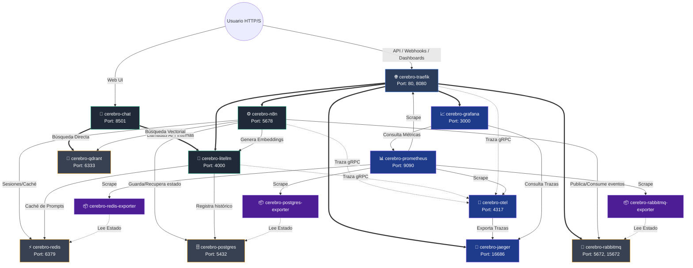

# 📋 Resumen de Contenedores y Topología de Red

El clúster del **LinkAnvil** está compuesto por un ecosistema de contenedores interconectados. A continuación, se detalla la función específica de cada contenedor desplegado y el diagrama de red que ilustra cómo están conectados entre sí.

---

## 🗺️ Diagrama de Conexiones entre Contenedores

Este diagrama detalla cómo las peticiones y los datos fluyen a través de la red interna de Docker (`cerebro-net`) y los puertos expuestos.

---

## 🗂️ Descripción de los Contenedores

La infraestructura desplegada abarca 15 contenedores operando en sintonía. Su función se desglosa a continuación:

### 1. 🌐 Interfaz de Usuario y API Gateway

* **`cerebro-chat`** (Ruta: `http://localhost:8501`): Frontend Web de usuario (Chatbot Streamlit). Es la entrada principal para la interacción conversacional de los seres humanos con el Segundo Cerebro. Al estar dentro de la misma red (`cerebro-net`), se comunica *directamente* con el LLM y la base vectorial, ahorrando la necesidad de pasar por el Gateway para consultas internas, lo cual mejora la velocidad de respuesta.
* **`cerebro-traefik`** (Ruta: `http://traefik.localhost` / `http://localhost:8080`): Actúa como Proxy Inverso y API Gateway. Es el único contenedor expuesto al puerto `80`. Todos los usuarios de API (`/ingest`), webhooks o herramientas externas interactúan directamente con Traefik, quien se encarga de transferir silenciosamente la petición (`routing`) al contenedor de Grafana, n8n, o Jaeger correspondiente de acuerdo con la URL solicitada.

### 2. ⚙️ Motores Principales (Lógica y Orquestación)

* **`cerebro-n8n`** (Ruta: `http://n8n.localhost`): Plataforma central de automatización (Orquestador). Es responsable de leer y reaccionar a webhooks, disparar tareas conectando de forma gráfica todo el ecosistema (AI, Base de datos, Mensajería).
* **`cerebro-scraper`**: Servicio de Worker asíncrono en Python. Basado en Scrapling y Playwright, se encarga de raspar el contenido de las webs complejas o estáticas sorteando bloqueos y depositando los resultados listos para ser procesados.
* **`cerebro-litellm`** (Ruta: `http://llm.localhost`): Proxy de Inteligencia Artificial. Centraliza el uso de modelos de lenguaje (Ej: pasarela uniforme que puede llamar a OpenAI, Anthropic, Gemini o Local). Al unificar la IA aquí, obtenemos registro total de los gastos, tolerancia a caídas e intercambio del modelo sin cambiar el código central.

### 3. 💾 Bases de Datos y Mensajería (Capa de Estado)

> **Arquitectura de Doble Cerebro (PostgreSQL + Qdrant):** El sistema separa estrictamente su forma de razonar. Delega las conexiones rígidas, textos crudos transaccionales y seguridad multi-tenant al "Cerebro Lógico" (PostgreSQL), y destina la búsqueda asociativa y de significado en alta dimensionalidad al "Cerebro Semántico" (Qdrant).

* **`cerebro-postgres`** (Puerto Local: `5432`): Base de datos relacional robusta. Retiene y asegura los textos completos elaborados, las URLs almacenadas, relaciones explícitas y metadatos. Garantiza eventos consistentes a través del patrón Outbox y mantiene un estricto *Row-Level Security (RLS)* por cada cliente.
* **`cerebro-qdrant`** (Ruta: `http://qdrant.localhost`): Base de datos vectorial. Especializada en retener vectores (*embeddings* dimensionales generados por la Inteligencia Artificial). Imprescindible para habilitar RAG (Generación Aumentada por Recuperación) y búsquedas por "similitud semántica".
* **`cerebro-redis`** (Puerto Local: `6379`): Base de datos de estructuras en memoria extremadamente veloz. Actúa de barrera inicial (Filtro Anti-duplicados), caché transitorio para LiteLLM evitando la re-evaluación de tokens costosos, y como el "disco" de sesión para la UI.
* **`cerebro-rabbitmq`** (Ruta Management: `http://rabbitmq.localhost`): Gestor o Bus asíncrono de colas empresariales. Funciona como un amortiguador de choques y cola de espera. Absorbe un número masivo de URLs que lleguen en el mismo segundo y asegura que n8n las procese a su ritmo sin que se saturen los servicios.

### 4. 👁️ Observabilidad y Recolección General

* **`cerebro-otel`** *(OpenTelemetry)* (Puertos Locales: `4317`, `4318`): El agregador neutro de señales. Todos los contenedores de arriba envían sus "mensajes" (trazas o logs informativos) ciegamente a OTel. OTel filtra y decide mandarlo al Jaeger o al Prometheus para evitar que n8n o Traefik se saturen intentando conectarse a cada sistema directo.
* **`cerebro-prometheus`** (Ruta: `http://prometheus.localhost`): Almacén o Base temporal de métricas matemáticas. Su fin es acumular las presiones vitales del servidor (cuánta RAM tiene Redis, cuántas peticiones recibe OTel, uso de la CPU por Docker).
* **`cerebro-jaeger`** (Ruta: `http://jaeger.localhost`): Sistema puro de Trazabilidad. Rastrea gráficamente el recorrido completo de cualquier petición, dejando expuesto en secuencia, cómo cruzó el cliente mediante API, el tiempo usado por RabbitMQ, y el tiempo restante de respuesta en milisegundos desde LiteLLM.
* **`cerebro-grafana`** (Ruta: `http://grafana.localhost`): Sala de mando visual e ingesta. Su labor es interpretar y graficar mediante Dashboards agradables, todos los datos puros almacenados pasivamente en `Prometheus` y `Jaeger`.

### 5. 📦 Exporters ("Traductores" para Prometheus)

*Dado que RabbitMQ, Redis y Postgres no hablan originalmente el dialecto de métricas de Prometheus de fábrica, se adjuntan contenedores traductores ultraligeros.*

* **`cerebro-postgres-exporter`**: Traduce el estado interno de PostgreSQL e índices a Prometheus.
* **`cerebro-redis-exporter`**: Traduce alertas, ram agotada, y hits en Redis a Prometheus.
* **`cerebro-rabbitmq-exporter`**: Convierte el estado vital de nodos consumidos/desconectados desde RabbitMQ a Prometheus.

### 6. 🧠 Exportación y Gemelo Digital

* **`Exportador LLM Wiki`**: Utilidad encargada de consolidar y exportar la bóveda local (Markdown) a partir del estado relacional y semántico almacenado en PostgreSQL y Qdrant. Genera una estructura de archivos físicos (`raw/`, `wiki/`) con enlaces bidireccionales nativos compatibles con Obsidian, además de una caché caliente (`hot.md`) para agilizar la sincronización del contexto conversacional offline.  Esta generación se produce en tiempo de ejecución **puramente en la Memoria RAM** (sin disco) por motivos de seguridad; no se guardan logs residuales, descargas tempranas, ni rastros de exportes multi-tenants en los clústers.
