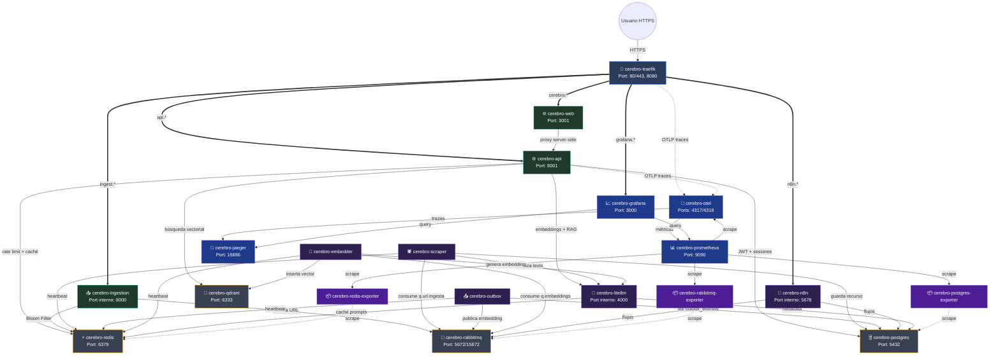

# 📋 Resumen de Contenedores y Topología de Red

El clúster del **LinkAnvil** está compuesto por **21 contenedores** que operan dentro de la red privada `cerebro-net`. Se dividen en seis capas funcionales: entrada y API, interfaz web, workers asíncronos, almacenamiento, orquestación/IA y observabilidad.

---

## 🗺️ Diagrama de Conexiones entre Contenedores



---

## 🗂️ Descripción Detallada de los Contenedores

### 1. 🔀 API Gateway

#### `cerebro-traefik`
**Imagen:** `traefik:v3.6.14` | **Puertos expuestos:** 80 (HTTP), 443 (HTTPS), 8080 (dashboard)

**Qué hace:** Actúa como el único punto de entrada al clúster. Enruta peticiones basándose en `Host` header (`ingest.localhost`, `cerebro.localhost`, etc.) hacia el contenedor correcto. Aplica rate limiting global (100 req/s promedio, burst 50) y reintento automático (3 intentos) a todos los endpoints. Además, estampa cada petición entrante con un `Trace-ID` que acompañará a la petición durante toda su vida en el sistema vía OpenTelemetry.

**Por qué esta decisión:** Un único punto de entrada garantiza que toda política de seguridad se aplica perimetralmente sin duplicar lógica en cada servicio. Traefik obtiene su configuración directamente de las labels Docker, lo que elimina archivos de configuración adicionales y mantiene la declaración del enrutado junto a la definición del servicio.

**Configuración clave:**
- `--entrypoints.web.http.middlewares=global-ratelimit@docker,global-retry@docker` — rate limit y retry en todas las rutas
- `--tracing.otlp.http.endpoint=http://otel-collector:4318/v1/traces` — exporta trazas al colector OTel
- `--metrics.prometheus=true` — expone métricas para que Prometheus las raspe
- En producción: `docker-compose.prod.yml` añade certResolver Let's Encrypt y redirige HTTP→HTTPS

---

### 2. 📥 Capa de Ingesta

#### `cerebro-ingestion`
**Código:** `src/ingestion/main.py` | **Imagen:** build propio (`infra/ingestion.Dockerfile`) | **Límites:** 512 MB RAM, 1 CPU

**Qué hace:** Microservicio FastAPI que expone `POST /ingest` para recibir URLs desde cualquier origen (extensión de navegador, bot de Telegram, webhook). Antes de encolar, aplica dos filtros: (1) deduplicación con Bloom Filter en Redis (`redis.asyncio`, comandos `BF.ADD`/`BF.EXISTS`) que detecta URLs ya procesadas en sub-milisegundo; (2) rate limiting atómico Redis INCR+EXPIRE por IP y por tenant para proteger contra abuso.

**Por qué esta decisión:** Separar la ingesta en su propio servicio permite que la respuesta al usuario sea instantánea (`202 Accepted`) sin bloquear el scraping. El rate limiter usa `INCR` seguido de `EXPIRE` solo en el primer increment — operación atómica que elimina la race condition TOCTOU que tenía la versión original (que usaba `GET` + `INCR` no atómicos). El cliente `redis.asyncio` evita bloquear el event loop de FastAPI, problema que tenía la versión sync anterior.

**Configuración clave:**
- `REDIS_HOST` / `REDIS_PORT` / `REDIS_PASSWORD` — conexión async a Redis
- `RABBITMQ_URL` — publica en la cola `q.url.ingesta` del vhost `cerebro`
- Traefik label: `Host(\`ingest.localhost\`) || PathPrefix(\`/ingest\`)` con `global-ratelimit`
- Healthcheck: verifica `http://localhost:8000/health` con Python stdlib (sin curl)
- Usuario no-root: `USER cerebro` (uid 1000) en el Dockerfile

---

### 3. ⚙️ API de la Aplicación

#### `cerebro-api`
**Código:** `src/api/main.py` | **Imagen:** build propio (`infra/api.Dockerfile`) | **Puerto expuesto:** 8001 | **Límites:** 768 MB RAM, 1 CPU

**Qué hace:** Backend principal de la plataforma (FastAPI). Gestiona: autenticación de usuarios (registro/login/logout con JWT), chat RAG con SSE streaming, CRUD de sesiones y mensajes (persistidos en Postgres), acceso al panel de recursos y bootstrapping del contexto RAG hacia LiteLLM/Qdrant.

**Por qué esta decisión:** La API propia reemplazó el frontend Streamlit (`cerebro-chat`) que almacenaba el JWT en `localStorage` — vector vulnerable a XSS. La nueva arquitectura usa:
- **httpOnly cookie** (`SESSION_COOKIE`): JavaScript no puede leerla, bloqueando robo de token por XSS.
- **CSRF doble submit**: cookie `CSRF_COOKIE` legible por JS + header `X-CSRF-Token` que el cliente debe echar en cada request state-changing. La API verifica que coincidan sin necesitar estado server-side.
- **Bearer fallback**: si no hay cookie, lee `Authorization: Bearer <token>` para compatibilidad con bots de Telegram y scripts.
- **Rate limiting**: `/auth/login` 5/min por IP, `/auth/register` 3/h por IP, `/chat` 30/min por tenant — todos con Redis INCR atómico.
- **httpx pool compartido**: un único `httpx.AsyncClient` por proceso, creado en `lifespan`, reutilizado en todas las llamadas a LiteLLM y Qdrant. Reduce conexiones TCP y elimina TIME_WAIT bajo carga.

**Configuración clave:**
- `DATABASE_URL` — asyncpg con `SET search_path TO cerebro` (schema aislado)
- `JWT_SECRET` / `JWT_SECRET_FILE` — el segundo lee desde Docker secrets (producción)
- `LITELLM_URL` + `LITELLM_KEY` — proxy LLM para RAG
- `QDRANT_URL` — búsqueda vectorial
- `SESSION_COOKIE_SECURE=true` en producción (requiere HTTPS)

---

### 4. 🌐 Frontend Web

#### `cerebro-web`
**Código:** `src/frontend/` | **Imagen:** build propio (`infra/frontend.Dockerfile`) | **Puerto expuesto:** 3001 | **Límites:** 384 MB RAM, 0.5 CPU

**Qué hace:** Interfaz web en Next.js 15 (React). Incluye: autenticación, chat RAG con streaming SSE, panel de recursos, historial de sesiones. El store de chats (Zustand) es API-backed: las sesiones y mensajes se persisten en Postgres vía `cerebro-api`, no en `localStorage`. Incluye error boundaries globales y por sección (`app/error.tsx`) para aislar fallos de rendering sin tumbar toda la app.

**Por qué esta decisión:** Reemplazó `cerebro-chat` (Streamlit) porque Streamlit no permitía control granular de la autenticación, SSE streaming nativo, ni gestión de estado con cookies httpOnly. Next.js 15 con `credentials: "include"` y el envío del `X-CSRF-Token` en cada mutación completa el modelo de seguridad diseñado en `cerebro-api`. La variable `CEREBRO_API_URL` es solo server-side; el navegador nunca ve la URL interna de la API.

**Configuración clave:**
- `CEREBRO_API_URL=http://cerebro-api:8001` — proxy server-side, nunca expuesto al browser
- El store Zustand elimina el `persist` en `localStorage` que causaba que los chats reaparecieran tras un reset completo del stack

---

### 5. 🕷️ Workers Asíncronos

#### `cerebro-scraper`
**Código:** `src/scraper/worker.py` | **Límites:** 1.5 GB RAM, 2 CPUs | `shm_size: 1gb` (Chromium)

**Qué hace:** Consume mensajes de la cola `q.url.ingesta` en RabbitMQ. Para cada URL, decide la estrategia de scraping: extracción básica (HTML estático), Scrapling avanzado, o Playwright/Chromium headless para SPAs y sitios que bloquean bots. Extrae el texto limpio, lo envía a LiteLLM para análisis estructurado (tags, resumen, volatilidad), y persiste el recurso en Postgres junto con un evento `outbox_eventos`.

**Por qué esta decisión:** Separar el scraping en un worker independiente permite escalar horizontalmente el procesamiento sin afectar la latencia de la API. El `shm_size: 1gb` es necesario para que Chromium (Playwright) no crashee en entornos Docker con poca memoria compartida. El worker corre como usuario `cerebro` (uid 1000) — Chromium necesita que `PLAYWRIGHT_BROWSERS_PATH` apunte a un directorio en el home del usuario no-root.

**Healthcheck:** Lee `worker:scraper:heartbeat` en Redis (clave con TTL 45s escrita por una tarea asyncio). Detecta workers zombi que no están procesando aunque el proceso esté activo.

#### `cerebro-embedder`
**Código:** `src/data/embedder_worker.py` | **Límites:** 768 MB RAM, 1 CPU

**Qué hace:** Consume la cola `q.embeddings` en RabbitMQ. Para eventos `recurso.procesado` (URL nueva), llama a LiteLLM para generar el embedding e inserta un punto nuevo en Qdrant con `point_id = uuid5(ns, "<recurso_id>:<tenant_id>")`. Para eventos `recurso.reusado` (URL ya conocida globalmente), localiza un punto existente del mismo `recurso_id` (cualquier tenant), copia el vector y crea el punto del nuevo tenant sin llamar a LiteLLM — el embedding depende solo del contenido público.

**Por qué esta decisión:** Separar la generación de embeddings del scraping permite reintentar solo la vectorización sin repetir el scraping costoso. Si Qdrant o LiteLLM están lentos, el backlog de embeddings crece sin bloquear la ingesta de nuevas URLs.

**Healthcheck:** `worker:embedder:heartbeat` en Redis — mismo patrón que el scraper.

#### `cerebro-outbox`
**Código:** `src/data/outbox_publisher.py` | **Límites:** 384 MB RAM, 0.5 CPU

**Qué hace:** Implementa el Patrón Outbox. Hace polling de la tabla `outbox_eventos` en Postgres buscando eventos con `estado='pendiente'`, los publica en RabbitMQ (routing key según `evento_tipo`) y los marca como `procesado`. Garantiza que ningún evento se pierda aunque RabbitMQ estuviera caído cuando se creó el recurso.

**Por qué esta decisión:** Sin el patrón Outbox, el worker del scraper tendría que escribir en Postgres Y publicar en RabbitMQ dentro de la misma operación — si RabbitMQ falla después del INSERT, el evento de embedding se pierde. El Outbox convierte ese riesgo en una garantía eventual: si RabbitMQ estaba caído, el outbox worker publicará el evento en el siguiente ciclo.

**Healthcheck:** `worker:outbox:heartbeat` en Redis.

---

### 6. 🤖 Motor LLM y Orquestación

#### `cerebro-litellm`
**Imagen:** `ghcr.io/berriai/litellm:main-latest@sha256:7c311...` (digest fijado) | **Puerto interno:** 4000 | **Límites:** 1 GB RAM, 1 CPU

**Qué hace:** Proxy unificado para modelos de lenguaje. Expone una API compatible con OpenAI que internamente puede llamar a OpenAI, Anthropic, Google Gemini, modelos locales (Ollama), u OpenRouter. Implementa Circuit Breaker (si un proveedor falla repetidamente, deja de intentarlo temporalmente), Fallback automático (si OpenAI falla, intenta Anthropic sin afectar al llamante) y caché de prompts en Redis (peticiones idénticas no consumen tokens).

**Por qué esta decisión:** Centralizar el acceso a LLMs elimina el acoplamiento del código de negocio a un proveedor específico. Cambiar de modelo o proveedor es una operación de configuración en `infra/litellm/config.yaml` sin tocar código. El digest fijado evita que actualizaciones silenciosas de `:main-latest` rompan el sistema.

**Nota importante:** LiteLLM usa Prisma internamente y corre `schema_sync` en cada arranque, que borra las tablas en el schema `public` de Postgres. Por eso todas las tablas de LinkAnvil están en el schema `cerebro` (ver sección de Postgres).

#### `cerebro-n8n`
**Imagen:** `n8nio/n8n:1.123.37` | **Puerto interno:** 5678 | **Límites:** 768 MB RAM, 1 CPU

**Qué hace:** Plataforma de automatización visual. Ejecuta workflows gráficos que orquestan los pasos del procesamiento: lectura de webhooks, scraping ligero, integración con bots de Telegram, flujos de curación nocturna, etc. Usa Postgres (schema `n8n`) para persistir sus propios workflows y credenciales.

**Configuración clave:**
- `DB_POSTGRESDB_SCHEMA: n8n` — n8n usa su propio schema, separado del schema `cerebro`
- `N8N_BASIC_AUTH_USER` / `N8N_BASIC_AUTH_PASSWORD` — protege la UI

#### `cerebro-n8n-bootstrap`
**Imagen:** `python:3.12-alpine` | `restart: "no"` (one-shot)

**Qué hace:** Contenedor de inicialización que se ejecuta una sola vez al arranque. Espera a que n8n esté healthy, luego llama a la API de n8n para crear una API key y escribirla en el fichero `.env` del proyecto. Elimina la necesidad de configurar n8n manualmente la primera vez.

**Por qué esta decisión:** Automatizar el bootstrapping permite que el stack se levante completamente desatendido (`docker compose up -d`) desde cero, sin pasos manuales post-arranque.

---

### 7. 💾 Almacenamiento y Mensajería

#### `cerebro-postgres`
**Imagen:** `postgres:16-alpine` | **Puerto:** 5432 | **Límites:** 2 GB RAM, 2 CPUs

**Qué hace:** Base de datos relacional central. Aloja el schema `cerebro` (tablas propias de LinkAnvil), el schema `n8n` (workflows del orquestador) y usa el schema `public` exclusivamente para las tablas de LiteLLM/Prisma.

**Tablas principales en `cerebro`:**
- `recursos` — **tabla global** (sin `tenant_id`): una fila por URL única (deduplicada por `url_hash`) con metadatos, tags JSONB, estado (activo/cuarentena/expirado/procesando), volatilidad, fecha de caducidad
- `usuario_recursos(tenant_id, recurso_id)` — pivote per-tenant con RLS: registra qué recursos globales tiene cada usuario en su KB. Aquí vive el aislamiento multi-tenant
- `outbox_eventos` — eventos pendientes de publicar en RabbitMQ (Patrón Outbox); incluye `recurso.procesado` (alta nueva) y `recurso.reusado` (alta de un recurso ya procesado por otro tenant)
- `usuarios` — cuentas de la plataforma con `tenant_id` y hash de contraseña
- `sesiones_chat` — sesiones de conversación persistidas (antes en localStorage, ahora en Postgres)
- `mensajes_chat` — mensajes individuales con `seq BIGSERIAL` para orden determinista dentro del mismo timestamp
- `grafo_relaciones` — grafo semántico per-tenant: relaciones bidireccionales entre recursos del corpus de un mismo usuario
- `schema_migrations` — registro de migraciones aplicadas (idempotencia)

**Por qué el schema `cerebro`:** LiteLLM usa Prisma que corre `schema_sync` al arrancar y borra cualquier tabla que no conozca en `public`. Cuando LinkAnvil tenía sus tablas en `public`, cada restart de LiteLLM las destruía. El schema `cerebro` es invisible para Prisma y sus tablas sobreviven cualquier reinicio de LiteLLM.

**Tuning de rendimiento** (activado en el `command` del compose):
```
max_connections=200     -- soporta pool de workers + api simultáneos
shared_buffers=512MB    -- 25% del límite de 2GB para page cache
effective_cache_size=1536MB -- guía al planificador de queries
work_mem=8MB            -- memoria por operación de sort/hash
```

#### `cerebro-redis`
**Imagen:** `redis/redis-stack-server:latest@sha256:798ab...` (digest fijado) | **Puerto:** 6379 | **Límites:** 768 MB RAM

**Qué hace:** Base de datos en memoria multi-propósito. Sirve cuatro funciones distintas en LinkAnvil:
1. **Bloom Filter** (`BF.*`): deduplicación de URLs en sub-milisegundo antes de encolar
2. **Rate limiting**: contadores INCR por IP/tenant para proteger los endpoints
3. **Heartbeat de workers**: claves `worker:<name>:heartbeat` con TTL 45s que los workers escriben periódicamente; si la clave expira el healthcheck falla
4. **Caché de LiteLLM**: prompts idénticos no consumen tokens si ya están en caché

**Por qué digest fijado:** `redis-stack-server:latest` se actualiza sin aviso con cambios que pueden afectar los módulos de Bloom Filter. El digest garantiza reproducibilidad.

#### `cerebro-rabbitmq`
**Imagen:** `rabbitmq:3.13-management-alpine` | **Puertos:** 5672 (AMQP), 15672 (management) | **Límites:** 768 MB RAM, 1 CPU

**Qué hace:** Bus de mensajes asíncrono. Gestiona las colas del pipeline de procesamiento:
- `q.url.ingesta` — URLs recibidas por `cerebro-ingestion`, consumidas por `cerebro-scraper`
- `q.embeddings` — recursos scrapeados listos para vectorizar, consumidos por `cerebro-embedder`
- `q.embeddings.fallidos` (DLQ) — mensajes que fallaron en el embedder tras el número máximo de intentos

**Por qué la DLQ de embeddings:** En una versión anterior, la cola `q.embeddings.fallidos` no existía aunque estaba referenciada como destino de la DLX (`cerebro.dlx`). Los mensajes que fallaban no tenían destino y se perdían silenciosamente (commit `d6203c5`). Se añadió la cola y el binding explícito para garantizar que los fallos crónicos sean visibles y recuperables.

**Nota de configuración:** Cuando `RABBITMQ_MANAGEMENT_DEFINITIONS_FILE` está activo, RabbitMQ ignora `RABBITMQ_DEFAULT_USER`/`RABBITMQ_DEFAULT_PASS`. Las credenciales deben definirse en `infra/rabbitmq/definitions.json` (sección `users` + `permissions`). El script `reset.sh` actualiza el hash de la contraseña dinámicamente desde `.env`.

#### `cerebro-qdrant`
**Imagen:** `qdrant/qdrant:v1.17.1` | **Puerto:** 6333 | **Límites:** 2 GB RAM, 2 CPUs

**Qué hace:** Motor de búsqueda vectorial. Almacena los embeddings (vectores numéricos de alta dimensionalidad) generados por `cerebro-embedder`. Cada punto representa un par `(recurso_id, tenant_id)` con `point_id = uuid5(ns, "<recurso_id>:<tenant_id>")` y payload con `tenant_id`, `recurso_id`, `url`, `title`, `category`, `volatility`. Las búsquedas RAG filtran por `tenant_id` en la misma operación de búsqueda.

**Reuso del vector entre tenants:** el embedding depende solo del contenido público de la URL, no del usuario. Cuando un segundo tenant añade una URL ya conocida, el embedder no llama a LiteLLM: localiza el punto existente vía `scroll filter recurso_id` y crea un punto nuevo con el mismo vector y el `tenant_id` actualizado.

**Por qué Qdrant sobre PostgreSQL pgvector:** Qdrant está optimizado específicamente para búsqueda vectorial con índices HNSW y ofrece filtrado por payload en la misma operación de búsqueda (el `tenant_id` se filtra sin hacer un JOIN separado). Qdrant también expone una API de snapshots que `scripts/backup.sh` usa para backups automáticos.

---

### 8. 👁️ Observabilidad

#### `cerebro-otel`
**Imagen:** `otel/opentelemetry-collector-contrib:0.150.1` | **Puertos:** 4317 (gRPC), 4318 (HTTP), 8888/8889 (métricas) | **Límites:** 384 MB RAM, 0.5 CPU

**Qué hace:** Recolector central de señales de observabilidad. Recibe trazas OpenTelemetry de Traefik y `cerebro-api` vía OTLP, las enruta a Jaeger para visualización. También expone métricas propias del colector en formato Prometheus.

**Por qué OTel Collector y no exportar directamente a Jaeger:** El colector desacopla los productores de trazas del backend de almacenamiento. Si en el futuro se quiere enviar trazas a un backend diferente (Tempo, Honeycomb), basta con cambiar la configuración del colector sin modificar el código de los servicios. La configuración en `infra/otel/config.yaml` usa la nueva estructura `readers.pull.exporter.prometheus` (la propiedad antigua `service.telemetry.metrics.address` fue eliminada en OTel v0.103+, lo que causaba restart loops antes de la corrección).

#### `cerebro-prometheus`
**Imagen:** `prom/prometheus:v3.11.2` | **Puerto:** 9090 | **Límites:** 1 GB RAM, 1 CPU

**Qué hace:** Recopila métricas de todos los servicios mediante scraping periódico. Evalúa las reglas de alerta definidas en `infra/prometheus/alert.rules.yml` e informa a Grafana cuando se superan umbrales.

**Reglas de alerta activas:**
- `APIHighP99Latency` — latencia P99 de la API > 2s
- `IngestionQueueBacklog` — cola de ingesta con > 1000 mensajes pendientes
- `EmbeddingsDLQAny` — cualquier mensaje en la DLQ de embeddings
- `PostgresConnectionsHigh` — conexiones activas > 160 (80% del límite de 200)
- `WorkerStuck` — heartbeat de un worker ausente > 2 minutos
- `VolumeDiskHigh` — uso de disco de volúmenes críticos > 80%

#### `cerebro-jaeger`
**Imagen:** `jaegertracing/all-in-one:latest@sha256:ab6f1...` (digest fijado) | **Puerto:** 16686 | **Límites:** 384 MB RAM, 0.5 CPU

**Qué hace:** Visualiza el recorrido completo de cada petición a través del sistema. Permite ver en cascada cuánto tardó Traefik en enrutar, cuánto tardó LiteLLM en responder, o dónde se ralentizó el pipeline de ingesta.

#### `cerebro-grafana`
**Imagen:** `grafana/grafana:11.4.0` | **Puerto:** 3000 | **Límites:** 384 MB RAM, 0.5 CPU

**Qué hace:** Panel de control unificado que combina métricas de Prometheus y trazas de Jaeger en dashboards visuales. Permite correlacionar un spike de latencia en la API con el estado de las colas de RabbitMQ o el uso de conexiones de Postgres.

---

### 9. 📦 Exporters (Traductores para Prometheus)

RabbitMQ, Redis y PostgreSQL no exponen métricas en formato Prometheus nativamente. Los exporters son contenedores ultraligeros que hablan el protocolo nativo de cada servicio y traducen su estado al formato de métricas que Prometheus puede raspar.

#### `cerebro-postgres-exporter`
Traduce el estado de PostgreSQL (conexiones activas, tamaño de tablas, locks, replication lag) a métricas Prometheus.

#### `cerebro-redis-exporter`
Traduce el estado de Redis (memoria usada, keyspace hits/misses, clientes conectados, comandos por segundo) a métricas Prometheus.

#### `cerebro-rabbitmq-exporter`
Traduce el estado de RabbitMQ (mensajes en cola, consumidores, publish/consume rate, mensajes en DLQ) a métricas Prometheus.

> **Imagen fijada por digest:** `kbudde/rabbitmq-exporter` tiene la imagen fijada por digest para evitar breaking changes silenciosos en una imagen que no usa tags semánticos estables.

---

## 📊 Resumen de Recursos por Contenedor

| Contenedor | RAM Límite | CPU Límite | Tipo |
|---|---|---|---|
| cerebro-postgres | 2 GB | 2.0 | Almacenamiento |
| cerebro-qdrant | 2 GB | 2.0 | Almacenamiento |
| cerebro-litellm | 1 GB | 1.0 | LLM Gateway |
| cerebro-prometheus | 1 GB | 1.0 | Observabilidad |
| cerebro-scraper | 1.5 GB | 2.0 | Worker |
| cerebro-api | 768 MB | 1.0 | API |
| cerebro-embedder | 768 MB | 1.0 | Worker |
| cerebro-rabbitmq | 768 MB | 1.0 | Mensajería |
| cerebro-redis | 768 MB | — | Caché |
| cerebro-n8n | 768 MB | 1.0 | Orquestador |
| cerebro-ingestion | 512 MB | 1.0 | API |
| cerebro-outbox | 384 MB | 0.5 | Worker |
| cerebro-web | 384 MB | 0.5 | Frontend |
| cerebro-otel | 384 MB | 0.5 | Observabilidad |
| cerebro-jaeger | 384 MB | 0.5 | Observabilidad |
| cerebro-grafana | 384 MB | 0.5 | Observabilidad |
| cerebro-traefik | 256 MB | 0.5 | Gateway |
| exporters (×3) | 128 MB c/u | 0.25 c/u | Observabilidad |
