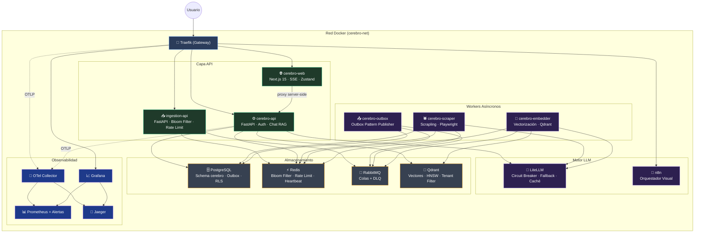
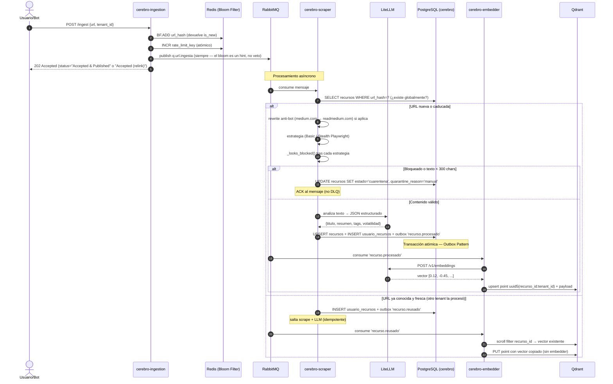
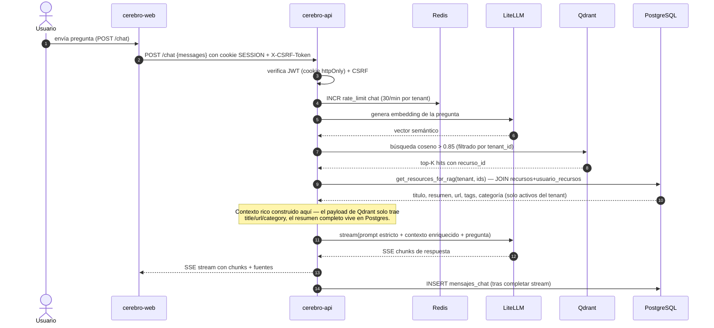
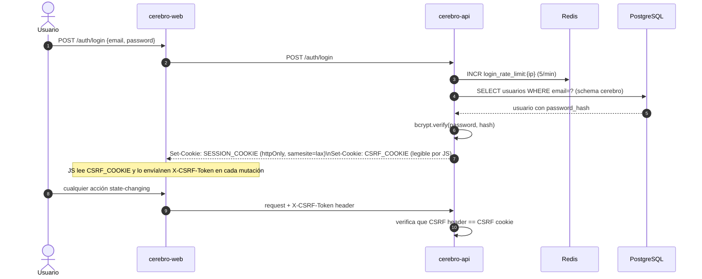
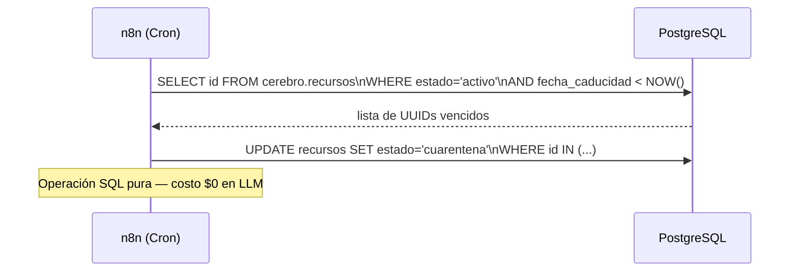

<div align="center">
  
  


# 🏗️ Arquitectura e Infraestructura — LinkAnvil

</div>


Este documento detalla la infraestructura del proyecto **LinkAnvil** basada en Docker Compose, explicando los componentes desplegados, sus responsabilidades, las decisiones de arquitectura tomadas durante el desarrollo y las ventajas de cada elección.

---

## 1. Topología del Sistema

Todos los servicios corren dentro de la red Docker privada `cerebro-net`. Las peticiones externas entran exclusivamente por **Traefik** en el puerto 80/443. Los servicios internos no exponen puertos al host salvo en desarrollo.



---

## 2. Descripción de Componentes

### 🚪 API Gateway — Traefik

Único punto de entrada al clúster. Se encarga de enrutamiento dinámico (lee labels Docker), rate limiting global (100 req/s, burst 50), reintentos automáticos (3 intentos por request), y genera el `Trace-ID` de correlación para OpenTelemetry. En producción añade TLS automático con Let's Encrypt y redirige HTTP→HTTPS.

**Decisión:** Traefik se autodescubre en Docker sin archivos de configuración adicionales — basta con añadir labels al servicio nuevo. Simplifica operaciones y garantiza que toda política de seguridad perimetral está en un solo lugar.

### 🔌 Túnel Telegram — Tailscale Funnel (sidecar opcional)

El bot de Telegram exige que LinkAnvil exponga `POST /webhook/telegram/{token_hash}` en una URL HTTPS pública. En entornos de desarrollo detrás de NAT no la hay, y el endpoint `INGESTION_URL=http://ingestion-api:8000` solo es resoluble dentro de `cerebro-net`. La solución es un sidecar `tailscale/tailscale:stable` (profile `telegram`) que se conecta a la tailnet del usuario, declara un proxy `serve.json` hacia `ingestion-api:8000` y publica al exterior con `AllowFunnel: true`. La URL pública resultante (`https://linkanvil-ingest.<tailnet>.ts.net`) se mete en `PUBLIC_INGESTION_URL` del `.env` para que `cerebro-api` la use al llamar a `setWebhook` en la API de Telegram.

**Decisión:** Tailscale Funnel sobre Cloudflare Tunnel/ngrok porque (a) es gratuito sin necesidad de dominio propio, (b) el subdominio se mantiene fijo entre `docker compose down/up` mientras viva el volumen `tailscale-state`, (c) HTTPS con cert Let's Encrypt es automático, (d) no requiere abrir puertos en el router. Tradeoff: sólo expone los puertos públicos 443/8443/10000 y solo está disponible mientras el contenedor esté activo — suficiente para webhooks, no para alta disponibilidad. Los pasos de configuración están en `docs/src/8_instalacion_y_configuracion.md` sección 6.4.

### 📥 Ingestion API — cerebro-ingestion

FastAPI que recibe URLs, aplica Bloom Filter en Redis para deduplicación sub-milisegundo y rate limiting atómico (INCR+EXPIRE), y publica en RabbitMQ. Responde `202 Accepted` inmediatamente.

### ⚙️ API Principal — cerebro-api

Backend FastAPI con: autenticación JWT (cookie httpOnly), chat RAG con SSE streaming, CRUD de sesiones/mensajes, paginación, integración con LiteLLM y Qdrant.

### 🌐 Frontend — cerebro-web

Next.js 15 con store Zustand API-backed (sin localStorage), error boundaries y SSE streaming.

### 🕷️ Scraper Worker — cerebro-scraper

Consume cola `q.url.ingesta`. Aplica reescritura anti-bot por dominio (`medium.com` → `readmedium.com`), elige estrategia (Basic / Stealth Playwright), valida el contenido con `_looks_blocked()` (marcadores específicos para evitar falsos positivos como `cdnjs.cloudflare.com`) y un guard de longitud mínima 300 chars. Si todo pasa, analiza con LiteLLM y persiste en Postgres con evento Outbox. Si está bloqueado o el texto es demasiado corto, mueve el recurso a `cuarentena` (sin DLQ) en lugar de embeder texto basura.

### 🧮 Embedder Worker — cerebro-embedder

Consume cola `q.embeddings`. Genera embeddings vía LiteLLM e inserta vectores en Qdrant.

### 📤 Outbox Publisher — cerebro-outbox

Polling de `outbox_eventos` en Postgres → publica en RabbitMQ. Implementa consistencia eventual sin riesgo de Dual-Write.

### 🤖 LiteLLM Gateway

Proxy multi-proveedor con Circuit Breaker, Fallback automático y caché de prompts en Redis.

### 🔄 n8n

Orquestador visual para workflows de scraping ligero, integración Telegram y curación nocturna.

---

## 3. Flujos de Trabajo Principales

### 3.1 Ingesta Asíncrona



> **Nota sobre la deduplicación**: la Ingestion API publica al queue **incluso cuando el bloom filter dice "duplicado"**. El bloom es un hint de Redis que puede divergir del estado real de Postgres (p.ej. tras un reset de DB) — confiar solo en él provocaría que la URL nunca llegue al worker y `usuario_recursos` no se cree para el tenant. La idempotencia se resuelve en el scraper: si el recurso global existe y está fresco, solo se inserta el link en `usuario_recursos` y el embedder copia el vector.

### 3.2 Chat RAG con SSE Streaming



### 3.3 Autenticación



### 3.4 Curación Nocturna (sin coste LLM)



---

## 4. Estrategia de Persistencia

### 4.1 Patrón de Doble Base de Datos (Cerebro Lógico vs Semántico)

LinkAnvil usa intencionalmente dos sistemas de persistencia complementarios:

**PostgreSQL — Cerebro Lógico y Transaccional:**
- Fuente única de verdad estructurada: URLs, metadatos, relaciones, histórico
- Garantías ACID: ningún dato se pierde ni queda en estado inconsistente
- **Modelo recurso global + pivote per-tenant:** la tabla `recursos` es global (deduplicada por `url_hash`); la asociación usuario↔recurso vive en `usuario_recursos(tenant_id, recurso_id)`, donde aplica la RLS. Si dos usuarios suben la misma URL, el contenido se procesa una vez y se reusa; cada uno mantiene su propia entrada en la pivote.
- Patrón Outbox para consistencia eventual de eventos asíncronos

**Qdrant — Cerebro Semántico e Intuitivo:**
- Exclusivamente almacena vectores matemáticos (embeddings) de alta dimensionalidad
- Búsquedas por similitud coseno (HNSW) en milisegundos
- Encuentra recursos "semánticamente afines" aunque no compartan palabras exactas
- **Un punto por `(recurso_id, tenant_id)`** con `point_id = uuid5(ns, "<recurso_id>:<tenant_id>")`. El payload incluye `tenant_id` y `recurso_id` separados, así el filtrado per-tenant se hace sin JOIN adicional. Cuando un segundo tenant reusa una URL, su punto se crea **copiando el vector** del primero (sin re-embedding) y solo se varía el payload.

Esta arquitectura de doble cerebro permite RAG avanzado: la intuición difusa de la IA (Qdrant) protegida por la seguridad transaccional del motor relacional (Postgres).

### 4.2 Persistencia de Sesiones de Chat

Las sesiones y mensajes de chat se persisten en Postgres (tablas `sesiones_chat` y `mensajes_chat`), no en `localStorage` del navegador. Esta decisión fue motivada por un problema observado: resetear el stack Docker completo (incluyendo volúmenes) no limpiaba los chats porque el estado vivía en el navegador. Ahora los mensajes se borran al borrar el volumen de Postgres, y el store Zustand del frontend los obtiene siempre de la API.

La columna `seq BIGSERIAL` en `mensajes_chat` garantiza orden determinista de los mensajes dentro de un mismo timestamp (cuando se insertan varios mensajes en la misma transacción).

### 4.3 Volúmenes Docker

Los datos persistentes usan volúmenes Docker gestionados:
- `postgres-data` — base de datos relacional (crítico: incluido en backup)
- `qdrant-data` — vectores (crítico: incluido en backup)
- `redis-data` — caché y estado de sesión Redis
- `n8n-data` — workflows y credenciales de n8n
- `prometheus-data` — series temporales de métricas
- `grafana-data` — dashboards y configuración
- `playwright-profile` — perfil de Chromium para sesiones autenticadas

---

## 5. Seguridad y Autenticación

### 5.1 httpOnly Cookie + CSRF Doble Submit

**Problema previo:** El JWT de sesión se almacenaba en `localStorage`. Cualquier vulnerabilidad XSS en el frontend podía leer el token y suplantar al usuario indefinidamente.

**Solución implementada:** Dos cookies en respuesta al login:
- `SESSION_COOKIE` — JWT firmado con `httponly=True, samesite="lax"`. JavaScript no puede leerla. El servidor la valida en cada request.
- `CSRF_COOKIE` — token CSRF aleatorio sin `httponly`. JavaScript puede leerlo y lo envía en el header `X-CSRF-Token` en cada request que modifica estado (POST, PUT, DELETE). La API verifica que header == cookie.

**Ventaja del doble submit:** No requiere sesión server-side ni tabla de tokens CSRF. El servidor solo compara los dos valores que llegan en el mismo request — un atacante externo no puede leer la cookie CSRF desde otro dominio (Same-Origin Policy).

**Bearer fallback:** Si no hay cookie `SESSION_COOKIE`, la API acepta `Authorization: Bearer <token>`. Esto permite que bots de Telegram y scripts externos sigan funcionando durante la migración y en casos de uso machine-to-machine.

### 5.2 Rate Limiting Atómico

Todos los rate limiters usan el patrón Redis INCR+EXPIRE:
```python
count = await redis.incr(key)
if count == 1:
    await redis.expire(key, window_seconds)
if count > limit:
    raise HTTPException(429)
```

**Por qué este patrón:** La versión anterior usaba `GET` seguido de `INCR` — dos operaciones separadas con una race condition (TOCTOU): dos requests simultáneos podían ambos pasar el check de `GET` y luego ambos ejecutar `INCR`, omitiendo el límite. El patrón INCR+EXPIRE es atómico: solo una operación incrementa y la comparación se hace sobre el resultado.

**Límites configurados:**
- `/auth/login`: 5 requests/minuto por IP
- `/auth/register`: 3 requests/hora por IP
- `/chat`: 30 requests/minuto por tenant

### 5.3 Contenedores Non-Root

Todos los servicios con código propio (`cerebro-api`, `cerebro-ingestion`, `cerebro-scraper`, `cerebro-embedder`, `cerebro-outbox`) corren con usuario `cerebro` (uid 1000) en lugar de root. El frontend corre con usuario `node` (uid 1000 en la imagen Node.js).

**Por qué:** Si un atacante logra ejecutar código en el contenedor (via inyección en el scraper o un RCE en una dependencia), el proceso no tiene privilegios de root y no puede modificar el filesystem del host, escalar privilegios, ni acceder a sockets del sistema.

**Caso especial — Playwright:** Chromium requiere acceso a su caché de binarios. Como el usuario es `cerebro` y no root, hay que asegurarse de que los binarios se instalen en el home del usuario correcto: `PLAYWRIGHT_BROWSERS_PATH=/home/cerebro/.cache/ms-playwright` y el `chown -R cerebro` del directorio `/data` en el Dockerfile.

### 5.4 Overlay de Producción

El archivo `docker-compose.prod.yml` es un overlay que extiende `docker-compose.yml` para producción. Activa:
- **TLS automático** con Let's Encrypt vía Traefik `certResolver`
- **Redirección HTTP→HTTPS** en todos los routers
- **Puertos internos cerrados**: servicios como Postgres (5432), Redis (6379), RabbitMQ (5672) no exponen ports al host — solo accesibles dentro de `cerebro-net`
- **Docker secrets**: `JWT_SECRET_FILE`, `POSTGRES_PASSWORD_FILE`, etc. leen secretos de `/run/secrets/<nombre>` en lugar de variables de entorno

Para desplegar en producción:
```bash
docker compose -f docker-compose.yml -f docker-compose.prod.yml up -d
```

Documentación completa en `docs/PRODUCTION.md`.

---

## 6. Aislamiento de Schema en PostgreSQL

### El Problema con LiteLLM y Prisma

LiteLLM usa el ORM Prisma internamente para gestionar sus tablas. En cada arranque, Prisma ejecuta una migración de tipo `schema_sync` que elimina del schema `public` cualquier tabla que no reconozca como propia. Cuando las tablas de LinkAnvil (`recursos`, `sesiones_chat`, etc.) estaban en `public`, **cada restart de LiteLLM las destruía**.

### La Solución: Schema `cerebro`

Todas las tablas de LinkAnvil residen en el schema `cerebro`:

```sql
-- init.sql
CREATE SCHEMA IF NOT EXISTS cerebro;
SET search_path TO cerebro, public;

CREATE TABLE IF NOT EXISTS recursos (...);          -- global, sin tenant_id
CREATE TABLE IF NOT EXISTS usuario_recursos (...);  -- pivote per-tenant con RLS
CREATE TABLE IF NOT EXISTS sesiones_chat (...);
-- etc.
```

El conector asyncpg en `cerebro-api` establece el search_path al conectar:
```python
conn = await asyncpg.connect(dsn, server_settings={"search_path": "cerebro,public"})
```

Prisma solo opera en `public` y nunca toca `cerebro`. n8n usa el schema `n8n` (configurable con `DB_POSTGRESDB_SCHEMA: n8n`).

**Resultado:** Los tres sistemas coexisten en la misma instancia Postgres sin interferir:
- `public` → tablas de LiteLLM/Prisma (efímeras, se recrean en cada start)
- `cerebro` → tablas de LinkAnvil (persistentes, gestionadas por `scripts/migrate.sh`)
- `n8n` → tablas del orquestador (persistentes, gestionadas por n8n)

---

## 7. Gestión de Migraciones de Schema

### Runner Shell Puro (`scripts/migrate.sh`)

LinkAnvil usa un runner de migraciones escrito en Bash que invoca `psql` directamente, sin dependencias Python adicionales.

**Por qué sin Alembic:** `psql` ya está disponible en la imagen `postgres:16-alpine` que usamos para el `db-migrate` one-shot. Añadir Alembic requeriría una imagen Python separada o añadir Python a la imagen Postgres, aumentando complejidad y tamaño de imagen sin ventaja real para el volumen de migraciones previsto.

**Funcionamiento:**
1. Crea `cerebro.schema_migrations(version INTEGER, applied_at TIMESTAMPTZ)` si no existe
2. Lee todos los archivos `infra/postgres/migrations/NNNN_*.sql` ordenados numéricamente
3. Para cada archivo, extrae el número de versión y verifica si ya está en `schema_migrations`
4. Si no está, lo ejecuta en una transacción y registra la versión

**Idempotencia:** La segunda ejecución detecta que todas las versiones ya están registradas y sale con `"schema is up to date"`. Seguro de ejecutar en CI o en cada deploy.

**Truco de la aritmética base-10:** Los nombres de archivo usan `0001`, `0002`, etc. Bash interpreta los ceros iniciales como números octales en operaciones aritméticas. La solución es forzar base 10:
```bash
version=$((10#${BASH_REMATCH[1]}))  # 0001 → 1, no interpretado como octal
```

Para aplicar migraciones pendientes:
```bash
bash scripts/migrate.sh
```

---

## 8. Liveness de Workers con Heartbeat Redis

### El Problema con Healthchecks Tradicionales

Un worker Python que se queda bloqueado esperando una conexión de base de datos o procesando un mensaje muy grande seguirá respondiendo al `docker ps` como "running" aunque no esté procesando trabajo nuevo. El healthcheck de Docker basado en comandos de proceso no detecta esta condición.

### Solución: Heartbeat Redis + TTL

Cada worker (scraper, embedder, outbox) ejecuta una tarea asyncio en background que periódicamente escribe una clave en Redis:
```python
await redis.set(f"worker:{name}:heartbeat", "1", ex=45)  # TTL 45 segundos
```

El healthcheck de Docker del worker lee esa clave:
```yaml
healthcheck:
  test: ["CMD-SHELL", "python -c \"import redis,os,sys; r=redis.Redis.from_url(os.environ['REDIS_URL']); sys.exit(0 if r.get('worker:scraper:heartbeat') else 1)\""]
  interval: 30s
```

Si el worker se bloquea y deja de escribir el heartbeat, la clave expira en 45 segundos. En el siguiente check de Docker (30s), la clave no existe y el healthcheck falla. Docker marca el contenedor como `unhealthy` y puede reiniciarlo según la política `restart: unless-stopped`.

**Ventaja:** Detecta workers zombi (proceso vivo pero no procesando) con un mecanismo mínimo que no requiere exponer un puerto HTTP adicional.

---

## 9. Observabilidad Integral

### Distributed Tracing

Cada petición entrante genera un `Trace-ID` único en Traefik que se propaga mediante headers OpenTelemetry a través de todos los servicios. El OTel Collector recibe las trazas y las envía a Jaeger, donde se puede visualizar el recorrido completo de una URL desde la ingesta hasta la inserción en Qdrant.

**Corrección de configuración OTel (v0.103+):** La propiedad `service.telemetry.metrics.address` fue eliminada en OTel Collector v0.103. El archivo `infra/otel/config.yaml` usa la nueva estructura:
```yaml
service:
  telemetry:
    metrics:
      readers:
        - pull:
            exporter:
              prometheus:
                host: "0.0.0.0"
                port: 8888
```
Sin esta corrección, el colector arrancaba en loop reiniciando indefinidamente.

### Logging Estructurado JSON

Todos los servicios Python usan `src/observability/logging.py` que configura un `JsonFormatter`:
- Cada log es un objeto JSON con campos estándar: `timestamp`, `level`, `service`, `message`
- Los campos `extra={}` pasados al logger se promueven al nivel raíz del JSON (no anidados)
- `LOG_LEVEL` configurable por variable de entorno (default `INFO`)

Esto permite que herramientas como Loki (Grafana) o cualquier agregador de logs indexen los campos del log sin parsear strings.

### Alertas Prometheus

El archivo `infra/prometheus/alert.rules.yml` contiene 6 reglas de alerta activas que disparan notificaciones en Grafana cuando:
- La latencia P99 de la API supera 2 segundos
- La cola de ingesta acumula más de 1000 mensajes
- Cualquier mensaje llega a la DLQ de embeddings (indica fallos crónicos)
- Las conexiones activas a Postgres superan el 80% del límite configurado
- El heartbeat de un worker desaparece más de 2 minutos
- El disco de un volumen crítico supera el 80% de uso

---

## 10. Backup Automático

El script `scripts/backup.sh` genera backups de los dos almacenamientos críticos:

**PostgreSQL:**
```bash
pg_dump --schema=cerebro | gzip > backup_postgres_YYYYMMDD_HHMMSS.sql.gz
```

**Qdrant:**
```bash
curl -X POST "http://qdrant:6333/collections/{collection}/snapshots"
```

Los backups se guardan en `$BACKUP_DIR` (configurable) y se eliminan los que superan `BACKUP_RETENTION_DAYS` días. El script se puede ejecutar manualmente o programar como cron job en el host.
