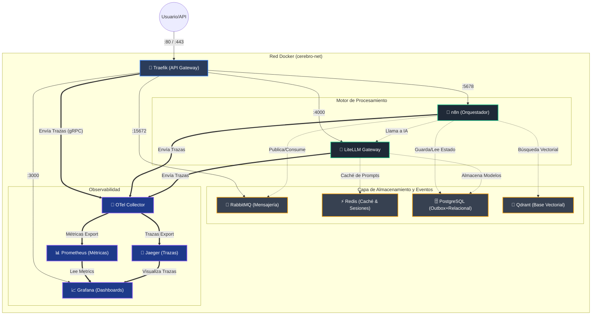
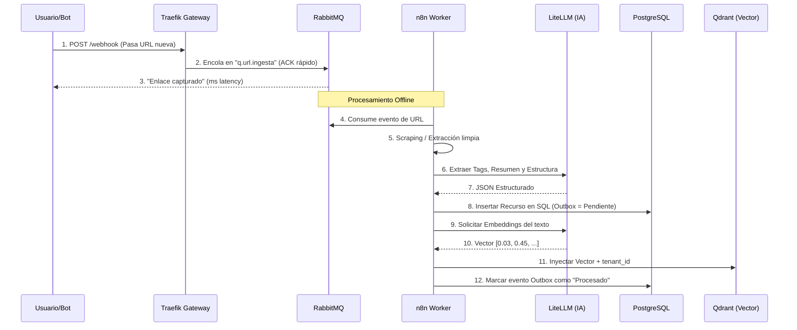
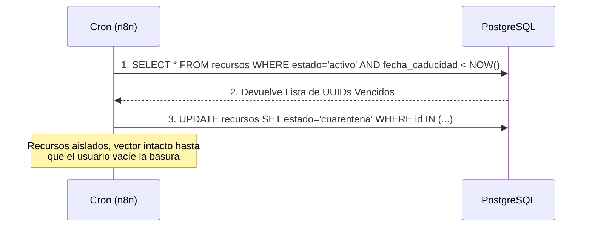
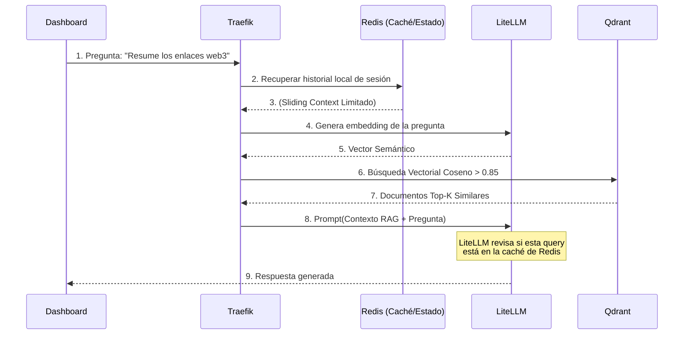

# 🏗️ Arquitectura e Infraestructura Local — Segundo Cerebro Autónomo

Este documento detalla la infraestructura local basada en Docker Compose del proyecto **Segundo Cerebro Autónomo**, explicando la topología de la red, los componentes desplegados, sus responsabilidades y cómo fluye la información a través del sistema.

---

## 1. Topología del Sistema y Conexiones

Todos los servicios se ejecutan dentro del mismo entorno aislado interconectado mediante la red Docker privada `cerebro-net`. Las peticiones externas entran exclusivamente a través de **Traefik**, garantizando control de tráfico, balanceo y autenticación perimetral.

---

## 2. Descripción de Componentes

### 🚪 Puerta de Enlace (API Gateway)
*   **Traefik (`cerebro-traefik`)**: Actúa como el único punto de entrada (reverse proxy). Se encarga del enrutamiento dinámico basado en nombres de dominio (`*.localhost`), *rate limiting* para proteger la infraestructura, y generación inicial del `Trace-ID` mediante OpenTelemetry para hacer seguimiento a la petición en todo el clúster.

### ⚙️ Motores Core
*   **n8n (`cerebro-n8n`)**: El "cerebro" orquestador. Define flujos de trabajo (*workflows*) visuales. Recibe notificaciones webhooks, consume URLs desde RabbitMQ, realiza scraping y orquesta los pasos ordenando al LLM que procese la información, para luego inyectar los resultados en PostgreSQL y los vectores en Qdrant.
*   **LiteLLM (`cerebro-litellm`)**: Actúa como capa de abstracción para modelos de IA. Recibe peticiones de n8n y decide internamente a qué LLM llamar (OpenAI, Anthropic, o Local). Implementa *Fallback* (si OpenAI cae, intenta con Anthropic sin afectar al sistema), usa *Circuit Breakers* y guarda peticiones comunes en caché de Redis para ahorrar tokens.

### 💾 Almacenamiento, Estado y Eventos
*   **PostgreSQL (`cerebro-postgres`)**: Centro de la verdad. Guarda los metadatos de los recursos, la tabla del patrón *Outbox* para mantener consistencia eventual de eventos, y el histórico semántico relacional entre recursos (grafología base). Incluye políticas RLS (Row-Level Security) para aislamiento multi-tenant.
*   **Redis (`cerebro-redis`)**: Base de datos en memoria hiper-rápida. Evita en tiempo real que se capturen URLs duplicadas (mediante un Bloom Filter), guarda y recupera contextos de sesiones de chats interactivas, y provee caché en sub-milisegundos al gateway de IA.
*   **RabbitMQ (`cerebro-rabbitmq`)**: Bus de mensajes de alta resiliencia. Mantiene colas de extracción de información. Si un sistema de origen o red falla, RabbitMQ reintenta o mueve el trabajo a una "Dead Letter Queue" (DLQ) mitigando fallos silenciosos.
*   **Qdrant (`cerebro-qdrant`)**: Motor de búsqueda vectorial para recuperación híbrida y *Retrieval-Augmented Generation* (RAG). Almacena los "embeddings" que el LLM genera. Aislado lógicamente mediantes payloads de `tenant_id` y preparado para *Similitud del Coseno*.

### 🔭 Observabilidad de Infraestructura
*   **OTel Collector (`cerebro-otel`)**: Recolector central que unifica *Traces* (rastreo) y *Metrics* (Métricas) de todo el sistema.
*   **Prometheus (`cerebro-prometheus`)**: Monitoriza activamente (mediante *scraping*) la salud, consumo de recursos y estado interno de todos los microservicios usando exportadores.
*   **Jaeger (`cerebro-jaeger`)**: Motor de *Distributed Tracing*. Permite auditar el ciclo de vida o viaje completo de una URL ("De Web a Base de Datos"). 
*   **Grafana (`cerebro-grafana`)**: Cuadros de mando unificados. Permite previsualizar atascos en RabbitMQ u OpenTemeletry.

---

## 3. Flujos de Trabajo Principales (Workflows)

### 3.1. Flujo de Ingesta Asíncrona (El Viaje del Dato)

Este esquema demuestra cómo el sistema absorbe picos masivos de entrada de información de forma controlada y la indexa tanto estructurada como semánticamente.

### 3.2. Curación Nocturna y Eliminación (Cost-Efficiency)

Un proceso que ejecuta n8n programado (cron) e interactúa solo con SQL para marcar elementos expirados a un costo nulo en lugar de usar Inteligencia Artificial para auditar toda la base a lo bruto.

### 3.3. Rutado Semántico Inteligente y RAG Híbrido

Cuando el usuario pregunta a la base a través de una interfaz o dashboard.

---

## 4. Estrategia de Persistencia y Seguridad

*   **Volúmenes Docker:** Se aplican Docker Volumes estándar manejados localmente. Los datos clave de Prometheus, PostgreSQL, Qdrant y Redis garantizan durabilidad incluso tras demoler y relanzar contenedores (`docker compose down && docker compose up -d`).
*   **Permisología Multi-tenant:** Una consulta originada para el entorno X es adjuntada internamente con el `tenant_id` que filtra filas de SQL y sub-índices (payloads) de vectores Qdrant; un pilar innegociable *Security by Design*.
*   **Healthchecks Proactivos:** En el `docker-compose.yml`, los *healthchecks* evalúan internamente la conectividad real y dependencias. `LiteLLM` no iniciará procesamiento si PostgreSQL o Redis no están operacionales (mecanismo `depends_on: condition: service_healthy`).
