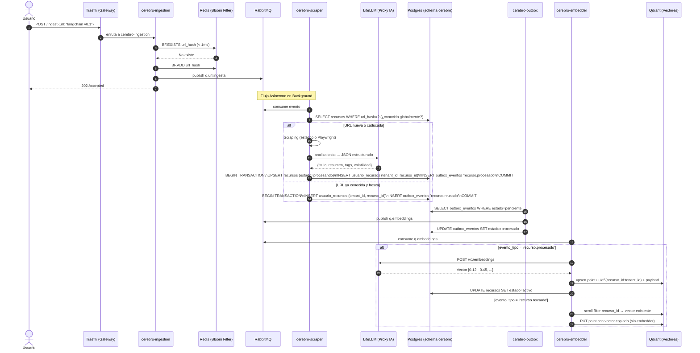

  
  

# 🌊 Ejemplo Completo de Flujo: Ingestión, Relaciones y Obsolescencia

Para ilustrar cómo los 21 contenedores del **LinkAnvil** interactúan en tiempo real, presentaremos un escenario de uso diario.

**El Escenario:**
Un desarrollador interactúa con el sistema para guardar documentación sobre un framework de Inteligencia Artificial ("LangChain"). El usuario realizará tres acciones cronológicas:

1. Añadir la documentación original (LangChain v0.1).
2. Añadir un tutorial relacionado con esa documentación.
3. Añadir la nueva versión de la documentación (LangChain v0.2), que hace obsoleta a la v0.1.

A lo largo de este viaje, veremos el flujo síncrono (respuesta inmediata al usuario), el flujo asíncrono (procesamiento de fondo) y cómo actúa la observabilidad pasiva.

---

## 🟢 Fase 1: El Primer Enlace (Ingestión y Creación)

**Acción:** El usuario envía desde su navegador la URL `https://python.langchain.com/v0.1/docs/` al sistema.

### 1. Recepción y Encolado (Milisegundos)

1. **`cerebro-traefik`** (o **`cerebro-tailscale`** si entra por webhook de Telegram): Recibe la petición y la enruta a `cerebro-ingestion`.
2. **`cerebro-ingestion`**: Aplica rate limiting atómico, consulta el Bloom Filter en Redis (con `BF.ADD`, que devuelve si era nueva o no) y **publica siempre al queue** — el bloom filter es un hint best-effort, no un veto. Si era duplicada, se publica con marca de "relink" para que el scraper resuelva la idempotencia más abajo.
3. **`cerebro-rabbitmq`**: La URL se inyecta en la cola `q.url.ingesta`.
4. **Retorno Inmediato**: `202 Accepted` con `status="Accepted & Published"` (URL nueva) o `"Accepted (relink)"` (vista antes en el bloom filter).

### 2. Procesamiento Asíncrono (Segundos)

1. **`cerebro-scraper`**: Consume el mensaje de RabbitMQ. Aplica primero un reescritor de dominios anti-bot agresivos (`medium.com` → `readmedium.com`) si el host coincide; luego decide la estrategia: Basic HTTP para HTML estático, Stealth Playwright/Chromium para SPAs, sitios JS-heavy o cuando el origen es `telegram`/`extension`.
2. **Scraping y validación**: Tras cada estrategia ejecuta `_looks_blocked()` con marcadores específicos (`cf-mitigated`, `verifica que usted no es un bot`, `failed to render this page`…) — evitando keywords genéricos como `cloudflare` solo, que matchearían `cdnjs.cloudflare.com` en sitios legítimos. Si tras Stealth sigue bloqueado, o si el texto extraído tras `_html_to_clean_text` es < 300 chars, **el recurso se mueve a `cuarentena` automáticamente** (con `quarantine_reason='manual'` y 30 días de gracia) en vez de embeder texto basura. El mensaje se ack-ea (no DLQ — el bloqueo no es un fallo recuperable).
3. **`cerebro-litellm`**: Si el contenido pasó la validación, el scraper envía el texto a LiteLLM solicitando un resumen, extracción de entidades y *tags*. LiteLLM se comunica con el proveedor (ej. NVIDIA NIM) y devuelve el JSON estructurado (validado con Pydantic).

### 3. Almacenamiento (Estado y Vectores — Patrón Outbox)

1. **`cerebro-scraper` consulta `cerebro.recursos` por `url_hash`**: si la URL ya existe globalmente y está fresca (estado='activo', `fecha_caducidad - now() > margen`), salta el scraping y va al paso de **reuso** (ver Fase 1.b). Si no existe o está caducada, sigue el flujo normal.
2. **`cerebro-postgres`**: El scraper guarda el recurso global en `cerebro.recursos` (sin `tenant_id`, deduplicado por `url_hash`), inserta el link `cerebro.usuario_recursos(tenant_id, recurso_id)` y un evento `recurso.procesado` en `cerebro.outbox_eventos`, todo en la **misma transacción**. Estado inicial: `'procesando'`.
3. **`cerebro-outbox`**: Lee `outbox_eventos` con estado `pendiente` y publica en la cola `q.embeddings`. Marca el evento como `procesado`.
4. **`cerebro-embedder`**: Consume `q.embeddings`. Llama a LiteLLM para generar el embedding numérico del texto.
5. **`cerebro-qdrant`**: El vector se inyecta con `point_id = uuid5(ns, "<recurso_id>:<tenant_id>")` y payload con `tenant_id`, `recurso_id`, url, título, categoría, volatilidad.
6. **`cerebro-postgres`**: El embedder actualiza `recursos.estado = 'activo'` y `embedding_version = 1`.

### 1.b Reuso cross-tenant (URL ya conocida globalmente)

Si la URL ya fue procesada por otro usuario y sigue fresca, el scraper:

1. Asocia el recurso global al nuevo tenant: `INSERT INTO usuario_recursos (tenant_id, recurso_id) ON CONFLICT DO NOTHING`.
2. Emite un evento `recurso.reusado` en outbox.
3. El embedder, al consumirlo, hace `scroll filter recurso_id` en Qdrant para localizar un punto existente y crea uno nuevo con el mismo vector y el `tenant_id` actualizado — **sin llamada a LiteLLM**, porque el embedding depende solo del contenido público.

Resultado: alta visibilidad inmediata en la KB del segundo usuario sin coste de scraping ni de embedder.

---

## 🟡 Fase 2: Añadir Enlaces Relacionados (Grafo de Conocimiento)

**Acción:** Al día siguiente, el usuario guarda un tutorial de YouTube: `https://youtube.com/watch?v=build-bot-langchain`.

El flujo se repite idéntico a la Fase 1, pero con un paso adicional de **Colisión Semántica**:

1. Tras generar el Embedding del tutorial a través de **`cerebro-litellm`**, **`cerebro-embedder`** hace una consulta de búsqueda por similitud en **`cerebro-qdrant`**.
2. **Qdrant** devuelve alta similitud (ej. Cosine > 0.88) con el UUID del recurso "LangChain v0.1".
3. **cerebro-scraper** envía ambos resúmenes a **LiteLLM** con un *prompt* interno: *"¿Están relacionados estos dos recursos y cómo?"*.
4. **LiteLLM** responde afirmativamente: *"El tutorial implementa los conceptos del framework"*.
5. **`cerebro-postgres`**: Se crea una entrada en `cerebro.relaciones` vinculando bidireccionalmente el Tutorial y el Framework.

---

## 🔴 Fase 3: Obsolescencia y Deprecación

**Acción:** Pasan los meses y el usuario añade la nueva documentación estructurada: `https://python.langchain.com/v0.2/docs/`.

1. Entra por `cerebro-traefik` → `cerebro-ingestion` → `cerebro-scraper` como de costumbre.
2. Durante la extracción, el texto indica claramente "Versión 0.2", "Migración desde 0.1", "Deprecado".
3. En la fase de Similitud Semántica, **`cerebro-embedder`** consulta **Qdrant** y obtiene similitud alta con LangChain v0.1.
4. **`cerebro-scraper`** instruye a **LiteLLM**: *"Identifica si uno de estos documentos hace obsoleto al otro"*.
5. La Inteligencia Artificial detecta que la v0.2 reemplaza a la v0.1.
6. **Manejo de Estado en `cerebro-postgres`**:
   - El nuevo enlace (v0.2) se inserta como `'activo'`.
   - El enlace antiguo (v0.1) se actualiza de `'activo'` a `'cuarentena'` o `'obsoleto'`.
   - Se crea una relación formal de actualización (`supersedes` / `replaced_by`).
7. Los vectores en Qdrant para la v0.1 se mantienen temporalmente, ya que la cuarentena asegura no borrar conocimiento a menos que el usuario lo destruya manualmente o una *Cron policy* lo expurgue posteriormente.

---

## 👁️ Fase 4: Observabilidad Silenciosa (Todo lo que el usuario no vio)

Mientras ocurrían las 3 fases anteriores, la mitad del clúster operaba silenciosamente para garantizar el rendimiento y la transparencia:

### Trazabilidad de las Peticiones (Tracing)

Cada vez que la URL pasó de Traefik a `cerebro-ingestion`, y de allí a `cerebro-scraper`, `cerebro-embedder` y LiteLLM, se propagó un `Trace-ID` de correlación único mediante headers OpenTelemetry.

- **`cerebro-otel`** (OpenTelemetry) interceptó el inicio y fin de cada llamada gRPC/HTTP de fondo.
- **`cerebro-jaeger`** dibujó una gráfica en cascada permitiendo al administrador ver exactamente cuántos milisegundos tomó LiteLLM en responder frente a lo que tardó el scraping web.

### Monitorización Médica (Metrics)

Las métricas del sistema no pararon.

- Los Exporters (**`cerebro-postgres-exporter`**, **`cerebro-redis-exporter`** y **`cerebro-rabbitmq-exporter`**) tradujeron el estado interno de las bases de datos cada 15 segundos.
- **`cerebro-prometheus`** raspó (*scraped*) estas traducciones para medir los picos de memoria RAM.
- Todo esto alimentó un Dashboard maestro en **`cerebro-grafana`**, mostrando si el pico de inyecciones de enlaces en RabbitMQ estaba ahogando el hardware.

### El Exportador Físico (Gemelo Markdown)

Finalmente, de manera desacoplada y reaccionando a los eventos "Outbox" guardados en Postgres:

- Un script de cron (`audit_cron` o similar guiado por sistema de eventos) activó al **Exportador LLM Wiki**.
- Este servicio extrajo el grafo de **Postgres** y materializó carpetas y archivos locales de extensiones Markdown (`.md`).
- Creó un archivo con *frontmatter* YAML y etiquetas correspondientes a "LangChain v0.2", insertó links al estilo Obsidian (`[[Tutorial Bot LangChain]]`) y movió la nota de v0.1 a un subdirectorio de archivo o la marcó con metadata `obsolete: true`.
- Adicionalmente agrupó las variables activas en `hot.md` para rápida carga al iniciar un diálogo local de asistente virtual.
