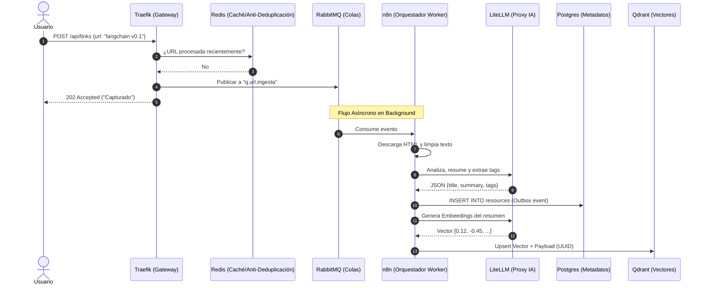

# 🌊 Ejemplo Completo de Flujo: Ingestión, Relaciones y Obsolescencia

Para ilustrar cómo los 14 contenedores del **LinkAnvil** interactúan en tiempo real, presentaremos un escenario de uso diario.

**El Escenario:**
Un desarrollador interactúa con el sistema para guardar documentación sobre un framework de Inteligencia Artificial ("LangChain"). El usuario realizará tres acciones cronológicas:

1. Añadir la documentación original (LangChain v0.1).
2. Añadir un tutorial relacionado con esa documentación.
3. Añadir la nueva versión de la documentación (LangChain v0.2), que hace obsoleta a la v0.1.

A lo largo de este viaje, veremos el flujo síncrono (respuesta inmediata al usuario), el flujo asíncrono (procesamiento de fondo) y cómo actúa la observabilidad pasiva.

---

## 🟢 Fase 1: El Primer Enlace (Ingestión y Creación)

**Acción:** El usuario envía desde su navegador la URL `https://python.langchain.com/v0.1/docs/` al sistema.

### 1. Recepción y Encolado (Milisegundos)

1. **`cerebro-traefik`**: Actuando como guardián del puerto 80/443, recibe la petición REST (`POST /api/links`) y la enruta internamente.
2. **`cerebro-redis`**: Traefik/API consulta la caché hiper-rápida. Verifica si la URL existe. Al ser nueva, avanza.
3. **`cerebro-rabbitmq`**: La URL se inyecta en la cola `q.url.ingesta`.
4. **Retorno Inmediato**: Se devuelve un estado `202 Accepted` al usuario ("Enlace capturado"). El usuario ya puede cerrar la pestaña.

### 2. Procesamiento Asíncrono (Segundos)

1. **`cerebro-n8n`**: Consume el mensaje de RabbitMQ cuando tiene capacidad.
2. **Scraping**: n8n descarga el HTML de la URL y limpia el ruido (menús, pies de página).
3. **`cerebro-litellm`**: n8n envía el texto estructurado a LiteLLM solicitando un resumen, extracción de entidades y *tags*. LiteLLM se comunica con el proveedor (ej. OpenAI) y devuelve el JSON estructurado.

### 3. Almacenamiento (Estado y Vectores)

1. **`cerebro-postgres`**: Se guarda un registro transaccional con el título, URL, resumen, etiquetas y un UUID único. Estado marcado como `'activo'`. Utiliza el *Outbox pattern* para asegurar consistencia.
2. **`cerebro-litellm`**: Se realiza una segunda llamada para convertir el resumen y tags en *Embeddings* (vectores numéricos).
3. **`cerebro-qdrant`**: El vector generado se inyecta en la colección principal asociado al UUID creado en Postgres.

---

## 🟡 Fase 2: Añadir Enlaces Relacionados (Grafo de Conocimiento)

**Acción:** Al día siguiente, el usuario guarda un tutorial de YouTube: `https://youtube.com/watch?v=build-bot-langchain`.

El flujo se repite idéntico a la Fase 1, pero con un paso adicional de **Colisión Semántica**:

1. Tras generar el Embedding del tutorial a través de **`cerebro-litellm`**, **`cerebro-n8n`** hace una consulta de búsqueda por similitud en **`cerebro-qdrant`**.
2. **Qdrant** devuelve alta similitud (ej. Cosine > 0.88) con el UUID de la base de datos de "LangChain v0.1".
3. **n8n** envía ambos resúmenes a **LiteLLM** con un *prompt* interno: *"¿Están relacionados estos dos recursos y cómo?"*.
4. **LiteLLM** responde afirmativamente: *"El tutorial implementa los conceptos del framework"*.
5. **`cerebro-postgres`**: Se crea una entrada en la tabla `relaciones` vinculando bidireccionalmente el Tutorial y el Framework.

---

## 🔴 Fase 3: Obsolescencia y Deprecación

**Acción:** Pasan los meses y el usuario añade la nueva documentación estructurada: `https://python.langchain.com/v0.2/docs/`.

1. Entra por Traefik, RabbitMQ y n8n como de costumbre.
2. Durante la extracción, el texto indica claramente "Versión 0.2", "Migración desde 0.1", "Deprecado".
3. En la fase de Similitud Semántica, **Qdrant** empareja este nuevo documento con LangChain v0.1.
4. **n8n** instruye a **LiteLLM**: *"Identifica si uno de estos documentos hace obsoleto al otro"*.
5. La Inteligencia Artificial detecta que la v0.2 reemplaza a la v0.1.
6. **Manejo de Estado en `cerebro-postgres`**:
   - El nuevo enlace (v0.2) se inserta como `'activo'`.
   - El enlace antiguo (v0.1) se actualiza de `'activo'` a `'cuarentena'` o `'obsoleto'`.
   - Se crea una relación formal de actualización (`supersedes` / `replaced_by`).
7. Los vectores en Qdrant para la v0.1 se mantienen temporalmente, ya que la cuarentena asegura no borrar conocimiento a menos que el usuario lo destruya manualmente o una *Cron policy* lo expurgue posteriormente.

---

## 👁️ Fase 4: Observabilidad Silenciosa (Todo lo que el usuario no vio)

Mientras ocurrían las 3 fases anteriores, la mitad del clúster operaba silenciosamente para garantizar el rendimiento y la transparencia:

### Trazabilidad de las Peticiones (Tracing)

Cada vez que la URL pasó de Traefik a RabbitMQ, y de allí a n8n y a LiteLLM, se inyectó un ID de correlación único.

- **`cerebro-otel`** (OpenTelemetry) interceptó el inicio y fin de cada llamada gRPC/HTTP de fondo.
- **`cerebro-jaeger`** dibujó una gráfica en cascada permitiendo al administrador ver exactamente cuántos milisegundos tomó LiteLLM en responder frente a lo que tardó el scraping web.

### Monitorización Médica (Metrics)

Las métricas del sistema no pararon.

- Los Exporters (**`cerebro-postgres-exporter`**, **`cerebro-redis-exporter`** y **`cerebro-rabbitmq-exporter`**) tradujeron el estado interno de las bases de datos cada 15 segundos.
- **`cerebro-prometheus`** raspó (*scraped*) estas traducciones para medir los picos de memoria RAM.
- Todo esto alimentó un Dashboard maestro en **`cerebro-grafana`**, mostrando si el pico de inyecciones de enlaces en RabbitMQ estaba ahogando el hardware.

### El Exportador Físico (Gemelo Markdown)

Finalmente, de manera desacoplada y reaccionando a los eventos "Outbox" guardados en Postgres:

- Un script de cron (`audit_cron` o similar guiado por sistema de eventos) activó al **Exportador LLM Wiki**.
- Este servicio extrajo el grafo de **Postgres** y materializó carpetas y archivos locales de extensiones Markdown (`.md`).
- Creó un archivo con *frontmatter* YAML y etiquetas correspondientes a "LangChain v0.2", insertó links al estilo Obsidian (`[[Tutorial Bot LangChain]]`) y movió la nota de v0.1 a un subdirectorio de archivo o la marcó con metadata `obsolete: true`.
- Adicionalmente agrupó las variables activas en `hot.md` para rápida carga al iniciar un diálogo local de asistente virtual.
