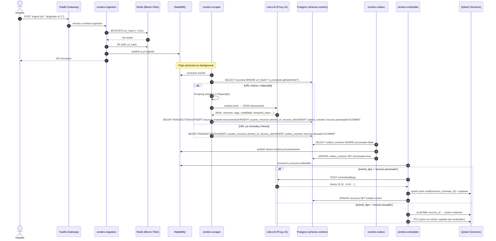

  
  

# 🌊 Ejemplo Completo de Flujo: Ingestión, Relaciones y Obsolescencia  — LinkAnvil

Para ilustrar cómo los ~23 contenedores de **LinkAnvil** colaboran en
tiempo real, seguimos un escenario realista de uso diario.

**El escenario:**
Un desarrollador interactúa con el sistema para guardar documentación sobre
un framework de IA llamado **LangChain**. Va a hacer tres acciones en
orden cronológico:

1. **Añadir** la documentación original (LangChain v0.1).
2. **Añadir** un tutorial de YouTube relacionado.
3. **Añadir** la nueva versión de la documentación (LangChain v0.2), que
   deja obsoleta a la v0.1.

A lo largo del recorrido veremos tres dimensiones del sistema:

- El **flujo síncrono** (lo que el usuario percibe como respuesta inmediata).
- El **flujo asíncrono** (lo que ocurre en background con colas y workers).
- La **observabilidad pasiva** (trazas, métricas y exportaciones que
  ocurren sin intervención del usuario).

> Nota: el escenario LangChain v0.1 → tutorial → v0.2 es **ilustrativo**,
> no un test reproducible. Las clasificaciones (`EXTIENDE`,
> `VUELVE_OBSOLETO`) dependen del LLM y pueden variar entre corridas; lo
> que es determinista son los **estados de las tablas y eventos del
> outbox**, no las palabras exactas que devuelve el modelo.

---

## 🧭 Antes de empezar — vocabulario mínimo

Si vienes nuevo al proyecto, estos cuatro conceptos te ayudarán a leer
el resto del documento sin perderte:

- **Tenant** — cada usuario aislado. LinkAnvil es **multi-tenant**: los
  datos de un usuario (sus recursos, sus chats, sus notificaciones)
  nunca son visibles a otro, aunque vivan en las mismas tablas.
  Se identifica por un `tenant_id` con formato `user_<32 hex>` para
  cuentas registradas o `demo_<8 hex>` para sub-tenants efímeros del
  demo público.

- **Síncrono vs asíncrono** — síncrono = el usuario espera a que termine
  (ej.: abrir el chat y leer). Asíncrono = el usuario lanza una tarea y
  el sistema responde "recibido, te aviso cuando esté" (ej.: ingestar
  una URL nueva — puede tardar 30 s en procesarse). Casi toda la
  ingestión de LinkAnvil es asíncrona.

- **Cola de mensajes** — buzón donde un servicio deja una tarea y otro
  la recoge. LinkAnvil usa **RabbitMQ** como broker de colas: el
  scraper consume `q.url.ingesta`, el embedder consume
  `q.recurso.embedder`, el notifier consume `q.notifications`. Esto
  desacopla los servicios (uno puede caerse sin parar a los otros).

- **Búsqueda semántica** — en lugar de buscar por palabras exactas, se
  busca por significado. Para hacerlo, cada texto se transforma en un
  **vector** (lista de cientos de números) que representa su contenido
  en el espacio semántico. Los textos parecidos tienen vectores
  parecidos. **Qdrant** es la base de datos que guarda esos vectores y
  permite "dame los más similares a este otro".

---

## Tabla de contenidos

1. [🟢 Fase 1: El primer enlace (ingestión y creación)](#-fase-1-el-primer-enlace-ingestión-y-creación)
   - 1.1 [Recepción y encolado (milisegundos)](#11-recepción-y-encolado-milisegundos)
   - 1.2 [Procesamiento asíncrono (segundos)](#12-procesamiento-asíncrono-segundos)
   - 1.3 [Almacenamiento (patrón Outbox)](#13-almacenamiento-patrón-outbox)
   - 1.b [Reuso cross-tenant (URL ya conocida globalmente)](#1b-reuso-cross-tenant-url-ya-conocida-globalmente)
2. [🟡 Fase 2: Añadir enlaces relacionados (grafo de conocimiento)](#-fase-2-añadir-enlaces-relacionados-grafo-de-conocimiento)
3. [🔴 Fase 3: Obsolescencia y deprecación](#-fase-3-obsolescencia-y-deprecación)
   - 3.a [Camino temporal — el cron nocturno](#3a-camino-temporal--el-cron-nocturno)
   - 3.b [Camino semántico — el reemplazo por contenido más reciente](#3b-camino-semántico--el-reemplazo-por-contenido-más-reciente)
   - 3.c [Camino manual — el usuario manda algo a cuarentena](#3c-camino-manual--el-usuario-manda-algo-a-cuarentena)
   - 3.d [Camino por policy — contenido pasado clasificado al ingestar](#3d-camino-por-policy--contenido-pasado-clasificado-al-ingestar)
   - 3.e [Y luego — el usuario decide](#3e-y-luego--el-usuario-decide)
   - 3.f [Camino demo — auditoría intra-sesión](#3f-camino-demo--auditoría-intra-sesión)
4. [👁️ Fase 4: Observabilidad silenciosa](#️-fase-4-observabilidad-silenciosa-todo-lo-que-el-usuario-no-vio)
5. [📚 Glosario rápido](#-glosario-rápido)

---

## 🟢 Fase 1: El primer enlace (ingestión y creación)

**Acción:** El usuario envía desde su navegador la URL
`https://python.langchain.com/v0.1/docs/` al sistema.

### 🎯 ¿Qué pasa aquí?

El sistema recibe una URL, la descarga, la analiza con un LLM, la guarda
en la base de datos y genera su representación vectorial para que pueda
buscarse semánticamente más tarde. El usuario recibe una respuesta
inmediata (`202 Accepted`) y el procesamiento real ocurre en background.

### 🛠️ El viaje paso a paso

#### 1.1 Recepción y encolado (milisegundos)

1. **`cerebro-traefik`** (el **reverse proxy** del clúster: enruta cada
   petición HTTP al servicio interno correspondiente) recibe la petición
   y la envía a `cerebro-ingestion`. Si la URL entra por Telegram,
   **`cerebro-tailscale`** (red privada VPN) expone `cerebro-ingestion`
   al webhook de Telegram sin exponer la API a internet; el receptor
   real del payload sigue siendo `cerebro-ingestion`, a través de su
   webhook `POST /webhook/telegram/{token_hash}`.

2. **`cerebro-ingestion`** (la API de entrada para ingestar URLs):
   - Aplica **rate limiting** atómico en Redis (máximo de peticiones por
     usuario por minuto; si lo excedes, devuelve 429).
   - Consulta un **Bloom Filter** en Redis **por tenant**
     (clave `bf:tenant:{tenant_id}:ingestion`) — estructura de datos
     probabilística muy compacta que responde "definitivamente NO he
     visto esto antes" o "quizás sí lo he visto" *para este tenant*;
     `BF.ADD` devuelve también si la URL era nueva para el tenant en
     cuestión. El Bloom es solo un hint local; la deduplicación global
     cross-tenant la hace el scraper consultando `recursos.url_hash` en
     Postgres.
   - **Publica SIEMPRE** al queue, sin importar lo que diga el bloom —
     el filtro es solo un hint *best-effort*, no un veto. El payload
     del mensaje es siempre el mismo (no se añade ningún flag de
     duplicado); el scraper resuelve la idempotencia río abajo
     consultando `recursos` por `url_hash` antes de scrapear (ver
     paso 1.3 punto 1).

3. **`cerebro-rabbitmq`** (el message broker): la URL se inyecta en la
   cola `q.url.ingesta`.

4. **Retorno inmediato al usuario**: `202 Accepted` con
   `status="Accepted & Published"` (URL nueva) o `"Accepted (relink)"`
   (vista antes en el bloom filter — este string es solo un hint en la
   respuesta HTTP, no se propaga al mensaje). El navegador muestra la
   URL en `/ingest` con estado `procesando` al instante.

#### 1.2 Procesamiento asíncrono (segundos)

5. **`cerebro-scraper`** (worker que descarga y limpia HTML): consume
   el mensaje de la cola.
   - Aplica primero un **reescritor de dominios anti-bot** (`medium.com`
     → `readmedium.com`) si el host coincide — algunos sitios tienen
     paywalls o CAPTCHAs muy agresivos y existen mirrors públicos que
     sirven el mismo contenido.
   - Decide la estrategia de scraping:
     - **Basic HTTP** para HTML estático (rápido, ~100 ms).
     - **Stealth Playwright/Chromium** (browser headless emulado con
       evasión de detección de bots) para SPAs, sitios JS-heavy, o
       cuando el origen es `telegram` / `extension` (que tienden a
       lanzar bloqueos por user-agent automático).

6. **Validación post-scraping**: tras cada estrategia ejecuta una
   detección de bloqueo que busca marcadores específicos
   (`cf-mitigated`, `verifica que usted no es un bot`,
   `failed to render this page`…). Evita keywords genéricos como
   `cloudflare` a secas — eso matchearía `cdnjs.cloudflare.com` en
   sitios legítimos. Si tras Stealth sigue bloqueado, **o** si el
   texto extraído tras limpiar HTML es < 300 caracteres, el recurso se
   mueve a `cuarentena` automáticamente (motivo `manual`, 30 días de
   gracia). El mensaje se *ack-ea* (= se confirma al broker que se
   procesó, no DLQ — el bloqueo no es un fallo recuperable: reintentar
   no lo arreglaría).

   > 💡 **¿Por qué cuarentena y no descarte?** El usuario lo añadió a
   > propósito; descartarlo silenciosamente sería frustrante. La
   > cuarentena le da 30 días para decidir: rescatar (e intentar de
   > nuevo manualmente más tarde) o eliminar.

7. **`cerebro-litellm`** (proxy unificado para llamar a varios LLMs):
   si el contenido pasó la validación, el scraper envía el texto
   pidiendo un JSON estructurado con 10 campos (título, resumen,
   categoría, tags, `temporal_class`, `valor_archivistico`,
   `event_date`, etc.). El JSON se valida con **Pydantic** (librería
   Python para definir schemas estrictos). Ver
   [`7-prompts.md` §2.1](./7-prompts.md#21-extracción-de-metadata-scraper)
   para el schema exacto.

#### 1.3 Almacenamiento (patrón Outbox)

8. **`cerebro-scraper` consulta `cerebro.recursos` por `url_hash`**
   (hash SHA-256 de la URL — sirve como clave de deduplicación
   global): si la URL ya existe globalmente y está fresca
   (`estado='activo'` y `fecha_caducidad - now() > margen`), salta el
   scraping y va al paso de **reuso** (ver Fase 1.b). Si no existe o
   está caducada, sigue el flujo normal.

9. **`cerebro-postgres`** (la base de datos relacional, esquema
   `cerebro`): el scraper guarda el recurso global en
   `cerebro.recursos` (sin `tenant_id` — la fila es compartida entre
   todos los usuarios que añaden la misma URL), inserta el link
   `cerebro.usuario_recursos(tenant_id, recurso_id)` (tabla pivote
   N:M entre usuarios y recursos), e inserta un evento
   `recurso.procesado` en `cerebro.outbox_eventos`. **Las tres
   inserts viven en la misma transacción SQL**. Estado inicial:
   `procesando`.

   > 💡 **¿Qué es el patrón Outbox y por qué lo usamos?**
   > Imagina que el scraper hace dos llamadas separadas: primero
   > guarda en Postgres, luego publica en RabbitMQ. Si Postgres
   > confirma y RabbitMQ se cae a medias, el recurso queda guardado
   > pero nunca se vectoriza — inconsistencia silenciosa.
   >
   > El patrón Outbox resuelve esto: en lugar de publicar a RabbitMQ
   > directamente, escribimos el mensaje en una tabla `outbox_eventos`
   > **dentro de la misma transacción SQL** que el INSERT principal.
   > Si algo falla, AMBOS cambios se revierten juntos. Un proceso
   > aparte (`cerebro-outbox`) vacía la tabla hacia RabbitMQ después,
   > con reintentos. Garantía: el evento eventualmente llega, o ambos
   > cambios se descartan.

10. **`cerebro-outbox`** (worker relay): lee `outbox_eventos` donde
    `procesado=false`, publica el evento en el **fanout exchange**
    `cerebro.procesamiento` (tipo de routing de RabbitMQ donde cada
    mensaje publicado se copia a **todas** las colas conectadas — útil
    cuando varios workers independientes necesitan ver el mismo
    evento) y marca el row como `procesado=true`.

11. **`cerebro-embedder`** (worker que genera vectores): consume del
    fanout vía su cola `q.recurso.embedder` (la cola está bound al
    fanout `cerebro.procesamiento` con routing key vacía). Filtra por
    `evento_tipo` — solo procesa `recurso.procesado` y
    `recurso.reusado`. Otros eventos (`recurso.cuarentena`,
    `recurso.expirado`…) los ack-ea silenciosamente; no son su
    responsabilidad.
    - Llama a `cerebro-litellm` para generar el **embedding**
      (vector numérico que representa el significado del texto).

12. **`cerebro-qdrant`** (base de datos vectorial): el vector se
    inyecta con `point_id = uuid5(ns, "<recurso_id>:<tenant_id>")`.
    **UUID v5** es un UUID determinista: con el mismo input siempre
    genera el mismo UUID. Permite hacer upsert idempotente (re-ingestar
    no duplica points). Payload del point incluye `tenant_id`,
    `recurso_id`, url, título, categoría, volatilidad.

13. **`cerebro-postgres`**: el embedder actualiza
    `recursos.estado = 'activo'` y `embedding_version = 1` (este
    último permite re-embebidos masivos en el futuro si cambiamos de
    modelo). A partir de aquí el recurso es **visible al RAG**
    (sistema de búsqueda contextual del chat — *Retrieval-Augmented
    Generation*: el LLM responde basándose en chunks recuperados de
    Qdrant, no solo en su conocimiento general).

### ⚠️ La rama 1.b — Reuso cross-tenant (URL ya conocida globalmente)

Si la URL ya fue procesada por otro tenant y sigue fresca, el scraper
ahorra trabajo:

1. Asocia el recurso global al nuevo tenant:
   `INSERT INTO usuario_recursos (tenant_id, recurso_id) ON CONFLICT DO NOTHING`.
2. Emite un evento `recurso.reusado` en outbox.
3. El embedder, al consumirlo, hace `scroll filter recurso_id` en
   Qdrant para localizar un point existente, copia su vector y crea
   un nuevo point con el `tenant_id` actualizado —
   **sin llamar a LiteLLM**, porque el embedding depende solo del
   contenido público de la URL (es determinista para el mismo texto).

**Resultado**: alta visibilidad inmediata en la KB del segundo usuario
sin coste de scraping ni de embedder.

> 💡 **¿Por qué tener un recurso "global" y no copias por tenant?**
> Si 50 usuarios añaden el mismo paper, scrapearlo 50 veces y guardar
> 50 vectores duplicados sería absurdo (carga LiteLLM × 50, coste ×
> 50). El recurso vive una sola vez en `cerebro.recursos`; la tabla
> pivote `usuario_recursos` define qué tenants lo "tienen". El
> aislamiento entre tenants sigue siendo total (un usuario solo ve
> sus filas linkeadas), pero ahorramos coste y latencia.

### Diagrama del flujo

**Cómo leer el diagrama**: el tiempo fluye de arriba abajo. Las flechas
sólidas son llamadas síncronas, las punteadas son respuestas. El `alt /
else` indica ramificación condicional. `Note over` agrupa pasos que son
"en background" desde la perspectiva del usuario.

---

## 🟡 Fase 2: Añadir enlaces relacionados (grafo de conocimiento)

**Acción:** Al día siguiente, el usuario guarda un tutorial de YouTube:
`https://youtube.com/watch?v=build-bot-langchain`.

### 🎯 ¿Qué pasa aquí?

El sistema repite el flujo de Fase 1 pero, al detectar que el nuevo
recurso es muy parecido a uno existente (LangChain v0.1), añade un paso
extra: pregunta al LLM cómo se relacionan los dos y guarda esa relación
en un grafo. Así el chat puede luego "saber" que el tutorial es una
implementación práctica del framework.

### 🛠️ El viaje paso a paso

1. Mismo flujo que Fase 1 hasta generar el embedding del tutorial.

2. **`cerebro-embedder`** consulta **Qdrant** buscando vectores
   similares. Qdrant devuelve la **similitud coseno** (medida entre 0
   y 1 que compara dos vectores: 1 = idénticos, 0 = ortogonales /
   sin relación) con cada recurso conocido. Encuentra alta similitud
   (cosine > 0.92) con el UUID del recurso "LangChain v0.1".

3. **`cerebro-embedder`** envía ambos resúmenes a **`cerebro-litellm`**
   con el **prompt clasificador de relación semántica** (ver
   [`7-prompts.md` §2.2](./7-prompts.md#22-clasificador-de-relación-semántica-embedder)):
   pide tipificar la relación con UNA palabra del enum
   `{ES_UN, CONTRADICE, EXTIENDE, VUELVE_OBSOLETO, ASOCIACION_GENERAL}`.

4. **LiteLLM** responde: `EXTIENDE` (el tutorial implementa los
   conceptos del framework).

5. **`cerebro-postgres`**: se crea una entrada bidireccional en
   `cerebro.grafo_relaciones`:
   - `tutorial → framework` con tipo `EXTIENDE`.
   - `framework → tutorial` con tipo `EXTENDIDO_POR` (relación inversa).

### 💡 Por qué este diseño

El umbral 0.92 es **alto a propósito**. Por debajo es ruido — dos
artículos del mismo dominio (ej.: ambos hablan de Python) tienen
similitud ~0.7, pero no están realmente relacionados. Solo por encima
de 0.92 (un threshold calibrado empíricamente) tiene sentido pedirle al
LLM que tipifique la relación. Esto evita decenas de llamadas al LLM
por cada ingesta — solo se invoca cuando hay una señal fuerte de
similitud.

---

## 🔴 Fase 3: Obsolescencia y deprecación

> 📘 **Referencia canónica del ciclo de vida**: [`8-lifecycle.md`](./8-lifecycle.md).
> Esta sección cuenta narrativas concretas; el documento dedicado
> describe el state machine completo, todas las transiciones y los
> efectos exactos sobre Postgres y Qdrant.

### 🎯 ¿Qué pasa aquí?

Los recursos no son eternos. Una noticia caduca, un paper se vuelve
obsoleto por uno más nuevo, un evento ya ocurrió. LinkAnvil tiene
**cinco caminos** distintos para mover un recurso de `activo` a un
estado terminal (`cuarentena`, `expirado` o eliminado):

1. **3.a — Cron temporal**: una `fecha_caducidad` cumplida → cuarentena.
2. **3.b — Colisión semántica**: un recurso más nuevo vuelve obsoleto a
   uno antiguo.
3. **3.c — Decisión manual**: el usuario manda algo a cuarentena
   desde `/kb`.
4. **3.d — `audit_policy` al ingestar**: el LLM detecta que el
   contenido es retrospectivo (fecha pasada) y la policy del tenant
   decide qué hacer (cuarentena, archivo histórico, o seguir activo).
5. **3.f — Auditoría intra-sesión del demo**: ruta paralela al cron de
   producción, ejecutada durante la sesión demo sobre sub-tenants
   efímeros.

Después de cualquiera de esos caminos, **3.e** describe las acciones
que el usuario puede tomar sobre el recurso ya transicionado.

### 3.a Camino temporal — el cron nocturno

**Acción:** El usuario añadió hace meses la URL del estreno de una
exposición, con `fecha_caducidad = 2026-03-19`. Hoy es 2026-04-10. El
usuario no ha vuelto a tocar el sistema.

#### 🛠️ El viaje paso a paso

1. A las 03:00 UTC (default del contenedor n8n, sin TZ explícita)
   **`cerebro-n8n`** (orquestador de workflows con UI visual — similar
   a Zapier pero self-hosted) dispara el workflow
   `linkanvil — audit cron diario`. Hace `POST /admin/audit-cron` con
   el header `X-Admin-Token`.

2. **`cerebro-api`** ejecuta la **Fase A** del cron de auditoría: un
   `UPDATE recursos SET estado='cuarentena'` filtrado por
   `estado='activo' AND temporal_class = 'evento' AND fecha_caducidad <= NOW()::DATE`.

   > 💡 **¿Por qué el filtro `temporal_class = 'evento'`?** La
   > clasificación temporal del LLM distingue recursos con deadline
   > (`evento`) de los descriptivos (`referencia`) y los eternos
   > (`evergreen`). Solo los `evento` tienen `fecha_caducidad`
   > activa; los demás la tienen `NULL`. El filtro es defensa en
   > profundidad: si por error se rellena la caducidad en una
   > referencia, el cron NO la cuarentena automáticamente.

3. La URL de la exposición transiciona a `cuarentena`, motivo
   `caducidad`, con `quarantine_grace_until = 2026-05-10` (30 días por
   defecto vía `OBSOLESCENCE_GRACE_DAYS`).

4. Por cada tenant linkeado al recurso, el cron inserta un evento
   `recurso.cuarentena` en `outbox_eventos` (un evento por tenant
   afectado).

5. **`cerebro-outbox`** publica esos eventos al fanout
   `cerebro.procesamiento`. **`cerebro-notifier`** (worker dedicado a
   notificaciones) consume desde `q.notifications`, inserta una fila
   en `notificaciones` (feed in-app para el bell de la UI) y, si el
   tenant tiene bot de Telegram configurado, envía un mensaje al
   chat.

6. Los **vectores en Qdrant siguen intactos** — ni `cerebro_recursos`
   ni `cerebro_chunks` se tocan. El recurso simplemente deja de
   aparecer en el RAG porque el filtro de recursos activos solo
   acepta `estado='activo'`.

#### ⚠️ Variante con disparo manual

Si el usuario no quiere esperar al cron, puede pulsar el botón
**"Revisar caducidades"** en `/kb`, que llama a
`POST /resources/audit-now` (auth de usuario normal + rate-limit
5/min) y ejecuta exactamente la misma lógica que el cron.

### 3.b Camino semántico — el reemplazo por contenido más reciente

**Acción:** El usuario añade la nueva documentación estructurada:
`https://python.langchain.com/v0.2/docs/`.

#### 🛠️ El viaje paso a paso

1. Entra por `cerebro-traefik` → `cerebro-ingestion` →
   `cerebro-scraper` como de costumbre.

2. Durante la extracción, el texto indica claramente "Versión 0.2",
   "Migración desde 0.1", "Deprecado".

3. En la fase de similitud semántica (igual que en Fase 2),
   **`cerebro-embedder`** consulta **Qdrant** y obtiene similitud alta
   con LangChain v0.1.

4. **`cerebro-embedder`** llama a LiteLLM con el prompt clasificador
   de relación semántica. La IA responde `VUELVE_OBSOLETO`.

5. **Manejo de estado en `cerebro-postgres`**:
   - El nuevo enlace (v0.2) se inserta como `'activo'`.
   - El enlace antiguo (v0.1) se actualiza de `'activo'` a
     `'cuarentena'` con `quarantine_reason='colision_semantica'` y
     `quarantine_grace_until = today + 30d`.
   - Se crea una relación bidireccional en `grafo_relaciones`
     (`VUELVE_OBSOLETO` y su inverso `OBSOLECIDO_POR`).

6. Igual que en 3.a: outbox → notifier → in-app + Telegram. Vectores
   en Qdrant intactos.

### 3.c Camino manual — el usuario manda algo a cuarentena

Trivial: el usuario pulsa el botón "Mandar a cuarentena" sobre un
recurso en `/kb`. El frontend llama a
`POST /resources/{id}/quarantine` (sin body específico). El backend
fija internamente `quarantine_reason='manual'`, hace
`UPDATE recursos SET estado='cuarentena'` + emite outbox + sigue el
mismo pipeline (notifier, SSE, Telegram).

### 3.d Camino por policy — contenido pasado clasificado al ingestar

**Acción:** El usuario pega en `/ingest` dos URLs el mismo día:

- `https://www.diaridegirona.cat/girona/2024/03/18/expojove-oferira-propostes-d-estudis-99635086.html`
  — artículo de prensa sobre la feria Expojove 2024 (ya celebrada).
- `https://aemetblog.es/2020/09/18/avance-climatico-nacional-del-verano-2020/`
  — informe oficial de AEMET sobre el verano de 2020.

Su tenant tiene `audit_policy` en el preset **Equilibrado** (default).

#### 📖 Mini-glosario del flujo policy-driven

Antes de seguir, estos 6 términos aparecen varias veces:

| Término | Significado |
|---|---|
| `audit_policy` | Configuración JSONB por tenant con 6 keys que decide qué hacer con contenido pasado. Se edita desde `/profile` (panel lateral Perfil → card "Auditoría de recursos"). |
| `temporal_class` | Tipo de contenido extraído por el LLM: `evento` (deadline/feria/oferta), `referencia` (artículo descriptivo), `evergreen` (tutorial atemporal). |
| `valor_archivistico` | ¿Vale la pena guardarlo si su fecha es pasada? `alto` (informes oficiales, papers), `medio` (prensa estándar), `nulo` (anuncio caducado). |
| `auto_archive_pending` | Flag booleano en `recursos`. Si `true`, el embedder transiciona el recurso directamente a `expirado` tras vectorizar (en vez del default `activo`). |
| `evento_pasado` | Valor del campo `quarantine_reason`. Indica que el recurso entró en cuarentena porque el LLM detectó fecha pasada. |
| Archivo histórico | El estado `expirado` significa "archivado, recuperable opcionalmente", no "borrado". Se accede en el chat con el toggle "Archivo ON". |

#### 🛠️ El viaje paso a paso

1. **Scraper** descarga ambas URLs y llama a LiteLLM con el prompt
   actualizado (3 campos extra: `event_date`, `temporal_class`,
   `valor_archivistico`). El LLM extrae:

   | URL | `event_date` | `temporal_class` | `valor_archivistico` |
   |---|---|---|---|
   | Expojove | 2024-03-18 (lo deduce del path de la URL) | `referencia` | `medio` (prensa estándar) |
   | AEMET | 2020-09-18 (del path) | `referencia` | `alto` (informe oficial con datos) |

2. **El paso de almacenamiento** consulta la `audit_policy` del tenant
   (cache in-process 60 s para no consultar Postgres en cada ingesta).
   Compone la key del JSONB combinando clase + valor archivístico:
   - Expojove: key `referencia_pasada_medio` → policy dice
     `"cuarentena"`. El recurso queda `estado='cuarentena'`,
     `quarantine_reason='evento_pasado'`, 30 días de gracia. El outbox
     emite directamente `recurso.cuarentena` (no un `recurso.procesado`
     que luego se filtre). Aparecerá en `/quarantine` con badge azul
     "Evento pasado".
   - AEMET: key `referencia_pasada_alto` → policy dice `"expirado"`.
     Marca `auto_archive_pending=true`, `estado='procesando'`, y el
     outbox emite `recurso.procesado` para que el embedder vectorice
     antes de archivar.

3. **Embedder** procesa los eventos del outbox:
   - **Expojove**: el outbox emitió `recurso.cuarentena`
     directamente. El embedder **ni siquiera lo recibe** como evento a
     procesar: su filtro acepta únicamente `recurso.procesado` y
     `recurso.reusado` (defensa en profundidad por si llegase). El
     flujo principal es que la decisión policy-driven ya se aplicó en
     la propia transacción, así que Expojove **nunca entra al pipeline
     de vectorización**.
   - **AEMET**: el outbox emitió `recurso.procesado` con el flag
     `auto_archive_pending=true` en el payload. El embedder vectoriza
     normalmente, inyecta el point en la colección Qdrant
     `cerebro_recursos`, construye chunks (~1200 caracteres con
     overlap de 150 chars), los inyecta en la **colección Qdrant
     `cerebro_chunks`** (separada del recurso "head" en
     `cerebro_recursos`), transiciona directo a `'expirado'`, y
     **emite un segundo evento outbox `recurso.expirado` con
     `motivo='auto_archive'`** para que el notifier avise al usuario.

   > 💡 **¿Por qué el embedder lee el flag de la BD si ya viene en el
   > payload?** Defensa en profundidad. El payload del outbox lleva el
   > flag como hint para evitar una query extra, pero si el evento ya
   > estaba en la cola desde antes del deploy (sin el campo nuevo) o
   > si alguna mutación intermedia cambió el flag, la BD es la fuente
   > autoritativa. El embedder consulta el flag justo antes de la
   > transición.

4. **Notificaciones al usuario**:
   - **Expojove**: el `recurso.cuarentena` con motivo `evento_pasado`
     llega al notifier → INSERT en `notificaciones` + PUBLISH a Redis
     canal `resources:{tenant_id}` + (si Telegram activo) bot envía
     "⚠️ Tu recurso \"Expojove…\" tiene fecha pasada y requiere
     revisión".
   - **AEMET**: el `recurso.expirado` con motivo `auto_archive` llega
     al notifier → INSERT + PUBLISH + Telegram "📦 Tu recurso
     \"Avance Climático Nacional…\" se archivó automáticamente.
     Recuperable en chat con toggle Archivo ON".
   - El frontend recibe ambos vía **SSE / Server-Sent Events** (canal
     HTTP de larga duración que el servidor mantiene abierto para
     empujar eventos al browser sin que este los pida —
     `/resources/stream`): la campana incrementa unread y los badges
     del sidebar (`Cuarentena` / `Expirados`) se refrescan al
     instante.

5. **Resultado tras ~30 segundos**:
   - Expojove en `/quarantine` con badge azul "Evento pasado",
     esperando decisión del usuario.
   - AEMET en `/expired` (UI dice "Archivo histórico") con chunks
     indexados en Qdrant.
   - Bell con 2 notificaciones nuevas, una por cada URL.

6. **Recuperación en chat**: el usuario pregunta "¿Cómo fue el verano
   2020 según AEMET?". Con el toggle **RAG ON + Archivo ON**, el
   endpoint `/chat` pasa `include_archive=true` y el filtro de recursos
   activos amplía el rango a `estado IN ('activo','expirado')`.
   Qdrant devuelve los chunks del AEMET y el LLM responde con datos
   reales del informe. Con **Archivo OFF**, el AEMET no aparece (queda
   como archivo pasivo, solo visible en `/expired`).

7. **Cambio de policy**: el usuario va a `/profile` (o abre el panel
   lateral Perfil), switchea al preset **Estricto** y re-ingesta el
   AEMET. Esta vez la key `referencia_pasada_alto` dice
   `"cuarentena"` → AEMET va a triaje manual. El usuario puede pulsar
   **Rescatar** o dejar que la gracia lo mande a `expirado`.

#### Tabla resumen — comportamiento por preset

Esta es la matriz que decide qué destino tiene un recurso "fecha
pasada" según el preset elegido. Cada celda es la decisión del JSONB
para esa combinación clase × valor:

| Preset | evento + alto | evento + medio | evento + nulo | referencia + alto | referencia + medio | referencia + nulo |
|---|---|---|---|---|---|---|
| **Estricto** | cuarentena | cuarentena | cuarentena | cuarentena | cuarentena | cuarentena |
| **Equilibrado** (default) | expirado | cuarentena | cuarentena | expirado | cuarentena | cuarentena |
| **Permisivo** | expirado | cuarentena | cuarentena | expirado | activo | cuarentena |

Cada celda se puede sobreescribir individualmente desde `/profile` (los
3 presets son atajos para precargar los 6 selects de un click).

### 3.e Y luego — el usuario decide

Una vez en `cuarentena`, hay **30 días de gracia**
(`OBSOLESCENCE_GRACE_DAYS`). El usuario verá el recurso en
`/quarantine` con cuatro acciones posibles:

| Acción del usuario | Efecto |
|---|---|
| **Rescatar** | El recurso vuelve a `activo`. `fecha_caducidad` se recalcula según `volatilidad` (baja=+365d, media=+180d, alta=+60d, dinamica=+30d). Los vectores en Qdrant son los mismos — vuelve a ser visible al RAG. |
| **Expirar ya** | El recurso pasa a `expirado` saltándose el resto del período de gracia. |
| **Borrar definitivamente** | Desliga al tenant. Si era el último tenant linkeado: borrado global en Postgres + cleanup de los puntos en Qdrant (`cerebro_recursos` y `cerebro_chunks`). **Es la única operación de todo el ciclo que toca Qdrant**. |
| **No hacer nada** | A los 30 días, la Fase B del cron transiciona a `expirado` automáticamente. El recurso sigue ocupando vectores en Qdrant, pero invisible al RAG. |

⚠️ Un recurso en `expirado` **nunca se borra solo**. El usuario debe
pasar por `/expired` y pulsar "Borrar definitivamente" para liberar
espacio en Qdrant. No existe (a día de hoy) garbage collection
automático de vectores huérfanos.

### 3.f Camino demo — auditoría intra-sesión

**Acción:** El visitante entra al demo (sub-tenant efímero
`demo_<8 hex>`) y, durante su sesión, los recursos pre-cargados
transicionan a `cuarentena` o `expirado` según un calendario de eventos
pre-programados — para que el visitante pueda ver el ciclo de vida sin
esperar al cron nocturno.

#### 🛠️ El viaje paso a paso

1. La tabla `demo_session_events` contiene filas con
   `fires_at TIMESTAMPTZ` que indican en qué instante exacto de la
   sesión debe dispararse cada transición.

2. Un loop de limpieza dentro de `cerebro-api` (tick cada 60 s)
   recorre periódicamente las sesiones demo activas e invoca la
   auditoría intra-sesión por cada sub-tenant.

3. La auditoría intra-sesión procesa los eventos vencidos del
   sub-tenant: aplica transiciones cuarentena/expirado idénticas a las
   del cron de prod, e inserta los eventos `recurso.cuarentena` /
   `recurso.expirado` en el mismo `outbox_eventos`.

4. A partir de aquí, **reutiliza exactamente el mismo pipeline que
   prod**: outbox → fanout → notifier → in-app + SSE (no se envía
   Telegram en demo). El bell del frontend funciona de forma idéntica
   al cron de prod, lo que permite ilustrar la observabilidad sin
   maquinaria extra.

---

## 👁️ Fase 4: Observabilidad silenciosa (todo lo que el usuario no vio)

### 🎯 ¿Qué pasa aquí?

Mientras las Fases 1–3 ocurrían, la mitad del clúster trabajaba en
silencio recopilando trazas, métricas y eventos para que el
administrador (o sea, tú cuando algo va mal) pueda reconstruir qué
pasó, cuándo y por qué, sin necesidad de revisar logs uno por uno.

### 🛠️ El viaje paso a paso

#### Trazabilidad de las peticiones (Tracing)

Cada vez que la URL pasó de `cerebro-traefik` a `cerebro-ingestion`, y
de allí a `cerebro-scraper`, `cerebro-embedder` y LiteLLM, se propagó
un **Trace ID** (identificador único de correlación) mediante headers
**OpenTelemetry** (estándar abierto de telemetría: tracing + metrics +
logs unificados).

- **`cerebro-otel`** (collector OpenTelemetry) intercepta el inicio y
  fin de cada llamada gRPC/HTTP de fondo.
- **`cerebro-jaeger`** (UI de visualización de trazas distribuidas)
  dibuja una gráfica en cascada permitiendo ver exactamente cuántos
  milisegundos tomó LiteLLM en responder frente a lo que tardó el
  scraping web.

> 💡 **¿Cuándo lo usas?** Cuando una ingesta tarda 5 minutos en lugar
> de 30 segundos, abres Jaeger, filtras por el `trace_id` del recurso
> y ves al instante si el cuello de botella fue Playwright, LiteLLM o
> Qdrant.

#### Monitorización médica (Metrics)

Las métricas del sistema no paran:

- Los **Exporters** (`cerebro-postgres-exporter`,
  `cerebro-redis-exporter`, `cerebro-rabbitmq-exporter`) traducen el
  estado interno de cada base de datos / broker a formato Prometheus
  cada 15 segundos.
- **`cerebro-prometheus`** *scrapea* (= consulta periódicamente) estos
  exporters para guardar series temporales.
- **`cerebro-grafana`** muestra el dashboard maestro: picos de
  inyecciones en RabbitMQ, RAM por contenedor, tasa de errores 5xx en
  cerebro-api, latencia del scraper.

> 💡 **¿Cuándo lo usas?** Antes de aceptar un día con muchas ingestas
> (digamos, 500 URLs en una hora porque procesas un dump de bookmarks),
> miras Grafana para confirmar que el clúster aguanta. Si la cola
> `q.url.ingesta` se acumula y la RAM del scraper sube, sabes que
> tienes que escalar replicas.

#### Exportador a Markdown (gemelo portable)

LinkAnvil incluye un **exportador on-demand** que genera un **ZIP** con
el vault completo del tenant: ficheros `.md` por recurso con
*frontmatter* YAML (cabecera estructurada con tags, fecha, categoría),
un `index.md` global y un `hot.md` con las variables activas. Ese es
el "gemelo Markdown" en formato portable.

La portabilidad es real: si mañana se abandona LinkAnvil, el
conocimiento del usuario sigue accesible como archivos `.md` que
cualquier herramienta (Obsidian, Logseq, grep) puede leer. **No hay
vendor lock-in**.

Actualmente el exportador no está cableado a ningún cron ni a ningún
evento del outbox: se invoca bajo demanda. El movimiento automático
"mueve la nota v0.1 a subdirectorio `archivo/` o la marca con
`obsolete: true`" tampoco está implementado todavía; la obsolescencia
vive solo en Postgres (`estado='expirado'`).

