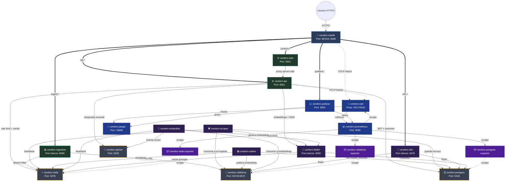

  
  

# 📋 Resumen de Contenedores y Topología de Red

El clúster del **LinkAnvil** está compuesto por **21 contenedores** que operan dentro de la red privada `cerebro-net`, más un sidecar opcional (`tailscale-funnel`, profile `telegram`) que expone públicamente el endpoint de webhooks de Telegram cuando se necesita. Se dividen en seis capas funcionales: entrada y API, interfaz web, workers asíncronos, almacenamiento, orquestación/IA y observabilidad.

---

## 🗺️ Diagrama de Conexiones entre Contenedores

---

## 🗂️ Descripción Detallada de los Contenedores

### 1. 🔀 API Gateway

#### `cerebro-tailscale` (sidecar opcional, profile `telegram`)
**Imagen:** `tailscale/tailscale:stable` | **Volumen:** `cerebro-tailscale-state` (estado del nodo)

*Analogía:* Imagina que tu casa (tu red local) no tiene buzón en la calle por seguridad. Tailscale Funnel es un apartado postal oficial y seguro que tú configuras en la oficina de correos. Cuando Telegram envía una carta allí, un mensajero de confianza la introduce mágicamente directo en tu escritorio, sin necesidad de abrir la puerta de tu casa.

### ¿Qué hace?

El sistema crea un conducto directo entre tu computadora y el internet utilizando una herramienta llamada Tailscale Funnel. 
*   **Recepción de Mensajes:** Funciona como un buzón seguro. Es la vía exclusiva por la cual tu bot de Telegram envía los mensajes automáticos (webhooks) hacia tu aplicación.
*   **Dirección Web Fija:** Te proporciona una dirección pública, permanente y segura (una URL que empieza con HTTPS temporal de Tailscale), para que Telegram siempre sepa adónde enviar la información.
*   **Activación Manual:** Este servicio no se enciende solo. Requiere que utilices un comando específico para iniciar (`docker compose --profile telegram up -d`).
*   **Seguridad y Reglas:** Opera de forma segura sin pedir permisos delicados a tu sistema operativo. Las reglas sobre cómo debe entregar los mensajes (su configuración de "proxy") están guardadas en un archivo llamado `serve.json`.

### ¿Por qué se tomó esta decisión?

*   **Requisito de Telegram:** Telegram obliga a que el destinatario de sus mensajes sea una dirección pública y blindada con seguridad (HTTPS). Sin embargo, las conexiones de internet en hogares y oficinas normalmente esconden a las computadoras detrás del router, imposibilitando recibir conexiones directas desde afuera.
*   **Facilidad de Uso:** Tailscale Funnel soluciona este problema sin costo y sin obligarte a modificar la configuración de tu router (sin "abrir puertos") ni a tramitar certificados de seguridad manualmente.
*   **Persistencia:** La dirección web que se te asigna no cambia aunque apagues o reinicies la aplicación, siempre que no elimines la memoria del sistema.

### Limitaciones a tener en cuenta

*   **Disponibilidad:** El enlace hacia Telegram solo funciona mientras mantengas encendido el contenedor de esta aplicación.
*   **Restricción de Puertos:** Tailscale Funnel solo permite recibir información por ciertos "canales" predefinidos en internet (en nuestro caso, utilizamos el puerto estándar de conexión segura, el 443).

**Configuración clave:**
- `TS_AUTHKEY` — auth-key reusable generada en https://login.tailscale.com/admin/settings/keys; solo necesaria al primer arranque (luego el volumen `tailscale-state` mantiene el registro).
- `TS_HOSTNAME=linkanvil-ingest` — define el subdominio público (cambiarlo después requiere borrar el nodo viejo en el dashboard).
- `TS_SERVE_CONFIG=/config/serve.json` — declara el proxy a `ingestion-api:8000` y `AllowFunnel: true` para publicar al exterior.

---

#### `cerebro-traefik`
**Imagen:** `traefik:v3.6.14` | **Puertos expuestos:** 80 (HTTP), 443 (HTTPS), 8080 (dashboard)

*Analogía:* Imagina un hospital gigantesco con muchas alas diferentes. En lugar de tener una puerta a la calle para Cardiología, otra para Pediatría y otra para Urgencias, hay una única Gran Recepción (Traefik). El recepcionista verifica adónde vas, te pone una pulsera numerada para seguir tu historial médico, y si hay demasiada gente queriendo entrar al mismo tiempo, los hace pasar en orden. Si en Pediatría no contestan el teléfono al primer intento, el recepcionista vuelve a llamar un par de veces por ti.

### ¿Qué hace?

Traefik actúa como el sistema de recepción inteligente y centralizado del clúster (el conjunto de tus aplicaciones). 

*   **Enrutamiento Automático:** Es la única puerta por la que entra el tráfico. Lee la dirección exacta que estás visitando (por ejemplo, `ingest.localhost`) y te dirige al contenedor correcto que sabe cómo responderte.
*   **Control de Multitudes (Rate Limiting):** Para prevenir sobrecargas o ataques, bloquea automáticamente los excesos impidiendo que entren demasiadas peticiones de golpe (el máximo promedio es de 100 por segundo por usuario).
*   **Reintentos a Prueba de Fallos:** Si uno de tus programas internos falla temporalmente al intentar responder, Traefik vuelve a intentar conectarse hasta 3 veces automáticamente antes de devolver un error.
*   **Etiqueta de Seguimiento (Trace-ID):** Le coloca un identificador único (como un gafete de visitante numerado) a cada conexión. Esto permite rastrear el recorrido de la petición por todos tus sistemas si necesitas diagnosticar un problema.

### ¿Por qué se tomó esta decisión?

*   **Seguridad Centralizada:** Al tener un único punto de entrada, las reglas pesadas (restricciones, reintentos y seguridad) se aplican una sola vez en la puerta principal. Así, no tienes que programar estas mismas defensas individualmente en cada aplicación de tu sistema.
*   **Configuración Invisible:** Traefik es capaz de leer de manera automática las pequeñas etiquetas incrustadas en tus otros programas (labels de Docker). Esto permite que el sistema sepa adónde dirigir el tráfico sin necesidad de crear ni actualizar documentos de configuración larguísimos y propensos a errores humanos.

### Beneficios adicionales de Configuración

*   **Monitoreo Transparente:** Avisa a tus herramientas de vigilancia (Prometheus y OpenTelemetry) qué rutas fallan y cuánto tardan en responder.
*   **Seguridad Web en Producción:** Cuando pasas el sistema a la versión de vida real en internet (producción), Traefik se encarga por sí solo de solicitar los candados de seguridad (certificados Let's Encrypt) y fuerza a que todo el mundo use conexiones cifradas (convierte HTTP normal a HTTPS).

---

### 2. 📥 Capa de Ingesta

#### `cerebro-ingestion`
**Código:** `src/ingestion/main.py` | **Imagen:** build propio (`infra/ingestion.Dockerfile`) | **Límites:** 512 MB RAM, 1 CPU

*Analogía:* Imagina la oficina de correos de un edificio gigante. Este servicio es el empleado de la ventanilla rápida. Cuando le entregas una carta (enlace), él no la abre para leerla; solo mira rápidamente su libreta para ver si ya le entregaste una igual (duplicado) y revisa que no le hayas traído 500 cartas hoy (control de abuso). Si todo está en orden, lanza la carta al cajón de procesamiento y te dice "¡Recibido!", despachándote al instante.

### ¿Qué hace?

Es un servicio ligero dedicado exclusivamente a recibir enlaces nuevos (ya sea desde la extensión de tu navegador, Telegram u otras aplicaciones). Antes de poner el enlace en la cola de trabajo, realiza dos filtros ultrarrápidos:

*   **Filtro de Duplicados:** Utiliza una herramienta de memoria rápida para comprobar en milisegundos si ese enlace ya existe en el sistema.
*   **Control de Abusos (Rate Limiting):** Verifica al instante quién está enviando el enlace y bloquea a los usuarios que estén enviando demasiadas peticiones al mismo tiempo.

### ¿Por qué se tomó esta decisión?

*   **Respuestas Instantáneas:** Al separar la recepción de la lectura profunda del texto (scraping), el usuario no tiene que esperar con una pantalla de carga; el sistema le confirma la recepción de inmediato.
*   **Corrección de Errores Ocultos:** El mecanismo de "control de abusos" se actualizó para hacer su comprobación en un solo paso indivisible (atómico). Antes usaba dos pasos (leer y luego sumar), lo cual causaba errores si llegaban dos enlaces al mismo milisegundo. Además, ahora la comunicación se hace de forma "asíncrona", lo que significa que el programa no se queda congelado esperando respuestas.

---

### 3. ⚙️ API de la Aplicación

#### `cerebro-api`
**Código:** `src/api/main.py` | **Imagen:** build propio (`infra/api.Dockerfile`) | **Puerto expuesto:** 8001 | **Límites:** 768 MB RAM, 1 CPU

*Analogía:* Es el gerente central de un banco. Verifica tu identidad al entrar, lleva un registro exacto de cada movimiento que haces en tu cuenta y, cuando pides un análisis complejo, coordina a los especialistas (Inteligencia Artificial y motores de búsqueda) para entregarte un reporte detallado.

### ¿Qué hace?

Es el "cerebro" central (backend) que conecta la interfaz que ve el usuario con las bases de datos. 

*   **Gestión de Usuarios:** Controla quién entra, quién sale y registra cuentas nuevas.
*   **Chat Inteligente:** Conecta tus preguntas con la inteligencia artificial y te envía las respuestas poco a poco a medida que se generan (como cuando ves a ChatGPT escribiendo).
*   **Gestión de Datos:** Guarda y recupera tu historial de sesiones y mensajes desde la base de datos principal.

### ¿Por qué se tomó esta decisión?

Se reconstruyó este motor por completo para priorizar la seguridad, abandonando el sistema anterior que guardaba las "llaves" del usuario en lugares poco seguros. Sus nuevas defensas incluyen:

*   **Cajas Fuertes Temporales (httpOnly):** Guarda tu "llave de acceso" (token) en un formato que el navegador web puede usar pero no puede leer directamente. Esto evita que los hackers roben tus credenciales.
*   **Doble Verificación contra Falsificaciones (CSRF):** Al hacer cambios importantes, el sistema exige que el navegador presente dos credenciales que deben coincidir exactamente, asegurando que realmente eres tú quien hace la petición y no un sitio web malicioso.
*   **Límites de Seguridad:** Establece reglas estrictas sobre cuántas veces puedes intentar iniciar sesión o enviar mensajes por minuto, bloqueando ataques automatizados.
*   **Ahorro de Recursos (Pool Compartido):** En lugar de abrir y cerrar una "línea telefónica" de red nueva cada vez que consulta a la Inteligencia Artificial, reutiliza una sola conexión abierta. Esto ahorra mucha memoria y evita que el servidor colapse bajo presión.

---

### 4. 🌐 Frontend Web

#### `cerebro-web`
**Código:** `src/frontend/` | **Imagen:** build propio (`infra/frontend.Dockerfile`) | **Puerto expuesto:** 3001 | **Límites:** 384 MB RAM, 0.5 CPU

*Analogía:* Imagina el tablero de mandos de un coche moderno. Es la pantalla táctil que tocas para interactuar con el vehículo. Si la aplicación de la radio (un componente) tiene un error y se reinicia, el motor del coche, los frenos y el velocímetro siguen operando sin problema. Además, la pantalla guarda tu música favorita en una caja fuerte central protegida, no en una memoria frágil detrás de la pantalla que cualquiera podría sacar.

### ¿Qué hace?

Es la página web principal del sistema, construida con herramientas modernas (Next.js y React). Sus funciones principales incluyen:

*   **Punto de Acceso:** Una pantalla segura para iniciar y cerrar sesión.
*   **Chat Interactivo:** Te permite conversar con la Inteligencia Artificial y ver cómo las respuestas aparecen palabra por palabra en tiempo real (similar a ChatGPT).
*   **Panel de Control:** Un espacio para ver todos los enlaces que has guardado y revisar el historial de tus conversaciones anteriores.
*   **Diseño Antifragilidad (Límites de Error):** La pantalla está dividida en piezas independientes. Si un bloque falla (por ejemplo, un recuadro de texto no carga), el sistema aísla el error para que el resto de la página siga funcionando sin colapsar por completo.

### ¿Por qué se tomó esta decisión?

*   **Mayor Seguridad y Control:** Se reemplazó la tecnología anterior (Streamlit) porque era demasiado rígida. No permitía gestionar inicios de sesión complejos ni manejar "Cajas Fuertes Temporales" (Las cookies httpOnly que vimos en la API). 
*   **Sincronización Total:** La tecnología actual se integra a la perfección con la regla de "doble verificación" de seguridad (CSRF) que exige la API central.
*   **Secreto de Ubicación:** El diseño asegura que tu navegador web nunca se entere de cuál es la dirección IP interna o secreta donde vive el motor del sistema (`CEREBRO_API_URL`); esa información se queda exclusiva en el servidor, blindando la aplicación contra fisgones.
*   **Solución a "Mensajes Fantasma":** Antes, los chats se guardaban temporalmente en la memoria de tu navegador (`localStorage`). Esto provocaba que, incluso si borrabas el sistema por completo, al volver a entrar aparecieran mensajes viejos. Ahora, todo se pide directamente a la base de datos oficial.

---

### 5. 🕷️ Workers Asíncronos

#### `cerebro-scraper`
**Código:** `src/scraper/worker.py` | **Límites:** 1.5 GB RAM, 2 CPUs | `shm_size: 1gb` (Chromium)

El sistema usa "trabajadores" silenciosos, son independientes, pueden tomarse su tiempo para leer páginas complejas sin que la aplicación web se quede congelada. Cada uno tiene un sistema de "latidos de corazón" (Heartbeat): envían una señal cada 45 segundos para demostrar que siguen vivos y trabajando; si no lo hacen, el sistema detecta que se han quedado atascados.

---

### El Lector de Páginas (`cerebro-scraper`)

*Analogía:* Imagina a un investigador privado que envías a leer un libro a una biblioteca. A veces el bibliotecario es estricto y no lo deja pasar, así que el investigador usa un disfraz. Una vez adentro, lee el texto importante, le pide a un especialista que haga un resumen de los puntos clave, guarda el reporte en tu archivo y avisa que ya terminó. 

**¿Qué hace?**
*   **Lectura Inteligente:** Toma los enlaces que acaban de entrar al sistema. Si la página es sencilla, extrae el texto directamente. Si es una página moderna y compleja, abre un "navegador invisible" en el fondo para poder leerla.
*   **Evasión de Bloqueos:** Aplica trucos para saltarse las barreras de seguridad (sistemas anti-bots) que algunas páginas usan para evitar ser leídas por programas automatizados.
*   **Análisis Inicial:** Tras extraer el texto limpio, se lo envía a la Inteligencia Artificial para que extraiga etiquetas y un resumen, y guarda todo en la base de datos principal.

**Sistema de Cuarentena Automática:**
A veces, las páginas web se dan cuenta de que somos un robot e intentan bloquearnos mostrándernos páginas de error (ej. "¡Verifica que no eres un robot!"). El Lector es capaz de reconocer estos mensajes de bloqueo o detectar si el texto extraído es absurdamente corto. Si esto ocurre, en lugar de guardar texto basura, envía ese enlace a un "hospital de cuarentena" durante 30 días para revisión manual.

**¿Por qué se tomó esta decisión?**
Separar la lectura de textos en un programa independiente permite que la aplicación principal siga funcionando a la perfección aunque estemos descargando cientos de páginas web muy pesadas. Además, a este trabajador se le asigna mucha más "memoria RAM" especializada para que su navegador invisible no colapse bajo presión.

---

#### `cerebro-embedder`
**Código:** `src/data/embedder_worker.py` | **Límites:** 768 MB RAM, 1 CPU

*Analogía:* Es como un archivero experto en sistemas numéricos. Recibe el texto que el investigador acaba de leer y lo convierte en coordenadas matemáticas precisas. Si ve que ese libro ya fue clasificado el mes pasado para otro cliente, simplemente fotocopia las coordenadas matemáticas en lugar de hacer todo el esfuerzo mental de nuevo.

**¿Qué hace?**
*   **Conversión a Números (Embedding):** Toma el texto recién extraído y le pide a la Inteligencia Artificial que lo convierta en un formato numérico complejo (vectores). Esto permite que el sistema pueda encontrar respuestas haciendo búsquedas por "significado" en el futuro.
*   **Reciclaje Inteligente:** Puesto que las matemáticas de un texto público siempre son las mismas sin importar quién lo guarde, si un usuario guarda un enlace que otro usuario ya había procesado antes, el Traductor simplemente reutiliza los números antiguos.

**¿Por qué se tomó esta decisión?**
El proceso de traducir palabras a matemáticas consumibles por la Inteligencia Artificial es muy lento y costoso. Al separarlo del Lector de Páginas, evitamos que un fallo o lentitud en la IA detenga el proceso de recolección de las páginas web. Si algo sale mal en este paso, se puede volver a intentar la traducción más tarde sin tener que volver a entrar a la página original.

---

#### `cerebro-outbox`
**Código:** `src/data/outbox_publisher.py` | **Límites:** 384 MB RAM, 0.5 CPU

*Analogía:* Es un empleado de correo certificado muy meticuloso. Nunca echa una carta al buzón y se olvida de ella. Primero inscribe la carta en un registro oficial con estado "Pendiente" y, solo después de confirmar que el sistema de mensajería la recibió correctamente, le pone el sello de "Enviada". 

**¿Qué hace?**
*   Utiliza una técnica llamada "Patrón Outbox". Este trabajador revisa constantemente la base de datos buscando tareas recién terminadas por el Lector que necesitan ser enviadas al Traductor. Cuando encuentra una, la entrega de forma segura al sistema de correos internos.

**¿Por qué se tomó esta decisión?**
Si el Lector intentara guardar su reporte en la base de datos *y al mismo tiempo* enviar la carta de aviso al traductor, un apagón repentino en el instante intermedio haría que se perdiera la notificación para siempre. El Cartero Seguro garantiza que los mensajes jamás se pierdan ni se queden a medias, incluso si los sistemas se caen y se reinician.

---

### 6. 🤖 Motor LLM y Orquestación

#### `cerebro-litellm`
**Código/Configuración:** `infra/litellm/config.yaml` | **Límites:** 1 GB RAM, 1 CPU

*Analogía:* Imagina un jefe de traductores en la sede de las Naciones Unidas. Tú solo le entregas un documento y le dices "Tradúcelo". No te importa si usa al traductor de OpenAI, al de Anthropic o a su propio equipo local. Si el traductor principal está enfermo (caída del sistema), el jefe le pasa el documento al suplente automáticamente sin detener tu trabajo. Y si alguien le pide traducir exactamente el mismo documento que ayer, simplemente saca una copia del archivo (caché) para no hacer el trabajo dos veces.

### ¿Qué hace?

Es un intermediario inteligente (Proxy) entre nuestro sistema y las diferentes Inteligencias Artificiales del mercado.
*   **Traductor Universal:** Le permite a nuestras aplicaciones hablar con cualquier IA (OpenAI, Gemini, modelos locales) usando siempre el mismo "idioma" de conexión.
*   **Plan B Automático (Fallback):** Si nuestro proveedor de IA favorito falla, instantáneamente intenta con el segundo de la lista.
*   **Interruptor de Seguridad (Circuit Breaker):** Si un proveedor se cae por completo, deja de enviarle preguntas temporalmente para no saturar el sistema.
*   **Memoria de Ahorro (Caché):** Recuerda las preguntas frecuentes para responder al instante y ahorrar costos.

### ¿Por qué se tomó esta decisión?

Nos da libertad absoluta. Si el día de mañana queremos cambiar la Inteligencia Artificial que usamos, solo tenemos que cambiar un par de líneas en un archivo de texto, sin tener que reprogramar nada del código principal del sistema.

**Nota Importante de Seguridad:** Este programa limpia la zona pública de la base de datos cada vez que se enciende. Es por esto que todas nuestras mesas de trabajo (tablas) se construyeron en un cuarto separado y exclusivo llamado `cerebro`, de lo contrario, LiteLLM borraría nuestra información accidentalmente.

---

#### `cerebro-n8n`
**Puerto interno:** 5678 | **Límites:** 768 MB RAM, 1 CPU

*Analogía:* Imagina a un ingeniero jefe frente a una pizarra gigante conectando cables de colores entre distintas máquinas. Cuando suena una alarma (por ejemplo, llega un mensaje de Telegram), la corriente viaja por los cables y activa una serie de interruptores que desencadenan acciones en cadena de forma completamente visual.

### ¿Qué hace?

Es una plataforma visual para crear "recetas" automatizadas (workflows). 
*   Se encarga de tareas de coordinación repetitivas como escuchar notificaciones, conectar la plataforma con bots externos, o programar limpiezas nocturnas de datos.
*   Guarda todos sus esquemas de trabajo en una zona privada y separada de la base de datos (schema `n8n`).

---

#### `cerebro-n8n-bootstrap`
**Límites:** Ejecución de un solo uso (One-shot)

*Analogía:* Imagina un cerrajero que contrataste para preparar una oficina nueva. Llega temprano en la mañana, instala la cerradura central, deja las copias de las llaves en un cajón seguro y se marcha para siempre. 

### ¿Qué hace?

Es un programa "desechable" que se ejecuta una única vez la primera vez que enciendes el sistema. 
*   Espera educadamente a que el ingeniero jefe (`n8n`) esté en su puesto.
*   Genera las llaves de seguridad maestra (API Key) y las guarda automáticamente en los archivos de configuración del sistema.

### ¿Por qué se tomó esta decisión?

Automatización total. Permite que cualquier persona pueda instalar y encender el sistema completo con un solo comando (`docker compose up -d`), de principio a fin, sin tener que abrir manuales para configurar contraseñas a mano en medio del proceso.

---

### 7. 💾 Almacenamiento y Mensajería

#### `cerebro-postgres`
**Puertos:** 5432 | **Límites:** 2 GB RAM, 2 CPUs

*Analogía:* Es el archivo central y acorazado de un gran banco. Tiene diferentes bóvedas (schemas) asignadas a distintos departamentos. Como el departamento de Inteligencia Artificial (LiteLLM) tiene la mala costumbre de limpiar su bóveda por completo todos los días, hemos construido una bóveda secreta y acorazada (`cerebro`) solo para nuestros documentos críticos, donde la IA no tiene llave.

### ¿Qué hace?

Es la base de datos principal y permanente del sistema.
*   **Registros Universales:** Guarda la información de cada enlace web (recurso) una sola vez para no repetir datos.
*   **Privacidad Estricta:** Usa un sistema de seguridad (RLS) para asegurar que un usuario solo pueda ver sus propios enlaces guardados, aunque el sistema recicle y comparta los textos "tras bambalinas".
*   **Historial y Memoria:** Almacena de forma segura tu perfil de usuario, contraseñas, y todas tus conversaciones con la IA.
*   **Gestor de Envíos:** Funciona como un registro para asegurarse de que todos los mensajes pasen al cartero seguro (Patrón Outbox).

### ¿Por qué se tomó esta decisión?

Además de separar las "bóvedas" para proteger los datos (schema `cerebro` invisible a LiteLLM), esta base de datos está afinada (tuneada) como un motor de Fórmula 1: tiene reglas precisas sobre cuántos trabajadores pueden escribir información a la vez y cuánta memoria utilizar para búsquedas, previniendo que el banco colapse en momentos de pánico.

---

#### `cerebro-redis`
**Puertos:** 6379 | **Límites:** 768 MB RAM

*Analogía:* Es la libreta de apuntes rápidos del sistema o la memoria a corto plazo. No se usa para guardar archivos históricos vitales, sino para cálculos ultrarrápidos que deben ocurrir en una fracción de segundo para coordinarlo todo.

### ¿Qué hace?

Es una base de datos temporal extremadamente veloz. Cumple cuatro misiones:
1.  **Detector Rápido (Bloom Filter):** Responde en un milisegundo si un enlace ya existe antes de aceptarlo.
2.  **Guardia de Seguridad (Rate Limiter):** Cuenta cuántas peticiones estás haciendo por segundo y levanta un escudo si intentas abusar del sistema.
3.  **Monitor de Vida (Heartbeat):** Los trabajadores (workers) dejan aquí su firma cada 45 segundos para avisarle al sistema que siguen vivos y no están atascados.
4.  **Caché de IA:** Acumula preguntas previas para no gastar dólares repitiendo el trabajo de la Inteligencia Artificial.

### ¿Por qué se tomó esta decisión?

Para garantizar estabilidad. Obligamos al sistema a no utilizar versiones "más recientes" de Redis con sorpresas, sino una versión probada para que cosas vitales como el "Detector Rápido de enlaces" no se rompan por actualizaciones silenciosas.

---

#### `cerebro-rabbitmq`
**Puertos:** 5672 | **Límites:** 768 MB RAM, 1 CPU

*Analogía:* Son las bandas transportadoras de una fábrica automatizada. Si hay mucho trabajo, los paquetes (enlaces o textos) se acumulan ordenadamente en la banda, esperando su turno para ser procesados sin que ninguno se caiga al suelo.

### ¿Qué hace?

Es el sistema central de correo y mensajería (colas de trabajo) en tiempo real.
*   **Rutas de Trabajo:** Mueve los enlaces recién llegados hacia el Lector (Scraper) y los textos limpios hacia el traductor matemático (Embedder).
*   **Basurero de Emergencia (Cola de Fallos):** Si no se puede generar el cálculo matemático repetidas veces, no permite que un documento importante desaparezca; lo deposita en un lugar seguro (DLQ) para ser arreglado manualmente después.

### ¿Por qué se tomó esta decisión?

Antes, los mensajes que fallaban no tenían un "hospital" hacia dónde ir, por lo cual simplemente se evaporaban, perdiendo parte del trabajo. Ahora, tenemos tuberías seguras para todos los casos de falla para que ningún proceso se corrompa sin dar aviso.

---

#### `cerebro-qdrant`
**Puertos:** 6333 | **Límites:** 2 GB RAM, 2 CPUs

*Analogía:* Es una supercomputadora programada con un mapa de estrellas gigante. En lugar de buscar archivos por orden alfabético, tú le das un poema y ella te dice "Ah, esa idea vive en este sector estelar de aquí, cerca de estas otras cinco ideas similares".

### ¿Qué hace?

Es un motor de búsqueda vectorial.
*   **Búsqueda por Intuición:** Almacena todos los resúmenes en números abstractos masivos. Cuando hablas con la Inteligencia artificial, esta base de datos busca en tu mapa estelar ideas similares en fracciones de segundo.
*   **Ahorro Compartido (Multi-tenant):** Si dos usuarios distintos guardan el enlace a la página oficial de la NASA, la IA no hace cálculos matemáticos dos veces; simplemente le crea un clon en el mapa estelar al segundo usuario y lo ata a un identificador único global.

### ¿Por qué se tomó esta decisión?

Aunque la base central PostgreSQL puede guardar números abstractos, Qdrant fue inventada *solamente* para buscar estrellas semánticas. Es cien veces más rápido (gracias a algo llamado índices HNSW) y nos permite buscar solo en tu biblioteca (por tu ID de usuario) sin complicar las consultas.

### 8. 👁️ Observabilidad (Monitoreo)

#### `cerebro-otel`
**Puertos:** 4317, 4318, 8888, 8889 | **Límites:** 384 MB RAM, 0.5 CPU

*Analogía:* Es el radar central de una torre de control de tráfico aéreo. Escucha las señales de radio de todos los aviones (aplicaciones) y las pasa en un formato limpio y unificado a las pantallas de los controladores (Jaeger).

### ¿Qué hace?
Es un recolector universal. Recibe las huellas digitales (trazas) que las aplicaciones dejan al funcionar y las enruta al sistema de visualización correspondiente.

### ¿Por qué se tomó esta decisión?
Nos da flexibilidad a futuro. Si mañana decidimos cambiar la pantalla donde analizamos los errores (por ejemplo, dejar de usar Jaeger para usar otra herramienta), solo le avisamos al radar, sin tener que reprogramar los aviones (las aplicaciones principales).

---

#### `cerebro-prometheus`
**Puertos:** 9090 | **Límites:** 1 GB RAM, 1 CPU

*Analogía:* Es el supervisor de la fábrica que pasa cada 15 segundos preguntándole a cada máquina "¿A qué temperatura estás?", "¿Cuántos productos llevas?". Si una máquina pasa de los grados permitidos, hace sonar la alarma.

### ¿Qué hace?
Recopila estadísticas (métricas) de salud de todo el sistema de manera periódica. Cuenta con reglas automáticas (alertas) configuradas para avisarnos si:
*   La aplicación central tarda más de 2 segundos en responder.
*   Se acumulan demasiados correos en espera de lectura (>1000).
*   Algún cálculo matemático falla.
*   La base de datos está a punto de llenarse de conexiones.
*   Algún trabajador silencioso (Worker) lleva más de 2 minutos sin dar señales de vida.
*   Los discos duros están al 80% de su capacidad.

---

#### `cerebro-jaeger`
**Puertos:** 16686 | **Límites:** 384 MB RAM, 0.5 CPU

*Analogía:* Es el detective experto que puede reconstruir el rastro de la escena del crimen, segundo a segundo.

### ¿Qué hace?
Muestra el mapa visual de cuánto tardó cada elemento. Si un usuario se queja de que "La aplicación está lenta", Jaeger permite ver en cascada que la Recepción (Traefik) tardó 1 milisegundo, pero la conexión con la Inteligencia artificial (LiteLLM) tardó 3 segundos.

---

#### `cerebro-grafana`
**Puertos:** 3000 | **Límites:** 384 MB RAM, 0.5 CPU

### ¿Qué hace?
Es la pantalla gigante con gráficas vistosas y velocímetros en el centro de mando. Reúne toda la información dura del supervisor estadístico (Prometheus) y el detective de tiempos (Jaeger) mostrándolos en un mismo panel fácil de leer humano.

---

### 9. 📦 Traductores (Exporters)

*Analogía:* Son traductores simultáneos con un pequeño auricular. Puesto que las bases de datos antiguas (RabbitMQ, Redis, PostgreSQL) hablan sus propios idiomas cerrados y el supervisor estadístico (Prometheus) solo habla un idioma internacional (Prometheus Metrics), estos traductores escuchan a la base de datos y le traducen al supervisor qué tal van en tiempo real.

Son tres pequeñas aplicaciones ultraligeras (**Límites:** 128 MB RAM, 0.25 CPU c/u):
1.  **`cerebro-postgres-exporter`:** Traduce cómo está la salud de la bóveda de datos.
2.  **`cerebro-redis-exporter`:** Traduce cuánta memoria temporal le queda a la libreta rápida.
3.  **`cerebro-rabbitmq-exporter`:** Traduce cómo van las bandas transportadoras y si hay atascos. *(Se usa con una configuración exacta, congelada en el tiempo para evitar que los traductores actualicen su diccionario sin avisarnos y rompan el sistema).*

---

## 📊 Resumen de Límites por Contenedor

Para asegurar que todo quepa en una sola computadora sólida sin interferirse, repartimos los recursos (Memoria RAM y Procesadores) inteligentemente. Almacenamiento y Trabajadores de Extracción de Texto ocupan los tanques más grandes, mientras que Exporters y Observabilidad son extremadamente compactos.

| Contenedor | RAM Límite | CPU Límite | Tipo |
|---|---|---|---|
| cerebro-postgres | 2 GB | 2.0 | Almacenamiento Seguro |
| cerebro-qdrant | 2 GB | 2.0 | Motor de Búsqueda de IA |
| cerebro-litellm | 1 GB | 1.0 | Intermediario LLM |
| cerebro-prometheus | 1 GB | 1.0 | Supervisor / Alarmas |
| cerebro-scraper | 1.5 GB | 2.0 | Trabajador en Segundo Plano |
| cerebro-api | 768 MB | 1.0 | Cerebro Central |
| cerebro-embedder | 768 MB | 1.0 | Trabajador de Traducción IA |
| cerebro-rabbitmq | 768 MB | 1.0 | Sistema de Correos |
| cerebro-n8n | 768 MB | 1.0 | Orquestador Automatizado |
| cerebro-redis | 768 MB | — | Libreta de Memoria Rápida |
| cerebro-ingestion | 512 MB | 1.0 | Recepción Rápida |
| cerebro-outbox | 384 MB | 0.5 | Trabajador Cartero |
| cerebro-web | 384 MB | 0.5 | Pantalla Web |
| cerebro-otel | 384 MB | 0.5 | Radar de Errores |
| cerebro-jaeger | 384 MB | 0.5 | Detective de Tiempos |
| cerebro-grafana | 384 MB | 0.5 | Pantalla de Gráficas |
| cerebro-traefik | 256 MB | 0.5 | Recepción Principal |
| exporters (×3) | 128 MB c/u | 0.25 c/u | Traductores de Estado |

---

